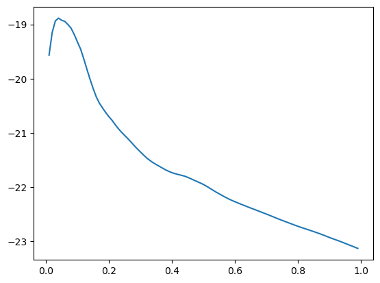

```python
import pandas as pd
import numpy as np
import matplotlib.pyplot as plt
from sklearn.model_selection import train_test_split
```


```python
pd.set_option('display.max_columns', None)
```


```python
dataframe = pd.read_csv('clean_df.csv')
```


```python
dataframe.rename(columns = {'min salary':'min_salary'}, inplace = True)
```


```python
dataframe['avg_salary'] = dataframe[['min_salary','max_salary']].mean(axis=1)
```


```python
dataframe.columns
```


    Index(['Job Description', 'Rating', 'Size', 'Type of ownership', 'Industry',
           'Revenue', 'per_hour', 'employer_provided', 'min_salary', 'max_salary',
           'company_txt', 'State', 'City', 'same_state_hq', 'company_age',
           'jd_python', 'jd_sql', 'jd_excel', 'jd_spark', 'jd_apache', 'jd_r',
           'jd_tensor', 'jd_jupyter', 'jd_git', 'jd_library', 'jd_aws', 'jd_cloud',
           'jd_linux', 'clean_title', 'jd_length', 'comp_count', 'avg_salary'],
          dtype='object')


```python
dataframe = dataframe[['clean_title','company_txt','Job Description', 'Rating', 'Size', 'Type of ownership', 'Industry',
       'Revenue', 'State', 'City', 'company_age','min_salary', 'max_salary', 'avg_salary', 'company_txt', 'comp_count', 
       'per_hour', 'employer_provided','same_state_hq',
       'jd_python', 'jd_sql', 'jd_excel', 'jd_spark', 'jd_apache', 'jd_r',
       'jd_tensor', 'jd_jupyter', 'jd_git', 'jd_library', 'jd_aws', 'jd_cloud',
       'jd_linux']]
```


```python
df = dataframe.copy()
```


```python
df_model = df[['avg_salary','Rating', 'Size','Type of ownership','Industry','Revenue', 'State', 'City', 'clean_title' ,
               'company_txt','company_age','company_txt', 'comp_count','per_hour', 'employer_provided','same_state_hq',
               'jd_python', 'jd_sql', 'jd_excel', 'jd_spark', 'jd_apache', 'jd_r',
               'jd_tensor', 'jd_jupyter', 'jd_git', 'jd_library', 'jd_aws', 'jd_cloud',
               'jd_linux' ]]
```

# Model Build


```python
df_dum = pd.get_dummies(df_model)
```


```python
X = df_dum.drop('avg_salary', axis = 1)
y = df_dum.avg_salary.values
```


```python
X_train, X_test, y_train, y_test = train_test_split(X,y,test_size=0.3,random_state=42)
```

# Multiple Linear Regr


```python
import statsmodels.api as sm
```


```python
X_sm = X = sm.add_constant(X)
model = sm.OLS(y,X_sm)
```


```python
model.fit().summary()
```


<table class="simpletable">
<caption>OLS Regression Results</caption>
<tr>
  <th>Dep. Variable:</th>            <td>y</td>        <th>  R-squared:         </th> <td>   0.948</td> 
</tr>
<tr>
  <th>Model:</th>                   <td>OLS</td>       <th>  Adj. R-squared:    </th> <td>   0.885</td> 
</tr>
<tr>
  <th>Method:</th>             <td>Least Squares</td>  <th>  F-statistic:       </th> <td>   15.10</td> 
</tr>
<tr>
  <th>Date:</th>             <td>Wed, 27 Dec 2023</td> <th>  Prob (F-statistic):</th> <td>5.27e-112</td>
</tr>
<tr>
  <th>Time:</th>                 <td>20:21:44</td>     <th>  Log-Likelihood:    </th> <td> -2650.0</td> 
</tr>
<tr>
  <th>No. Observations:</th>      <td>   742</td>      <th>  AIC:               </th> <td>   6110.</td> 
</tr>
<tr>
  <th>Df Residuals:</th>          <td>   337</td>      <th>  BIC:               </th> <td>   7977.</td> 
</tr>
<tr>
  <th>Df Model:</th>              <td>   404</td>      <th>                     </th>     <td> </td>    
</tr>
<tr>
  <th>Covariance Type:</th>      <td>nonrobust</td>    <th>                     </th>     <td> </td>    
</tr>
</table>
<table class="simpletable">
<tr>
                                 <td></td>                                    <th>coef</th>     <th>std err</th>      <th>t</th>      <th>P>|t|</th>  <th>[0.025</th>    <th>0.975]</th>  
</tr>
<tr>
  <th>Rating</th>                                                          <td>    4.5004</td> <td>    1.802</td> <td>    2.498</td> <td> 0.013</td> <td>    0.957</td> <td>    8.044</td>
</tr>
<tr>
  <th>company_age</th>                                                     <td>    0.0872</td> <td>    0.027</td> <td>    3.175</td> <td> 0.002</td> <td>    0.033</td> <td>    0.141</td>
</tr>
<tr>
  <th>comp_count</th>                                                      <td>   -6.0026</td> <td>    3.645</td> <td>   -1.647</td> <td> 0.101</td> <td>  -13.173</td> <td>    1.168</td>
</tr>
<tr>
  <th>per_hour</th>                                                        <td>   -8.2029</td> <td>    4.632</td> <td>   -1.771</td> <td> 0.078</td> <td>  -17.315</td> <td>    0.909</td>
</tr>
<tr>
  <th>employer_provided</th>                                               <td>   37.9468</td> <td>    6.421</td> <td>    5.909</td> <td> 0.000</td> <td>   25.316</td> <td>   50.578</td>
</tr>
<tr>
  <th>same_state_hq</th>                                                   <td>   56.6159</td> <td>   21.510</td> <td>    2.632</td> <td> 0.009</td> <td>   14.305</td> <td>   98.926</td>
</tr>
<tr>
  <th>jd_python</th>                                                       <td>   -3.5357</td> <td>    3.786</td> <td>   -0.934</td> <td> 0.351</td> <td>  -10.983</td> <td>    3.912</td>
</tr>
<tr>
  <th>jd_sql</th>                                                          <td>   20.4313</td> <td>    3.794</td> <td>    5.385</td> <td> 0.000</td> <td>   12.968</td> <td>   27.894</td>
</tr>
<tr>
  <th>jd_excel</th>                                                        <td>   -5.8297</td> <td>    2.719</td> <td>   -2.144</td> <td> 0.033</td> <td>  -11.178</td> <td>   -0.481</td>
</tr>
<tr>
  <th>jd_spark</th>                                                        <td>  -15.7645</td> <td>    5.620</td> <td>   -2.805</td> <td> 0.005</td> <td>  -26.819</td> <td>   -4.711</td>
</tr>
<tr>
  <th>jd_apache</th>                                                       <td>   42.0868</td> <td>    9.092</td> <td>    4.629</td> <td> 0.000</td> <td>   24.203</td> <td>   59.971</td>
</tr>
<tr>
  <th>jd_r</th>                                                            <td>   11.3815</td> <td>    4.942</td> <td>    2.303</td> <td> 0.022</td> <td>    1.661</td> <td>   21.102</td>
</tr>
<tr>
  <th>jd_tensor</th>                                                       <td>  -24.4795</td> <td>    5.114</td> <td>   -4.787</td> <td> 0.000</td> <td>  -34.538</td> <td>  -14.421</td>
</tr>
<tr>
  <th>jd_jupyter</th>                                                      <td>   18.0163</td> <td>    6.748</td> <td>    2.670</td> <td> 0.008</td> <td>    4.743</td> <td>   31.289</td>
</tr>
<tr>
  <th>jd_git</th>                                                          <td>   -1.3631</td> <td>    4.337</td> <td>   -0.314</td> <td> 0.753</td> <td>   -9.894</td> <td>    7.168</td>
</tr>
<tr>
  <th>jd_library</th>                                                      <td>   21.2366</td> <td>    5.608</td> <td>    3.787</td> <td> 0.000</td> <td>   10.206</td> <td>   32.268</td>
</tr>
<tr>
  <th>jd_aws</th>                                                          <td>    5.8161</td> <td>    5.726</td> <td>    1.016</td> <td> 0.310</td> <td>   -5.447</td> <td>   17.080</td>
</tr>
<tr>
  <th>jd_cloud</th>                                                        <td>    8.6137</td> <td>    6.133</td> <td>    1.404</td> <td> 0.161</td> <td>   -3.450</td> <td>   20.677</td>
</tr>
<tr>
  <th>jd_linux</th>                                                        <td>   -1.2103</td> <td>    7.453</td> <td>   -0.162</td> <td> 0.871</td> <td>  -15.871</td> <td>   13.450</td>
</tr>
<tr>
  <th>Size_1 to 50 employees</th>                                          <td>   -5.0782</td> <td>    3.541</td> <td>   -1.434</td> <td> 0.152</td> <td>  -12.043</td> <td>    1.886</td>
</tr>
<tr>
  <th>Size_10000+ employees</th>                                           <td>    4.8825</td> <td>    6.957</td> <td>    0.702</td> <td> 0.483</td> <td>   -8.803</td> <td>   18.568</td>
</tr>
<tr>
  <th>Size_1001 to 5000 employees</th>                                     <td>   12.9082</td> <td>    2.605</td> <td>    4.954</td> <td> 0.000</td> <td>    7.783</td> <td>   18.033</td>
</tr>
<tr>
  <th>Size_201 to 500 employees</th>                                       <td>   -2.4097</td> <td>    2.376</td> <td>   -1.014</td> <td> 0.311</td> <td>   -7.084</td> <td>    2.264</td>
</tr>
<tr>
  <th>Size_5001 to 10000 employees</th>                                    <td>   15.1148</td> <td>    3.918</td> <td>    3.858</td> <td> 0.000</td> <td>    7.409</td> <td>   22.821</td>
</tr>
<tr>
  <th>Size_501 to 1000 employees</th>                                      <td>  -17.6281</td> <td>    4.937</td> <td>   -3.570</td> <td> 0.000</td> <td>  -27.340</td> <td>   -7.916</td>
</tr>
<tr>
  <th>Size_51 to 200 employees</th>                                        <td>    3.5921</td> <td>    4.448</td> <td>    0.807</td> <td> 0.420</td> <td>   -5.158</td> <td>   12.342</td>
</tr>
<tr>
  <th>Type of ownership_College / University</th>                          <td>   -5.6552</td> <td>    4.067</td> <td>   -1.390</td> <td> 0.165</td> <td>  -13.656</td> <td>    2.345</td>
</tr>
<tr>
  <th>Type of ownership_Company - Private</th>                             <td>    5.2133</td> <td>    3.519</td> <td>    1.481</td> <td> 0.139</td> <td>   -1.709</td> <td>   12.135</td>
</tr>
<tr>
  <th>Type of ownership_Company - Public</th>                              <td>   16.4730</td> <td>    2.956</td> <td>    5.573</td> <td> 0.000</td> <td>   10.659</td> <td>   22.287</td>
</tr>
<tr>
  <th>Type of ownership_Government</th>                                    <td>    5.6663</td> <td>    4.121</td> <td>    1.375</td> <td> 0.170</td> <td>   -2.439</td> <td>   13.772</td>
</tr>
<tr>
  <th>Type of ownership_Hospital</th>                                      <td>  -10.9953</td> <td>    5.949</td> <td>   -1.848</td> <td> 0.065</td> <td>  -22.696</td> <td>    0.706</td>
</tr>
<tr>
  <th>Type of ownership_Nonprofit Organization</th>                        <td>  -19.7414</td> <td>    5.304</td> <td>   -3.722</td> <td> 0.000</td> <td>  -30.175</td> <td>   -9.308</td>
</tr>
<tr>
  <th>Type of ownership_Other Organization</th>                            <td>  -11.8257</td> <td>    5.622</td> <td>   -2.104</td> <td> 0.036</td> <td>  -22.884</td> <td>   -0.768</td>
</tr>
<tr>
  <th>Type of ownership_School / School District</th>                      <td>    8.6134</td> <td>    6.032</td> <td>    1.428</td> <td> 0.154</td> <td>   -3.252</td> <td>   20.479</td>
</tr>
<tr>
  <th>Type of ownership_Subsidiary or Business Segment</th>                <td>   23.6332</td> <td>    5.327</td> <td>    4.436</td> <td> 0.000</td> <td>   13.154</td> <td>   34.112</td>
</tr>
<tr>
  <th>Industry_Accounting</th>                                             <td>   16.9679</td> <td>    8.779</td> <td>    1.933</td> <td> 0.054</td> <td>   -0.301</td> <td>   34.237</td>
</tr>
<tr>
  <th>Industry_Advertising & Marketing</th>                                <td>  -11.2527</td> <td>    3.660</td> <td>   -3.074</td> <td> 0.002</td> <td>  -18.452</td> <td>   -4.053</td>
</tr>
<tr>
  <th>Industry_Aerospace & Defense</th>                                    <td>   17.4420</td> <td>    6.925</td> <td>    2.519</td> <td> 0.012</td> <td>    3.820</td> <td>   31.064</td>
</tr>
<tr>
  <th>Industry_Architectural & Engineering Services</th>                   <td>   -1.6652</td> <td>    4.500</td> <td>   -0.370</td> <td> 0.712</td> <td>  -10.518</td> <td>    7.187</td>
</tr>
<tr>
  <th>Industry_Auctions & Galleries</th>                                   <td>    6.5699</td> <td>    5.015</td> <td>    1.310</td> <td> 0.191</td> <td>   -3.294</td> <td>   16.434</td>
</tr>
<tr>
  <th>Industry_Banks & Credit Unions</th>                                  <td>   -1.6460</td> <td>    4.154</td> <td>   -0.396</td> <td> 0.692</td> <td>   -9.817</td> <td>    6.525</td>
</tr>
<tr>
  <th>Industry_Beauty & Personal Accessories Stores</th>                   <td>   11.2740</td> <td>    4.644</td> <td>    2.428</td> <td> 0.016</td> <td>    2.139</td> <td>   20.409</td>
</tr>
<tr>
  <th>Industry_Biotech & Pharmaceuticals</th>                              <td>   35.4828</td> <td>    5.305</td> <td>    6.689</td> <td> 0.000</td> <td>   25.048</td> <td>   45.918</td>
</tr>
<tr>
  <th>Industry_Brokerage Services</th>                                     <td>   21.3554</td> <td>    4.197</td> <td>    5.088</td> <td> 0.000</td> <td>   13.099</td> <td>   29.612</td>
</tr>
<tr>
  <th>Industry_Colleges & Universities</th>                                <td>    9.8682</td> <td>    8.275</td> <td>    1.193</td> <td> 0.234</td> <td>   -6.409</td> <td>   26.145</td>
</tr>
<tr>
  <th>Industry_Computer Hardware & Software</th>                           <td>  -25.0264</td> <td>    4.810</td> <td>   -5.203</td> <td> 0.000</td> <td>  -34.489</td> <td>  -15.564</td>
</tr>
<tr>
  <th>Industry_Construction</th>                                           <td>    2.4074</td> <td>    5.070</td> <td>    0.475</td> <td> 0.635</td> <td>   -7.565</td> <td>   12.380</td>
</tr>
<tr>
  <th>Industry_Consulting</th>                                             <td>    5.6319</td> <td>    5.107</td> <td>    1.103</td> <td> 0.271</td> <td>   -4.414</td> <td>   15.678</td>
</tr>
<tr>
  <th>Industry_Consumer Product Rental</th>                                <td>    3.7079</td> <td>    5.156</td> <td>    0.719</td> <td> 0.473</td> <td>   -6.433</td> <td>   13.849</td>
</tr>
<tr>
  <th>Industry_Consumer Products Manufacturing</th>                        <td>   -1.3080</td> <td>    4.687</td> <td>   -0.279</td> <td> 0.780</td> <td>  -10.527</td> <td>    7.911</td>
</tr>
<tr>
  <th>Industry_Department, Clothing, & Shoe Stores</th>                    <td>   23.3984</td> <td>    4.838</td> <td>    4.837</td> <td> 0.000</td> <td>   13.883</td> <td>   32.914</td>
</tr>
<tr>
  <th>Industry_Education Training Services</th>                            <td>  -13.2045</td> <td>    7.006</td> <td>   -1.885</td> <td> 0.060</td> <td>  -26.985</td> <td>    0.576</td>
</tr>
<tr>
  <th>Industry_Energy</th>                                                 <td>   -2.2782</td> <td>    4.256</td> <td>   -0.535</td> <td> 0.593</td> <td>  -10.651</td> <td>    6.094</td>
</tr>
<tr>
  <th>Industry_Enterprise Software & Network Solutions</th>                <td>    6.0667</td> <td>    3.818</td> <td>    1.589</td> <td> 0.113</td> <td>   -1.443</td> <td>   13.576</td>
</tr>
<tr>
  <th>Industry_Farm Support Services</th>                                  <td>  -23.6761</td> <td>    9.786</td> <td>   -2.419</td> <td> 0.016</td> <td>  -42.925</td> <td>   -4.427</td>
</tr>
<tr>
  <th>Industry_Federal Agencies</th>                                       <td>   25.7908</td> <td>    6.347</td> <td>    4.063</td> <td> 0.000</td> <td>   13.305</td> <td>   38.276</td>
</tr>
<tr>
  <th>Industry_Financial Analytics & Research</th>                         <td>  -44.4023</td> <td>    7.789</td> <td>   -5.701</td> <td> 0.000</td> <td>  -59.723</td> <td>  -29.081</td>
</tr>
<tr>
  <th>Industry_Financial Transaction Processing</th>                       <td>    8.7392</td> <td>    3.640</td> <td>    2.401</td> <td> 0.017</td> <td>    1.579</td> <td>   15.899</td>
</tr>
<tr>
  <th>Industry_Food & Beverage Manufacturing</th>                          <td>   -4.7830</td> <td>    3.644</td> <td>   -1.312</td> <td> 0.190</td> <td>  -11.952</td> <td>    2.386</td>
</tr>
<tr>
  <th>Industry_Gambling</th>                                               <td>   -9.1452</td> <td>    2.213</td> <td>   -4.133</td> <td> 0.000</td> <td>  -13.497</td> <td>   -4.793</td>
</tr>
<tr>
  <th>Industry_Gas Stations</th>                                           <td>  -12.5674</td> <td>    6.213</td> <td>   -2.023</td> <td> 0.044</td> <td>  -24.789</td> <td>   -0.346</td>
</tr>
<tr>
  <th>Industry_Health Care Products Manufacturing</th>                     <td>   29.2950</td> <td>    8.808</td> <td>    3.326</td> <td> 0.001</td> <td>   11.970</td> <td>   46.620</td>
</tr>
<tr>
  <th>Industry_Health Care Services & Hospitals</th>                       <td>   15.6250</td> <td>    3.286</td> <td>    4.755</td> <td> 0.000</td> <td>    9.162</td> <td>   22.088</td>
</tr>
<tr>
  <th>Industry_Health, Beauty, & Fitness</th>                              <td>    7.4822</td> <td>    5.762</td> <td>    1.299</td> <td> 0.195</td> <td>   -3.851</td> <td>   18.816</td>
</tr>
<tr>
  <th>Industry_IT Services</th>                                            <td>   32.0183</td> <td>    7.626</td> <td>    4.199</td> <td> 0.000</td> <td>   17.018</td> <td>   47.019</td>
</tr>
<tr>
  <th>Industry_Industrial Manufacturing</th>                               <td>  -33.3506</td> <td>    6.273</td> <td>   -5.317</td> <td> 0.000</td> <td>  -45.689</td> <td>  -21.012</td>
</tr>
<tr>
  <th>Industry_Insurance Agencies & Brokerages</th>                        <td>   21.7475</td> <td>    7.211</td> <td>    3.016</td> <td> 0.003</td> <td>    7.564</td> <td>   35.931</td>
</tr>
<tr>
  <th>Industry_Insurance Carriers</th>                                     <td>   17.0088</td> <td>    3.285</td> <td>    5.178</td> <td> 0.000</td> <td>   10.547</td> <td>   23.470</td>
</tr>
<tr>
  <th>Industry_Internet</th>                                               <td>   -5.9998</td> <td>    4.368</td> <td>   -1.374</td> <td> 0.170</td> <td>  -14.592</td> <td>    2.592</td>
</tr>
<tr>
  <th>Industry_Investment Banking & Asset Management</th>                  <td>    6.7862</td> <td>    4.684</td> <td>    1.449</td> <td> 0.148</td> <td>   -2.428</td> <td>   16.000</td>
</tr>
<tr>
  <th>Industry_K-12 Education</th>                                         <td>   -2.8503</td> <td>    4.642</td> <td>   -0.614</td> <td> 0.540</td> <td>  -11.982</td> <td>    6.281</td>
</tr>
<tr>
  <th>Industry_Lending</th>                                                <td>    8.7728</td> <td>    4.254</td> <td>    2.062</td> <td> 0.040</td> <td>    0.406</td> <td>   17.140</td>
</tr>
<tr>
  <th>Industry_Logistics & Supply Chain</th>                               <td>  -28.7066</td> <td>    5.431</td> <td>   -5.285</td> <td> 0.000</td> <td>  -39.390</td> <td>  -18.023</td>
</tr>
<tr>
  <th>Industry_Metals Brokers</th>                                         <td>  -13.8179</td> <td>    3.978</td> <td>   -3.473</td> <td> 0.001</td> <td>  -21.643</td> <td>   -5.993</td>
</tr>
<tr>
  <th>Industry_Mining</th>                                                 <td>   -1.5018</td> <td>    5.308</td> <td>   -0.283</td> <td> 0.777</td> <td>  -11.943</td> <td>    8.939</td>
</tr>
<tr>
  <th>Industry_Motion Picture Production & Distribution</th>               <td>    1.3693</td> <td>    4.486</td> <td>    0.305</td> <td> 0.760</td> <td>   -7.455</td> <td>   10.193</td>
</tr>
<tr>
  <th>Industry_Other Retail Stores</th>                                    <td>    1.5962</td> <td>    6.328</td> <td>    0.252</td> <td> 0.801</td> <td>  -10.852</td> <td>   14.044</td>
</tr>
<tr>
  <th>Industry_Real Estate</th>                                            <td>  -47.3236</td> <td>    7.744</td> <td>   -6.111</td> <td> 0.000</td> <td>  -62.557</td> <td>  -32.090</td>
</tr>
<tr>
  <th>Industry_Religious Organizations</th>                                <td>    2.3295</td> <td>    2.650</td> <td>    0.879</td> <td> 0.380</td> <td>   -2.884</td> <td>    7.543</td>
</tr>
<tr>
  <th>Industry_Research & Development</th>                                 <td>    0.3971</td> <td>    4.460</td> <td>    0.089</td> <td> 0.929</td> <td>   -8.375</td> <td>    9.169</td>
</tr>
<tr>
  <th>Industry_Security Services</th>                                      <td>    9.2839</td> <td>    4.238</td> <td>    2.191</td> <td> 0.029</td> <td>    0.948</td> <td>   17.619</td>
</tr>
<tr>
  <th>Industry_Social Assistance</th>                                      <td>    6.1959</td> <td>    5.212</td> <td>    1.189</td> <td> 0.235</td> <td>   -4.056</td> <td>   16.448</td>
</tr>
<tr>
  <th>Industry_Sporting Goods Stores</th>                                  <td>   -0.0008</td> <td>    2.985</td> <td>   -0.000</td> <td> 1.000</td> <td>   -5.872</td> <td>    5.870</td>
</tr>
<tr>
  <th>Industry_Staffing & Outsourcing</th>                                 <td>  -12.7813</td> <td>    4.474</td> <td>   -2.857</td> <td> 0.005</td> <td>  -21.582</td> <td>   -3.981</td>
</tr>
<tr>
  <th>Industry_Stock Exchanges</th>                                        <td>   -5.3727</td> <td>    4.296</td> <td>   -1.251</td> <td> 0.212</td> <td>  -13.822</td> <td>    3.077</td>
</tr>
<tr>
  <th>Industry_TV Broadcast & Cable Networks</th>                          <td>   15.9881</td> <td>    7.561</td> <td>    2.114</td> <td> 0.035</td> <td>    1.115</td> <td>   30.861</td>
</tr>
<tr>
  <th>Industry_Telecommunications Manufacturing</th>                       <td>    4.6220</td> <td>    2.945</td> <td>    1.569</td> <td> 0.117</td> <td>   -1.171</td> <td>   10.415</td>
</tr>
<tr>
  <th>Industry_Telecommunications Services</th>                            <td>   -0.0501</td> <td>    3.700</td> <td>   -0.014</td> <td> 0.989</td> <td>   -7.328</td> <td>    7.228</td>
</tr>
<tr>
  <th>Industry_Transportation Equipment Manufacturing</th>                 <td>    4.1932</td> <td>    3.479</td> <td>    1.205</td> <td> 0.229</td> <td>   -2.650</td> <td>   11.036</td>
</tr>
<tr>
  <th>Industry_Transportation Management</th>                              <td>  -61.0338</td> <td>   10.507</td> <td>   -5.809</td> <td> 0.000</td> <td>  -81.701</td> <td>  -40.366</td>
</tr>
<tr>
  <th>Industry_Travel Agencies</th>                                        <td>    9.3207</td> <td>    3.926</td> <td>    2.374</td> <td> 0.018</td> <td>    1.598</td> <td>   17.044</td>
</tr>
<tr>
  <th>Industry_Trucking</th>                                               <td>   -6.7679</td> <td>    4.873</td> <td>   -1.389</td> <td> 0.166</td> <td>  -16.353</td> <td>    2.817</td>
</tr>
<tr>
  <th>Industry_Video Games</th>                                            <td>    7.2339</td> <td>    5.498</td> <td>    1.316</td> <td> 0.189</td> <td>   -3.580</td> <td>   18.048</td>
</tr>
<tr>
  <th>Industry_Wholesale</th>                                              <td>  -14.0744</td> <td>    5.925</td> <td>   -2.375</td> <td> 0.018</td> <td>  -25.730</td> <td>   -2.419</td>
</tr>
<tr>
  <th>Revenue_$1 to $2 billion (USD)</th>                                  <td>   18.9318</td> <td>    3.685</td> <td>    5.138</td> <td> 0.000</td> <td>   11.684</td> <td>   26.179</td>
</tr>
<tr>
  <th>Revenue_$1 to $5 million (USD)</th>                                  <td>   -3.1436</td> <td>    4.039</td> <td>   -0.778</td> <td> 0.437</td> <td>  -11.088</td> <td>    4.800</td>
</tr>
<tr>
  <th>Revenue_$10 to $25 million (USD)</th>                                <td>   -2.9732</td> <td>    3.367</td> <td>   -0.883</td> <td> 0.378</td> <td>   -9.595</td> <td>    3.649</td>
</tr>
<tr>
  <th>Revenue_$10+ billion (USD)</th>                                      <td>   25.8128</td> <td>    3.094</td> <td>    8.343</td> <td> 0.000</td> <td>   19.727</td> <td>   31.899</td>
</tr>
<tr>
  <th>Revenue_$100 to $500 million (USD)</th>                              <td>    3.7537</td> <td>    2.957</td> <td>    1.269</td> <td> 0.205</td> <td>   -2.063</td> <td>    9.570</td>
</tr>
<tr>
  <th>Revenue_$2 to $5 billion (USD)</th>                                  <td>   -6.4546</td> <td>    3.985</td> <td>   -1.620</td> <td> 0.106</td> <td>  -14.292</td> <td>    1.383</td>
</tr>
<tr>
  <th>Revenue_$25 to $50 million (USD)</th>                                <td>   -8.0818</td> <td>    3.778</td> <td>   -2.139</td> <td> 0.033</td> <td>  -15.514</td> <td>   -0.650</td>
</tr>
<tr>
  <th>Revenue_$5 to $10 billion (USD)</th>                                 <td>  -39.8115</td> <td>    8.221</td> <td>   -4.843</td> <td> 0.000</td> <td>  -55.982</td> <td>  -23.641</td>
</tr>
<tr>
  <th>Revenue_$5 to $10 million (USD)</th>                                 <td>   28.3098</td> <td>    5.059</td> <td>    5.596</td> <td> 0.000</td> <td>   18.358</td> <td>   38.262</td>
</tr>
<tr>
  <th>Revenue_$50 to $100 million (USD)</th>                               <td>   -7.9920</td> <td>    3.526</td> <td>   -2.266</td> <td> 0.024</td> <td>  -14.929</td> <td>   -1.055</td>
</tr>
<tr>
  <th>Revenue_$500 million to $1 billion (USD)</th>                        <td>    1.9957</td> <td>    3.191</td> <td>    0.625</td> <td> 0.532</td> <td>   -4.281</td> <td>    8.273</td>
</tr>
<tr>
  <th>Revenue_Less than $1 million (USD)</th>                              <td>  -12.2301</td> <td>    6.003</td> <td>   -2.037</td> <td> 0.042</td> <td>  -24.038</td> <td>   -0.423</td>
</tr>
<tr>
  <th>Revenue_unknown</th>                                                 <td>   13.2645</td> <td>    2.299</td> <td>    5.769</td> <td> 0.000</td> <td>    8.742</td> <td>   17.787</td>
</tr>
<tr>
  <th>State_ AL</th>                                                       <td>  -14.0979</td> <td>    6.524</td> <td>   -2.161</td> <td> 0.031</td> <td>  -26.930</td> <td>   -1.266</td>
</tr>
<tr>
  <th>State_ AZ</th>                                                       <td>   11.1148</td> <td>    4.843</td> <td>    2.295</td> <td> 0.022</td> <td>    1.588</td> <td>   20.642</td>
</tr>
<tr>
  <th>State_ CA</th>                                                       <td>   11.5542</td> <td>    6.785</td> <td>    1.703</td> <td> 0.090</td> <td>   -1.792</td> <td>   24.901</td>
</tr>
<tr>
  <th>State_ CO</th>                                                       <td>   -1.9924</td> <td>    4.441</td> <td>   -0.449</td> <td> 0.654</td> <td>  -10.727</td> <td>    6.742</td>
</tr>
<tr>
  <th>State_ CT</th>                                                       <td>  -35.5969</td> <td>    6.517</td> <td>   -5.462</td> <td> 0.000</td> <td>  -48.416</td> <td>  -22.778</td>
</tr>
<tr>
  <th>State_ DC</th>                                                       <td>    5.1383</td> <td>    3.106</td> <td>    1.654</td> <td> 0.099</td> <td>   -0.971</td> <td>   11.248</td>
</tr>
<tr>
  <th>State_ DE</th>                                                       <td>   -7.3444</td> <td>    2.496</td> <td>   -2.942</td> <td> 0.003</td> <td>  -12.254</td> <td>   -2.435</td>
</tr>
<tr>
  <th>State_ FL</th>                                                       <td>  -16.2729</td> <td>    4.609</td> <td>   -3.531</td> <td> 0.000</td> <td>  -25.338</td> <td>   -7.208</td>
</tr>
<tr>
  <th>State_ GA</th>                                                       <td>   63.1798</td> <td>   19.054</td> <td>    3.316</td> <td> 0.001</td> <td>   25.699</td> <td>  100.660</td>
</tr>
<tr>
  <th>State_ IA</th>                                                       <td>  -10.3377</td> <td>    4.970</td> <td>   -2.080</td> <td> 0.038</td> <td>  -20.114</td> <td>   -0.561</td>
</tr>
<tr>
  <th>State_ ID</th>                                                       <td>   20.2931</td> <td>    5.193</td> <td>    3.908</td> <td> 0.000</td> <td>   10.079</td> <td>   30.507</td>
</tr>
<tr>
  <th>State_ IL</th>                                                       <td>   55.0195</td> <td>    4.620</td> <td>   11.908</td> <td> 0.000</td> <td>   45.931</td> <td>   64.108</td>
</tr>
<tr>
  <th>State_ IN</th>                                                       <td>  -12.7098</td> <td>    6.288</td> <td>   -2.021</td> <td> 0.044</td> <td>  -25.078</td> <td>   -0.342</td>
</tr>
<tr>
  <th>State_ KS</th>                                                       <td>   -5.3727</td> <td>    4.296</td> <td>   -1.251</td> <td> 0.212</td> <td>  -13.822</td> <td>    3.077</td>
</tr>
<tr>
  <th>State_ KY</th>                                                       <td>   23.7477</td> <td>    8.189</td> <td>    2.900</td> <td> 0.004</td> <td>    7.639</td> <td>   39.856</td>
</tr>
<tr>
  <th>State_ LA</th>                                                       <td>    0.8687</td> <td>    4.088</td> <td>    0.212</td> <td> 0.832</td> <td>   -7.173</td> <td>    8.911</td>
</tr>
<tr>
  <th>State_ MA</th>                                                       <td>  -30.1359</td> <td>    8.708</td> <td>   -3.461</td> <td> 0.001</td> <td>  -47.265</td> <td>  -13.006</td>
</tr>
<tr>
  <th>State_ MD</th>                                                       <td>    0.9411</td> <td>    7.910</td> <td>    0.119</td> <td> 0.905</td> <td>  -14.618</td> <td>   16.500</td>
</tr>
<tr>
  <th>State_ MI</th>                                                       <td>    5.5179</td> <td>    5.528</td> <td>    0.998</td> <td> 0.319</td> <td>   -5.356</td> <td>   16.392</td>
</tr>
<tr>
  <th>State_ MN</th>                                                       <td>    6.1533</td> <td>    3.411</td> <td>    1.804</td> <td> 0.072</td> <td>   -0.556</td> <td>   12.863</td>
</tr>
<tr>
  <th>State_ MO</th>                                                       <td>  -13.6951</td> <td>    4.883</td> <td>   -2.804</td> <td> 0.005</td> <td>  -23.301</td> <td>   -4.089</td>
</tr>
<tr>
  <th>State_ NC</th>                                                       <td>  -19.5485</td> <td>    8.367</td> <td>   -2.336</td> <td> 0.020</td> <td>  -36.007</td> <td>   -3.090</td>
</tr>
<tr>
  <th>State_ NE</th>                                                       <td>   -8.4140</td> <td>    3.296</td> <td>   -2.553</td> <td> 0.011</td> <td>  -14.897</td> <td>   -1.931</td>
</tr>
<tr>
  <th>State_ NJ</th>                                                       <td>   14.1613</td> <td>    4.520</td> <td>    3.133</td> <td> 0.002</td> <td>    5.270</td> <td>   23.053</td>
</tr>
<tr>
  <th>State_ NM</th>                                                       <td>  -16.3174</td> <td>    4.945</td> <td>   -3.300</td> <td> 0.001</td> <td>  -26.043</td> <td>   -6.591</td>
</tr>
<tr>
  <th>State_ NY</th>                                                       <td>  -26.0999</td> <td>    6.615</td> <td>   -3.945</td> <td> 0.000</td> <td>  -39.112</td> <td>  -13.087</td>
</tr>
<tr>
  <th>State_ OH</th>                                                       <td>    7.6158</td> <td>    3.052</td> <td>    2.495</td> <td> 0.013</td> <td>    1.612</td> <td>   13.620</td>
</tr>
<tr>
  <th>State_ OR</th>                                                       <td>    2.9564</td> <td>    6.003</td> <td>    0.493</td> <td> 0.623</td> <td>   -8.851</td> <td>   14.764</td>
</tr>
<tr>
  <th>State_ PA</th>                                                       <td>    5.2348</td> <td>    5.242</td> <td>    0.999</td> <td> 0.319</td> <td>   -5.076</td> <td>   15.546</td>
</tr>
<tr>
  <th>State_ RI</th>                                                       <td>    7.1492</td> <td>    3.833</td> <td>    1.865</td> <td> 0.063</td> <td>   -0.391</td> <td>   14.690</td>
</tr>
<tr>
  <th>State_ SC</th>                                                       <td>   14.9802</td> <td>    5.070</td> <td>    2.955</td> <td> 0.003</td> <td>    5.007</td> <td>   24.953</td>
</tr>
<tr>
  <th>State_ TN</th>                                                       <td>    5.3043</td> <td>    4.522</td> <td>    1.173</td> <td> 0.242</td> <td>   -3.591</td> <td>   14.199</td>
</tr>
<tr>
  <th>State_ TX</th>                                                       <td>   -2.9212</td> <td>    2.829</td> <td>   -1.033</td> <td> 0.303</td> <td>   -8.486</td> <td>    2.644</td>
</tr>
<tr>
  <th>State_ UT</th>                                                       <td>   -0.9753</td> <td>    5.703</td> <td>   -0.171</td> <td> 0.864</td> <td>  -12.193</td> <td>   10.243</td>
</tr>
<tr>
  <th>State_ VA</th>                                                       <td>  -29.6946</td> <td>   15.173</td> <td>   -1.957</td> <td> 0.051</td> <td>  -59.540</td> <td>    0.150</td>
</tr>
<tr>
  <th>State_ WA</th>                                                       <td>   13.6994</td> <td>    4.095</td> <td>    3.345</td> <td> 0.001</td> <td>    5.644</td> <td>   21.755</td>
</tr>
<tr>
  <th>State_ WI</th>                                                       <td>  -11.7219</td> <td>    4.839</td> <td>   -2.422</td> <td> 0.016</td> <td>  -21.241</td> <td>   -2.203</td>
</tr>
<tr>
  <th>City_Agoura Hills</th>                                               <td>  -75.7013</td> <td>   15.081</td> <td>   -5.020</td> <td> 0.000</td> <td> -105.366</td> <td>  -46.037</td>
</tr>
<tr>
  <th>City_Alabaster</th>                                                  <td>   -5.1523</td> <td>    4.120</td> <td>   -1.251</td> <td> 0.212</td> <td>  -13.256</td> <td>    2.951</td>
</tr>
<tr>
  <th>City_Alameda</th>                                                    <td>  -12.5796</td> <td>    3.544</td> <td>   -3.550</td> <td> 0.000</td> <td>  -19.550</td> <td>   -5.609</td>
</tr>
<tr>
  <th>City_Albuquerque</th>                                                <td>  -16.3174</td> <td>    4.945</td> <td>   -3.300</td> <td> 0.001</td> <td>  -26.043</td> <td>   -6.591</td>
</tr>
<tr>
  <th>City_Alexandria</th>                                                 <td>    8.4992</td> <td>    7.574</td> <td>    1.122</td> <td> 0.263</td> <td>   -6.398</td> <td>   23.397</td>
</tr>
<tr>
  <th>City_Aliso Viejo</th>                                                <td>   -8.5257</td> <td>    9.043</td> <td>   -0.943</td> <td> 0.346</td> <td>  -26.313</td> <td>    9.262</td>
</tr>
<tr>
  <th>City_Allendale</th>                                                  <td>    4.9481</td> <td>    5.881</td> <td>    0.841</td> <td> 0.401</td> <td>   -6.621</td> <td>   16.517</td>
</tr>
<tr>
  <th>City_Allentown</th>                                                  <td>   20.7189</td> <td>   11.647</td> <td>    1.779</td> <td> 0.076</td> <td>   -2.190</td> <td>   43.628</td>
</tr>
<tr>
  <th>City_Ann Arbor</th>                                                  <td>   -3.4649</td> <td>    3.933</td> <td>   -0.881</td> <td> 0.379</td> <td>  -11.201</td> <td>    4.271</td>
</tr>
<tr>
  <th>City_Annapolis Junction</th>                                         <td>    5.4926</td> <td>    3.436</td> <td>    1.598</td> <td> 0.111</td> <td>   -1.266</td> <td>   12.252</td>
</tr>
<tr>
  <th>City_Arlington</th>                                                  <td>   32.4719</td> <td>   11.714</td> <td>    2.772</td> <td> 0.006</td> <td>    9.431</td> <td>   55.513</td>
</tr>
<tr>
  <th>City_Armonk</th>                                                     <td>    4.7763</td> <td>    2.696</td> <td>    1.772</td> <td> 0.077</td> <td>   -0.527</td> <td>   10.079</td>
</tr>
<tr>
  <th>City_Arvada</th>                                                     <td>   27.3576</td> <td>    9.427</td> <td>    2.902</td> <td> 0.004</td> <td>    8.815</td> <td>   45.900</td>
</tr>
<tr>
  <th>City_Ashburn</th>                                                    <td>  -38.3008</td> <td>   12.169</td> <td>   -3.148</td> <td> 0.002</td> <td>  -62.237</td> <td>  -14.365</td>
</tr>
<tr>
  <th>City_Atlanta</th>                                                    <td>   74.2774</td> <td>   22.428</td> <td>    3.312</td> <td> 0.001</td> <td>   30.160</td> <td>  118.395</td>
</tr>
<tr>
  <th>City_Aurora</th>                                                     <td>  -24.3734</td> <td>    5.172</td> <td>   -4.713</td> <td> 0.000</td> <td>  -34.546</td> <td>  -14.201</td>
</tr>
<tr>
  <th>City_Austin</th>                                                     <td>   32.0630</td> <td>    4.862</td> <td>    6.594</td> <td> 0.000</td> <td>   22.499</td> <td>   41.627</td>
</tr>
<tr>
  <th>City_Baltimore</th>                                                  <td>    0.1949</td> <td>    4.988</td> <td>    0.039</td> <td> 0.969</td> <td>   -9.616</td> <td>   10.006</td>
</tr>
<tr>
  <th>City_Beavercreek</th>                                                <td>   34.8890</td> <td>   10.605</td> <td>    3.290</td> <td> 0.001</td> <td>   14.029</td> <td>   55.749</td>
</tr>
<tr>
  <th>City_Bedford</th>                                                    <td>  -55.9806</td> <td>   13.167</td> <td>   -4.252</td> <td> 0.000</td> <td>  -81.880</td> <td>  -30.081</td>
</tr>
<tr>
  <th>City_Bellevue</th>                                                   <td>   34.0096</td> <td>    9.155</td> <td>    3.715</td> <td> 0.000</td> <td>   16.002</td> <td>   52.017</td>
</tr>
<tr>
  <th>City_Birmingham</th>                                                 <td>   -8.8753</td> <td>    4.630</td> <td>   -1.917</td> <td> 0.056</td> <td>  -17.983</td> <td>    0.232</td>
</tr>
<tr>
  <th>City_Bloomington</th>                                                <td>  -20.3969</td> <td>    7.067</td> <td>   -2.886</td> <td> 0.004</td> <td>  -34.298</td> <td>   -6.496</td>
</tr>
<tr>
  <th>City_Blue Bell</th>                                                  <td>   -7.4917</td> <td>    3.334</td> <td>   -2.247</td> <td> 0.025</td> <td>  -14.049</td> <td>   -0.934</td>
</tr>
<tr>
  <th>City_Boise</th>                                                      <td>   -1.5228</td> <td>    4.487</td> <td>   -0.339</td> <td> 0.735</td> <td>  -10.348</td> <td>    7.303</td>
</tr>
<tr>
  <th>City_Boston</th>                                                     <td>   -1.6078</td> <td>    6.536</td> <td>   -0.246</td> <td> 0.806</td> <td>  -14.465</td> <td>   11.250</td>
</tr>
<tr>
  <th>City_Brisbane</th>                                                   <td>  -14.0565</td> <td>    6.875</td> <td>   -2.045</td> <td> 0.042</td> <td>  -27.580</td> <td>   -0.533</td>
</tr>
<tr>
  <th>City_Burbank</th>                                                    <td>   30.4432</td> <td>    4.033</td> <td>    7.549</td> <td> 0.000</td> <td>   22.511</td> <td>   38.375</td>
</tr>
<tr>
  <th>City_Burleson</th>                                                   <td>  -11.5798</td> <td>    2.605</td> <td>   -4.445</td> <td> 0.000</td> <td>  -16.705</td> <td>   -6.455</td>
</tr>
<tr>
  <th>City_Cambridge</th>                                                  <td>  -32.3385</td> <td>    8.782</td> <td>   -3.682</td> <td> 0.000</td> <td>  -49.614</td> <td>  -15.063</td>
</tr>
<tr>
  <th>City_Carle Place</th>                                                <td>  -13.8571</td> <td>    3.778</td> <td>   -3.668</td> <td> 0.000</td> <td>  -21.288</td> <td>   -6.426</td>
</tr>
<tr>
  <th>City_Cedar Rapids</th>                                               <td>   -0.8009</td> <td>    3.057</td> <td>   -0.262</td> <td> 0.794</td> <td>   -6.815</td> <td>    5.213</td>
</tr>
<tr>
  <th>City_Chandler</th>                                                   <td>    4.8766</td> <td>    4.713</td> <td>    1.035</td> <td> 0.302</td> <td>   -4.394</td> <td>   14.147</td>
</tr>
<tr>
  <th>City_Chantilly</th>                                                  <td>   -5.1967</td> <td>   21.120</td> <td>   -0.246</td> <td> 0.806</td> <td>  -46.739</td> <td>   36.346</td>
</tr>
<tr>
  <th>City_Charlotte</th>                                                  <td>  -39.7973</td> <td>   17.701</td> <td>   -2.248</td> <td> 0.025</td> <td>  -74.615</td> <td>   -4.979</td>
</tr>
<tr>
  <th>City_Charlottesville</th>                                            <td>  -18.9592</td> <td>   23.157</td> <td>   -0.819</td> <td> 0.414</td> <td>  -64.510</td> <td>   26.591</td>
</tr>
<tr>
  <th>City_Chattanooga</th>                                                <td>   -7.6527</td> <td>    5.088</td> <td>   -1.504</td> <td> 0.134</td> <td>  -17.661</td> <td>    2.356</td>
</tr>
<tr>
  <th>City_Cherry Hill</th>                                                <td>   -5.5694</td> <td>    5.161</td> <td>   -1.079</td> <td> 0.281</td> <td>  -15.721</td> <td>    4.582</td>
</tr>
<tr>
  <th>City_Chicago</th>                                                    <td>  112.9738</td> <td>   14.518</td> <td>    7.781</td> <td> 0.000</td> <td>   84.416</td> <td>  141.532</td>
</tr>
<tr>
  <th>City_Cincinnati</th>                                                 <td>  -30.3626</td> <td>    7.689</td> <td>   -3.949</td> <td> 0.000</td> <td>  -45.487</td> <td>  -15.238</td>
</tr>
<tr>
  <th>City_Clearwater</th>                                                 <td>    4.2786</td> <td>    2.736</td> <td>    1.564</td> <td> 0.119</td> <td>   -1.102</td> <td>    9.660</td>
</tr>
<tr>
  <th>City_Clovis</th>                                                     <td>  -11.4930</td> <td>    3.070</td> <td>   -3.744</td> <td> 0.000</td> <td>  -17.531</td> <td>   -5.455</td>
</tr>
<tr>
  <th>City_Columbia</th>                                                   <td>    1.1325</td> <td>    4.080</td> <td>    0.278</td> <td> 0.781</td> <td>   -6.893</td> <td>    9.158</td>
</tr>
<tr>
  <th>City_Concord</th>                                                    <td>   -5.2827</td> <td>    3.653</td> <td>   -1.446</td> <td> 0.149</td> <td>  -12.468</td> <td>    1.902</td>
</tr>
<tr>
  <th>City_Coraopolis</th>                                                 <td>   -0.0008</td> <td>    2.985</td> <td>   -0.000</td> <td> 1.000</td> <td>   -5.872</td> <td>    5.870</td>
</tr>
<tr>
  <th>City_Corvallis</th>                                                  <td>  -14.1568</td> <td>    6.606</td> <td>   -2.143</td> <td> 0.033</td> <td>  -27.150</td> <td>   -1.163</td>
</tr>
<tr>
  <th>City_Cupertino</th>                                                  <td>   17.7825</td> <td>    7.378</td> <td>    2.410</td> <td> 0.016</td> <td>    3.269</td> <td>   32.296</td>
</tr>
<tr>
  <th>City_Dallas</th>                                                     <td>    5.0444</td> <td>    3.995</td> <td>    1.263</td> <td> 0.208</td> <td>   -2.814</td> <td>   12.903</td>
</tr>
<tr>
  <th>City_Dayton</th>                                                     <td>   -6.7679</td> <td>    4.873</td> <td>   -1.389</td> <td> 0.166</td> <td>  -16.353</td> <td>    2.817</td>
</tr>
<tr>
  <th>City_Dearborn</th>                                                   <td>    4.7374</td> <td>    5.041</td> <td>    0.940</td> <td> 0.348</td> <td>   -5.179</td> <td>   14.653</td>
</tr>
<tr>
  <th>City_Denver</th>                                                     <td>  -18.4024</td> <td>    5.413</td> <td>   -3.400</td> <td> 0.001</td> <td>  -29.049</td> <td>   -7.755</td>
</tr>
<tr>
  <th>City_Des Moines</th>                                                 <td>   -3.4370</td> <td>    4.072</td> <td>   -0.844</td> <td> 0.399</td> <td>  -11.446</td> <td>    4.572</td>
</tr>
<tr>
  <th>City_Detroit</th>                                                    <td>    0.0522</td> <td>    2.939</td> <td>    0.018</td> <td> 0.986</td> <td>   -5.730</td> <td>    5.834</td>
</tr>
<tr>
  <th>City_Dublin</th>                                                     <td>   11.0869</td> <td>    4.413</td> <td>    2.513</td> <td> 0.012</td> <td>    2.407</td> <td>   19.767</td>
</tr>
<tr>
  <th>City_Durham</th>                                                     <td>   26.9527</td> <td>    6.588</td> <td>    4.091</td> <td> 0.000</td> <td>   13.994</td> <td>   39.911</td>
</tr>
<tr>
  <th>City_Emeryville</th>                                                 <td>    9.3250</td> <td>    5.083</td> <td>    1.835</td> <td> 0.067</td> <td>   -0.673</td> <td>   19.323</td>
</tr>
<tr>
  <th>City_Ewing</th>                                                      <td>    9.4114</td> <td>    5.881</td> <td>    1.600</td> <td> 0.110</td> <td>   -2.157</td> <td>   20.979</td>
</tr>
<tr>
  <th>City_Exton</th>                                                      <td>    3.7707</td> <td>    3.201</td> <td>    1.178</td> <td> 0.240</td> <td>   -2.526</td> <td>   10.067</td>
</tr>
<tr>
  <th>City_Fort Belvoir</th>                                               <td>  -34.0857</td> <td>   17.047</td> <td>   -2.000</td> <td> 0.046</td> <td>  -67.617</td> <td>   -0.554</td>
</tr>
<tr>
  <th>City_Fort Lauderdale</th>                                            <td>  -11.9054</td> <td>    3.972</td> <td>   -2.997</td> <td> 0.003</td> <td>  -19.719</td> <td>   -4.091</td>
</tr>
<tr>
  <th>City_Fort Lee</th>                                                   <td>   -2.2812</td> <td>    4.086</td> <td>   -0.558</td> <td> 0.577</td> <td>  -10.319</td> <td>    5.756</td>
</tr>
<tr>
  <th>City_Fort Worth</th>                                                 <td>  -22.8705</td> <td>    5.217</td> <td>   -4.384</td> <td> 0.000</td> <td>  -33.133</td> <td>  -12.608</td>
</tr>
<tr>
  <th>City_Foster City</th>                                                <td>    7.4822</td> <td>    5.762</td> <td>    1.299</td> <td> 0.195</td> <td>   -3.851</td> <td>   18.816</td>
</tr>
<tr>
  <th>City_Framingham</th>                                                 <td>    0.2948</td> <td>    4.706</td> <td>    0.063</td> <td> 0.950</td> <td>   -8.962</td> <td>    9.552</td>
</tr>
<tr>
  <th>City_Franklin</th>                                                   <td>    8.7034</td> <td>    4.078</td> <td>    2.134</td> <td> 0.034</td> <td>    0.683</td> <td>   16.724</td>
</tr>
<tr>
  <th>City_Frederick</th>                                                  <td>   -4.8426</td> <td>    3.708</td> <td>   -1.306</td> <td> 0.192</td> <td>  -12.136</td> <td>    2.451</td>
</tr>
<tr>
  <th>City_Fremont</th>                                                    <td>   27.8110</td> <td>   13.214</td> <td>    2.105</td> <td> 0.036</td> <td>    1.819</td> <td>   53.803</td>
</tr>
<tr>
  <th>City_Gaithersburg</th>                                               <td>  -53.9937</td> <td>   21.390</td> <td>   -2.524</td> <td> 0.012</td> <td>  -96.068</td> <td>  -11.919</td>
</tr>
<tr>
  <th>City_Glen Burnie</th>                                                <td>    2.0765</td> <td>    5.908</td> <td>    0.351</td> <td> 0.725</td> <td>   -9.546</td> <td>   13.698</td>
</tr>
<tr>
  <th>City_Green Bay</th>                                                  <td>   -7.6647</td> <td>    4.200</td> <td>   -1.825</td> <td> 0.069</td> <td>  -15.927</td> <td>    0.598</td>
</tr>
<tr>
  <th>City_Groton</th>                                                     <td>  -49.4563</td> <td>    7.996</td> <td>   -6.185</td> <td> 0.000</td> <td>  -65.184</td> <td>  -33.728</td>
</tr>
<tr>
  <th>City_Hamilton</th>                                                   <td>  -11.8119</td> <td>    6.233</td> <td>   -1.895</td> <td> 0.059</td> <td>  -24.071</td> <td>    0.448</td>
</tr>
<tr>
  <th>City_Hampton</th>                                                    <td>   17.8969</td> <td>    9.201</td> <td>    1.945</td> <td> 0.053</td> <td>   -0.203</td> <td>   35.996</td>
</tr>
<tr>
  <th>City_Harrisburg</th>                                                 <td>   12.4945</td> <td>    4.599</td> <td>    2.717</td> <td> 0.007</td> <td>    3.447</td> <td>   21.542</td>
</tr>
<tr>
  <th>City_Hartford</th>                                                   <td>   13.8594</td> <td>    6.035</td> <td>    2.297</td> <td> 0.022</td> <td>    1.989</td> <td>   25.730</td>
</tr>
<tr>
  <th>City_Herndon</th>                                                    <td>   12.9781</td> <td>   12.080</td> <td>    1.074</td> <td> 0.283</td> <td>  -10.784</td> <td>   36.740</td>
</tr>
<tr>
  <th>City_Highland</th>                                                   <td>   -9.1452</td> <td>    2.213</td> <td>   -4.133</td> <td> 0.000</td> <td>  -13.497</td> <td>   -4.793</td>
</tr>
<tr>
  <th>City_Hillsboro</th>                                                  <td>   10.7698</td> <td>    4.102</td> <td>    2.626</td> <td> 0.009</td> <td>    2.701</td> <td>   18.838</td>
</tr>
<tr>
  <th>City_Holyoke</th>                                                    <td>    3.7104</td> <td>    4.781</td> <td>    0.776</td> <td> 0.438</td> <td>   -5.693</td> <td>   13.114</td>
</tr>
<tr>
  <th>City_Hoopeston</th>                                                  <td>    1.3491</td> <td>    4.617</td> <td>    0.292</td> <td> 0.770</td> <td>   -7.732</td> <td>   10.430</td>
</tr>
<tr>
  <th>City_Houston</th>                                                    <td>   -1.5640</td> <td>    6.578</td> <td>   -0.238</td> <td> 0.812</td> <td>  -14.503</td> <td>   11.376</td>
</tr>
<tr>
  <th>City_Huntsville</th>                                                 <td>   -0.0702</td> <td>    9.364</td> <td>   -0.007</td> <td> 0.994</td> <td>  -18.490</td> <td>   18.350</td>
</tr>
<tr>
  <th>City_Indianapolis</th>                                               <td>   10.9663</td> <td>   13.181</td> <td>    0.832</td> <td> 0.406</td> <td>  -14.961</td> <td>   36.894</td>
</tr>
<tr>
  <th>City_Ipswich</th>                                                    <td>   -1.9261</td> <td>    3.779</td> <td>   -0.510</td> <td> 0.611</td> <td>   -9.360</td> <td>    5.508</td>
</tr>
<tr>
  <th>City_Irvine</th>                                                     <td>  -12.2714</td> <td>    4.390</td> <td>   -2.795</td> <td> 0.005</td> <td>  -20.906</td> <td>   -3.637</td>
</tr>
<tr>
  <th>City_Ithaca</th>                                                     <td>   26.4898</td> <td>   13.396</td> <td>    1.977</td> <td> 0.049</td> <td>    0.140</td> <td>   52.840</td>
</tr>
<tr>
  <th>City_Jersey City</th>                                                <td>   20.6953</td> <td>    6.148</td> <td>    3.366</td> <td> 0.001</td> <td>    8.602</td> <td>   32.788</td>
</tr>
<tr>
  <th>City_Kansas City</th>                                                <td>    1.7946</td> <td>    3.928</td> <td>    0.457</td> <td> 0.648</td> <td>   -5.931</td> <td>    9.520</td>
</tr>
<tr>
  <th>City_King of Prussia</th>                                            <td>  -12.5693</td> <td>   12.847</td> <td>   -0.978</td> <td> 0.329</td> <td>  -37.839</td> <td>   12.700</td>
</tr>
<tr>
  <th>City_Knoxville</th>                                                  <td>  -12.5674</td> <td>    6.213</td> <td>   -2.023</td> <td> 0.044</td> <td>  -24.789</td> <td>   -0.346</td>
</tr>
<tr>
  <th>City_Lafayette</th>                                                  <td>   14.7039</td> <td>    5.575</td> <td>    2.638</td> <td> 0.009</td> <td>    3.738</td> <td>   25.670</td>
</tr>
<tr>
  <th>City_Lake Forest</th>                                                <td>   -8.3516</td> <td>    6.155</td> <td>   -1.357</td> <td> 0.176</td> <td>  -20.458</td> <td>    3.755</td>
</tr>
<tr>
  <th>City_Landover</th>                                                   <td>   17.1464</td> <td>    6.065</td> <td>    2.827</td> <td> 0.005</td> <td>    5.216</td> <td>   29.076</td>
</tr>
<tr>
  <th>City_Laurel</th>                                                     <td>   -0.9348</td> <td>    5.129</td> <td>   -0.182</td> <td> 0.856</td> <td>  -11.024</td> <td>    9.155</td>
</tr>
<tr>
  <th>City_Lenexa</th>                                                     <td>   -5.3727</td> <td>    4.296</td> <td>   -1.251</td> <td> 0.212</td> <td>  -13.822</td> <td>    3.077</td>
</tr>
<tr>
  <th>City_Lewes</th>                                                      <td>   -3.6722</td> <td>    5.883</td> <td>   -0.624</td> <td> 0.533</td> <td>  -15.244</td> <td>    7.900</td>
</tr>
<tr>
  <th>City_Linthicum</th>                                                  <td>   -4.3340</td> <td>    4.575</td> <td>   -0.947</td> <td> 0.344</td> <td>  -13.333</td> <td>    4.664</td>
</tr>
<tr>
  <th>City_Logan</th>                                                      <td>   -5.8280</td> <td>    4.493</td> <td>   -1.297</td> <td> 0.196</td> <td>  -14.666</td> <td>    3.010</td>
</tr>
<tr>
  <th>City_Long Beach</th>                                                 <td>    4.8869</td> <td>    4.533</td> <td>    1.078</td> <td> 0.282</td> <td>   -4.030</td> <td>   13.804</td>
</tr>
<tr>
  <th>City_Longmont</th>                                                   <td>   10.6493</td> <td>    4.591</td> <td>    2.320</td> <td> 0.021</td> <td>    1.619</td> <td>   19.680</td>
</tr>
<tr>
  <th>City_Los Angeles</th>                                                <td>   -0.8381</td> <td>    4.884</td> <td>   -0.172</td> <td> 0.864</td> <td>  -10.445</td> <td>    8.768</td>
</tr>
<tr>
  <th>City_Louisville</th>                                                 <td>   14.8133</td> <td>    4.705</td> <td>    3.149</td> <td> 0.002</td> <td>    5.559</td> <td>   24.067</td>
</tr>
<tr>
  <th>City_Lyndhurst</th>                                                  <td>  -15.7192</td> <td>    5.878</td> <td>   -2.674</td> <td> 0.008</td> <td>  -27.282</td> <td>   -4.157</td>
</tr>
<tr>
  <th>City_Madison</th>                                                    <td>    2.0592</td> <td>    2.853</td> <td>    0.722</td> <td> 0.471</td> <td>   -3.552</td> <td>    7.671</td>
</tr>
<tr>
  <th>City_Marietta</th>                                                   <td>  -34.7736</td> <td>   13.083</td> <td>   -2.658</td> <td> 0.008</td> <td>  -60.509</td> <td>   -9.039</td>
</tr>
<tr>
  <th>City_Marlborough</th>                                                <td>   14.6976</td> <td>    4.644</td> <td>    3.165</td> <td> 0.002</td> <td>    5.562</td> <td>   23.833</td>
</tr>
<tr>
  <th>City_Maryland Heights</th>                                           <td>   27.4398</td> <td>    7.831</td> <td>    3.504</td> <td> 0.001</td> <td>   12.035</td> <td>   42.844</td>
</tr>
<tr>
  <th>City_Matawan</th>                                                    <td>   15.4424</td> <td>    7.241</td> <td>    2.133</td> <td> 0.034</td> <td>    1.198</td> <td>   29.686</td>
</tr>
<tr>
  <th>City_McLean</th>                                                     <td>   39.8745</td> <td>    9.211</td> <td>    4.329</td> <td> 0.000</td> <td>   21.757</td> <td>   57.992</td>
</tr>
<tr>
  <th>City_Meridian</th>                                                   <td>   21.8158</td> <td>    6.475</td> <td>    3.369</td> <td> 0.001</td> <td>    9.078</td> <td>   34.553</td>
</tr>
<tr>
  <th>City_Miami</th>                                                      <td>  -11.7994</td> <td>    5.152</td> <td>   -2.290</td> <td> 0.023</td> <td>  -21.933</td> <td>   -1.666</td>
</tr>
<tr>
  <th>City_Millville</th>                                                  <td>   -3.6722</td> <td>    5.445</td> <td>   -0.674</td> <td> 0.501</td> <td>  -14.383</td> <td>    7.039</td>
</tr>
<tr>
  <th>City_Milpitas</th>                                                   <td>  -13.3198</td> <td>   21.171</td> <td>   -0.629</td> <td> 0.530</td> <td>  -54.964</td> <td>   28.324</td>
</tr>
<tr>
  <th>City_Milwaukee</th>                                                  <td>   11.9348</td> <td>    3.585</td> <td>    3.329</td> <td> 0.001</td> <td>    4.883</td> <td>   18.987</td>
</tr>
<tr>
  <th>City_Minneapolis</th>                                                <td>    6.1533</td> <td>    3.411</td> <td>    1.804</td> <td> 0.072</td> <td>   -0.556</td> <td>   12.863</td>
</tr>
<tr>
  <th>City_Mountain View</th>                                              <td>  112.6613</td> <td>   17.441</td> <td>    6.460</td> <td> 0.000</td> <td>   78.355</td> <td>  146.967</td>
</tr>
<tr>
  <th>City_Nashville</th>                                                  <td>   13.0544</td> <td>    5.708</td> <td>    2.287</td> <td> 0.023</td> <td>    1.826</td> <td>   24.283</td>
</tr>
<tr>
  <th>City_Natick</th>                                                     <td>   11.7812</td> <td>    3.976</td> <td>    2.963</td> <td> 0.003</td> <td>    3.961</td> <td>   19.602</td>
</tr>
<tr>
  <th>City_New Orleans</th>                                                <td>  -13.8352</td> <td>    4.333</td> <td>   -3.193</td> <td> 0.002</td> <td>  -22.358</td> <td>   -5.313</td>
</tr>
<tr>
  <th>City_New York</th>                                                   <td>  -24.7575</td> <td>   16.668</td> <td>   -1.485</td> <td> 0.138</td> <td>  -57.544</td> <td>    8.029</td>
</tr>
<tr>
  <th>City_Newark</th>                                                     <td>    1.3693</td> <td>    4.486</td> <td>    0.305</td> <td> 0.760</td> <td>   -7.455</td> <td>   10.193</td>
</tr>
<tr>
  <th>City_Newton</th>                                                     <td>   -0.3628</td> <td>    3.880</td> <td>   -0.093</td> <td> 0.926</td> <td>   -7.996</td> <td>    7.270</td>
</tr>
<tr>
  <th>City_Novato</th>                                                     <td>    9.8646</td> <td>    4.610</td> <td>    2.140</td> <td> 0.033</td> <td>    0.796</td> <td>   18.933</td>
</tr>
<tr>
  <th>City_Oak Ridge</th>                                                  <td>    3.7666</td> <td>    4.913</td> <td>    0.767</td> <td> 0.444</td> <td>   -5.897</td> <td>   13.431</td>
</tr>
<tr>
  <th>City_Oakland</th>                                                    <td>   -8.6694</td> <td>    4.382</td> <td>   -1.978</td> <td> 0.049</td> <td>  -17.290</td> <td>   -0.049</td>
</tr>
<tr>
  <th>City_Olympia</th>                                                    <td>  -12.4630</td> <td>    4.328</td> <td>   -2.879</td> <td> 0.004</td> <td>  -20.977</td> <td>   -3.949</td>
</tr>
<tr>
  <th>City_Omaha</th>                                                      <td>   -8.4140</td> <td>    3.296</td> <td>   -2.553</td> <td> 0.011</td> <td>  -14.897</td> <td>   -1.931</td>
</tr>
<tr>
  <th>City_Orange</th>                                                     <td>   -7.4719</td> <td>    3.515</td> <td>   -2.126</td> <td> 0.034</td> <td>  -14.386</td> <td>   -0.557</td>
</tr>
<tr>
  <th>City_Orlando</th>                                                    <td>   11.8861</td> <td>    4.011</td> <td>    2.963</td> <td> 0.003</td> <td>    3.996</td> <td>   19.777</td>
</tr>
<tr>
  <th>City_Owensboro</th>                                                  <td>    8.9344</td> <td>    5.544</td> <td>    1.612</td> <td> 0.108</td> <td>   -1.970</td> <td>   19.839</td>
</tr>
<tr>
  <th>City_Palo Alto</th>                                                  <td>   -4.9196</td> <td>    4.988</td> <td>   -0.986</td> <td> 0.325</td> <td>  -14.731</td> <td>    4.891</td>
</tr>
<tr>
  <th>City_Parlier</th>                                                    <td>   16.0050</td> <td>    4.616</td> <td>    3.467</td> <td> 0.001</td> <td>    6.926</td> <td>   25.084</td>
</tr>
<tr>
  <th>City_Patuxent River</th>                                             <td>   13.5118</td> <td>    6.382</td> <td>    2.117</td> <td> 0.035</td> <td>    0.958</td> <td>   26.066</td>
</tr>
<tr>
  <th>City_Pella</th>                                                      <td>   -6.0998</td> <td>    3.529</td> <td>   -1.728</td> <td> 0.085</td> <td>  -13.042</td> <td>    0.843</td>
</tr>
<tr>
  <th>City_Peoria</th>                                                     <td>  -30.5549</td> <td>    5.599</td> <td>   -5.457</td> <td> 0.000</td> <td>  -41.568</td> <td>  -19.541</td>
</tr>
<tr>
  <th>City_Phila</th>                                                      <td>   -8.1169</td> <td>   12.364</td> <td>   -0.657</td> <td> 0.512</td> <td>  -32.437</td> <td>   16.203</td>
</tr>
<tr>
  <th>City_Philadelphia</th>                                               <td>    0.1756</td> <td>    9.547</td> <td>    0.018</td> <td> 0.985</td> <td>  -18.603</td> <td>   18.955</td>
</tr>
<tr>
  <th>City_Phoenix</th>                                                    <td>   25.3379</td> <td>    6.920</td> <td>    3.662</td> <td> 0.000</td> <td>   11.727</td> <td>   38.949</td>
</tr>
<tr>
  <th>City_Pittsburgh</th>                                                 <td>    7.8886</td> <td>    4.919</td> <td>    1.604</td> <td> 0.110</td> <td>   -1.788</td> <td>   17.565</td>
</tr>
<tr>
  <th>City_Plano</th>                                                      <td>    1.8839</td> <td>    3.005</td> <td>    0.627</td> <td> 0.531</td> <td>   -4.027</td> <td>    7.795</td>
</tr>
<tr>
  <th>City_Plymouth Meeting</th>                                           <td>    4.5349</td> <td>    4.292</td> <td>    1.057</td> <td> 0.291</td> <td>   -3.908</td> <td>   12.977</td>
</tr>
<tr>
  <th>City_Port Washington</th>                                            <td>  -26.0562</td> <td>    4.208</td> <td>   -6.193</td> <td> 0.000</td> <td>  -34.333</td> <td>  -17.780</td>
</tr>
<tr>
  <th>City_Portland</th>                                                   <td>    6.3434</td> <td>    5.120</td> <td>    1.239</td> <td> 0.216</td> <td>   -3.728</td> <td>   16.415</td>
</tr>
<tr>
  <th>City_Portsmouth</th>                                                 <td>   65.2801</td> <td>   24.109</td> <td>    2.708</td> <td> 0.007</td> <td>   17.858</td> <td>  112.702</td>
</tr>
<tr>
  <th>City_Providence</th>                                                 <td>    7.1492</td> <td>    3.833</td> <td>    1.865</td> <td> 0.063</td> <td>   -0.391</td> <td>   14.690</td>
</tr>
<tr>
  <th>City_Quincy</th>                                                     <td>    0.1065</td> <td>    3.587</td> <td>    0.030</td> <td> 0.976</td> <td>   -6.949</td> <td>    7.162</td>
</tr>
<tr>
  <th>City_Raleigh</th>                                                    <td>   -0.6482</td> <td>    7.862</td> <td>   -0.082</td> <td> 0.934</td> <td>  -16.113</td> <td>   14.817</td>
</tr>
<tr>
  <th>City_Red Bank</th>                                                   <td>    1.8101</td> <td>    4.136</td> <td>    0.438</td> <td> 0.662</td> <td>   -6.325</td> <td>    9.946</td>
</tr>
<tr>
  <th>City_Redlands</th>                                                   <td>  -16.4359</td> <td>   12.399</td> <td>   -1.326</td> <td> 0.186</td> <td>  -40.826</td> <td>    7.954</td>
</tr>
<tr>
  <th>City_Reston</th>                                                     <td>  -86.9826</td> <td>   20.083</td> <td>   -4.331</td> <td> 0.000</td> <td> -126.485</td> <td>  -47.480</td>
</tr>
<tr>
  <th>City_Richfield</th>                                                  <td>   -1.3812</td> <td>    4.204</td> <td>   -0.329</td> <td> 0.743</td> <td>   -9.650</td> <td>    6.888</td>
</tr>
<tr>
  <th>City_Richland</th>                                                   <td>  -49.8697</td> <td>    7.833</td> <td>   -6.367</td> <td> 0.000</td> <td>  -65.277</td> <td>  -34.462</td>
</tr>
<tr>
  <th>City_Riverton</th>                                                   <td>   11.5872</td> <td>    8.441</td> <td>    1.373</td> <td> 0.171</td> <td>   -5.016</td> <td>   28.190</td>
</tr>
<tr>
  <th>City_Roanoke</th>                                                    <td>    1.8740</td> <td>    9.021</td> <td>    0.208</td> <td> 0.836</td> <td>  -15.870</td> <td>   19.618</td>
</tr>
<tr>
  <th>City_Rochester</th>                                                  <td>    9.5686</td> <td>    3.122</td> <td>    3.065</td> <td> 0.002</td> <td>    3.427</td> <td>   15.710</td>
</tr>
<tr>
  <th>City_Rockville</th>                                                  <td>   -0.2219</td> <td>    5.305</td> <td>   -0.042</td> <td> 0.967</td> <td>  -10.657</td> <td>   10.213</td>
</tr>
<tr>
  <th>City_Saint Louis</th>                                                <td>  -21.6057</td> <td>    6.181</td> <td>   -3.495</td> <td> 0.001</td> <td>  -33.765</td> <td>   -9.447</td>
</tr>
<tr>
  <th>City_Salt Lake City</th>                                             <td>   -6.7346</td> <td>    6.867</td> <td>   -0.981</td> <td> 0.327</td> <td>  -20.243</td> <td>    6.774</td>
</tr>
<tr>
  <th>City_San Antonio</th>                                                <td>   -5.8984</td> <td>    3.595</td> <td>   -1.641</td> <td> 0.102</td> <td>  -12.970</td> <td>    1.174</td>
</tr>
<tr>
  <th>City_San Diego</th>                                                  <td>  -21.8033</td> <td>    9.914</td> <td>   -2.199</td> <td> 0.029</td> <td>  -41.305</td> <td>   -2.301</td>
</tr>
<tr>
  <th>City_San Francisco</th>                                              <td>   15.7497</td> <td>    4.206</td> <td>    3.744</td> <td> 0.000</td> <td>    7.476</td> <td>   24.024</td>
</tr>
<tr>
  <th>City_San Jose</th>                                                   <td>   45.2103</td> <td>   11.503</td> <td>    3.930</td> <td> 0.000</td> <td>   22.584</td> <td>   67.837</td>
</tr>
<tr>
  <th>City_San Mateo</th>                                                  <td>   15.7596</td> <td>    9.752</td> <td>    1.616</td> <td> 0.107</td> <td>   -3.422</td> <td>   34.941</td>
</tr>
<tr>
  <th>City_San Rafael</th>                                                 <td>  -14.1816</td> <td>    3.443</td> <td>   -4.119</td> <td> 0.000</td> <td>  -20.954</td> <td>   -7.410</td>
</tr>
<tr>
  <th>City_San Ramon</th>                                                  <td>  -21.3551</td> <td>    4.836</td> <td>   -4.416</td> <td> 0.000</td> <td>  -30.867</td> <td>  -11.843</td>
</tr>
<tr>
  <th>City_Santa Barbara</th>                                              <td>  -12.5419</td> <td>    5.215</td> <td>   -2.405</td> <td> 0.017</td> <td>  -22.800</td> <td>   -2.284</td>
</tr>
<tr>
  <th>City_Santa Clara</th>                                                <td>   15.7497</td> <td>   15.735</td> <td>    1.001</td> <td> 0.318</td> <td>  -15.201</td> <td>   46.700</td>
</tr>
<tr>
  <th>City_Santa Fe Springs</th>                                           <td>    3.3040</td> <td>    3.860</td> <td>    0.856</td> <td> 0.393</td> <td>   -4.288</td> <td>   10.896</td>
</tr>
<tr>
  <th>City_Scotts Valley</th>                                              <td>    3.1797</td> <td>    5.213</td> <td>    0.610</td> <td> 0.542</td> <td>   -7.075</td> <td>   13.434</td>
</tr>
<tr>
  <th>City_Scottsdale</th>                                                 <td>  -19.0996</td> <td>    6.361</td> <td>   -3.003</td> <td> 0.003</td> <td>  -31.612</td> <td>   -6.588</td>
</tr>
<tr>
  <th>City_Seattle</th>                                                    <td>    8.8694</td> <td>    6.206</td> <td>    1.429</td> <td> 0.154</td> <td>   -3.338</td> <td>   21.077</td>
</tr>
<tr>
  <th>City_Sheboygan</th>                                                  <td>  -18.0513</td> <td>    4.611</td> <td>   -3.915</td> <td> 0.000</td> <td>  -27.121</td> <td>   -8.982</td>
</tr>
<tr>
  <th>City_Silver Spring</th>                                              <td>    0.8867</td> <td>    5.259</td> <td>    0.169</td> <td> 0.866</td> <td>   -9.458</td> <td>   11.232</td>
</tr>
<tr>
  <th>City_South San Francisco</th>                                        <td>  -30.2536</td> <td>    6.304</td> <td>   -4.799</td> <td> 0.000</td> <td>  -42.654</td> <td>  -17.853</td>
</tr>
<tr>
  <th>City_Southfield</th>                                                 <td>    4.1932</td> <td>    3.479</td> <td>    1.205</td> <td> 0.229</td> <td>   -2.650</td> <td>   11.036</td>
</tr>
<tr>
  <th>City_Springfield</th>                                                <td>   29.3276</td> <td>    9.733</td> <td>    3.013</td> <td> 0.003</td> <td>   10.183</td> <td>   48.472</td>
</tr>
<tr>
  <th>City_Suitland</th>                                                   <td>    0.0700</td> <td>   14.181</td> <td>    0.005</td> <td> 0.996</td> <td>  -27.825</td> <td>   27.965</td>
</tr>
<tr>
  <th>City_Sunnyvale</th>                                                  <td>  -17.8326</td> <td>    7.622</td> <td>   -2.340</td> <td> 0.020</td> <td>  -32.825</td> <td>   -2.840</td>
</tr>
<tr>
  <th>City_Syracuse</th>                                                   <td>   -7.1507</td> <td>    3.790</td> <td>   -1.887</td> <td> 0.060</td> <td>  -14.606</td> <td>    0.305</td>
</tr>
<tr>
  <th>City_Tacoma</th>                                                     <td>    8.1343</td> <td>    3.922</td> <td>    2.074</td> <td> 0.039</td> <td>    0.419</td> <td>   15.850</td>
</tr>
<tr>
  <th>City_Tampa</th>                                                      <td>   -3.9346</td> <td>    3.795</td> <td>   -1.037</td> <td> 0.301</td> <td>  -11.400</td> <td>    3.531</td>
</tr>
<tr>
  <th>City_Vail</th>                                                       <td>    2.7766</td> <td>    2.499</td> <td>    1.111</td> <td> 0.267</td> <td>   -2.140</td> <td>    7.693</td>
</tr>
<tr>
  <th>City_Valencia</th>                                                   <td>  -11.1822</td> <td>    5.134</td> <td>   -2.178</td> <td> 0.030</td> <td>  -21.281</td> <td>   -1.084</td>
</tr>
<tr>
  <th>City_Vancouver</th>                                                  <td>   25.0187</td> <td>    6.822</td> <td>    3.667</td> <td> 0.000</td> <td>   11.599</td> <td>   38.438</td>
</tr>
<tr>
  <th>City_Waltham</th>                                                    <td>    6.0272</td> <td>    7.710</td> <td>    0.782</td> <td> 0.435</td> <td>   -9.139</td> <td>   21.193</td>
</tr>
<tr>
  <th>City_Washington</th>                                                 <td>    5.1383</td> <td>    3.106</td> <td>    1.654</td> <td> 0.099</td> <td>   -0.971</td> <td>   11.248</td>
</tr>
<tr>
  <th>City_Watertown</th>                                                  <td>    1.8182</td> <td>    3.910</td> <td>    0.465</td> <td> 0.642</td> <td>   -5.873</td> <td>    9.510</td>
</tr>
<tr>
  <th>City_West Palm Beach</th>                                            <td>    4.6220</td> <td>    2.945</td> <td>    1.569</td> <td> 0.117</td> <td>   -1.171</td> <td>   10.415</td>
</tr>
<tr>
  <th>City_West Reading</th>                                               <td>  -16.1697</td> <td>    3.404</td> <td>   -4.751</td> <td> 0.000</td> <td>  -22.865</td> <td>   -9.474</td>
</tr>
<tr>
  <th>City_Westlake</th>                                                   <td>   11.2385</td> <td>    5.221</td> <td>    2.152</td> <td> 0.032</td> <td>    0.968</td> <td>   21.509</td>
</tr>
<tr>
  <th>City_Winston-Salem</th>                                              <td>   -6.0556</td> <td>    9.313</td> <td>   -0.650</td> <td> 0.516</td> <td>  -24.375</td> <td>   12.264</td>
</tr>
<tr>
  <th>City_Winter Park</th>                                                <td>   -9.4202</td> <td>    4.625</td> <td>   -2.037</td> <td> 0.042</td> <td>  -18.518</td> <td>   -0.322</td>
</tr>
<tr>
  <th>City_Woburn</th>                                                     <td>  -20.7028</td> <td>   14.682</td> <td>   -1.410</td> <td> 0.159</td> <td>  -49.582</td> <td>    8.176</td>
</tr>
<tr>
  <th>City_Woodbridge</th>                                                 <td>   -4.1335</td> <td>    4.341</td> <td>   -0.952</td> <td> 0.342</td> <td>  -12.672</td> <td>    4.405</td>
</tr>
<tr>
  <th>City_Worcester</th>                                                  <td>    8.3877</td> <td>    2.564</td> <td>    3.271</td> <td> 0.001</td> <td>    3.344</td> <td>   13.431</td>
</tr>
<tr>
  <th>clean_title_Consultant</th>                                          <td>  -26.0114</td> <td>   20.171</td> <td>   -1.290</td> <td> 0.198</td> <td>  -65.688</td> <td>   13.666</td>
</tr>
<tr>
  <th>clean_title_Data Analyst</th>                                        <td>  -32.3670</td> <td>    9.078</td> <td>   -3.566</td> <td> 0.000</td> <td>  -50.223</td> <td>  -14.511</td>
</tr>
<tr>
  <th>clean_title_Data Engineer</th>                                       <td>   13.7531</td> <td>    8.364</td> <td>    1.644</td> <td> 0.101</td> <td>   -2.699</td> <td>   30.206</td>
</tr>
<tr>
  <th>clean_title_Data Scientist</th>                                      <td>   32.1785</td> <td>    6.256</td> <td>    5.144</td> <td> 0.000</td> <td>   19.874</td> <td>   44.483</td>
</tr>
<tr>
  <th>clean_title_Director</th>                                            <td>   46.7860</td> <td>    8.812</td> <td>    5.309</td> <td> 0.000</td> <td>   29.452</td> <td>   64.120</td>
</tr>
<tr>
  <th>clean_title_Machine Learning Engineer</th>                           <td>   88.7831</td> <td>   12.578</td> <td>    7.058</td> <td> 0.000</td> <td>   64.041</td> <td>  113.525</td>
</tr>
<tr>
  <th>clean_title_Manager</th>                                             <td>  -25.8704</td> <td>   13.172</td> <td>   -1.964</td> <td> 0.050</td> <td>  -51.780</td> <td>    0.039</td>
</tr>
<tr>
  <th>clean_title_Research Scientist</th>                                  <td>    9.8257</td> <td>    5.617</td> <td>    1.749</td> <td> 0.081</td> <td>   -1.223</td> <td>   20.875</td>
</tr>
<tr>
  <th>company_txt_1-800-FLOWERS.COM</th>                                   <td>  -13.8571</td> <td>    3.778</td> <td>   -3.668</td> <td> 0.000</td> <td>  -21.288</td> <td>   -6.426</td>
</tr>
<tr>
  <th>company_txt_1904labs</th>                                            <td>  -21.6057</td> <td>    6.181</td> <td>   -3.495</td> <td> 0.001</td> <td>  -33.765</td> <td>   -9.447</td>
</tr>
<tr>
  <th>company_txt_23andMe</th>                                             <td>    2.4536</td> <td>    6.177</td> <td>    0.397</td> <td> 0.691</td> <td>   -9.697</td> <td>   14.604</td>
</tr>
<tr>
  <th>company_txt_7Park Data</th>                                          <td>   14.8090</td> <td>   11.663</td> <td>    1.270</td> <td> 0.205</td> <td>   -8.132</td> <td>   37.750</td>
</tr>
<tr>
  <th>company_txt_<intent></th>                                            <td>   46.7525</td> <td>   10.033</td> <td>    4.660</td> <td> 0.000</td> <td>   27.017</td> <td>   66.488</td>
</tr>
<tr>
  <th>company_txt_ALIN</th>                                                <td>   16.8614</td> <td>   15.353</td> <td>    1.098</td> <td> 0.273</td> <td>  -13.339</td> <td>   47.062</td>
</tr>
<tr>
  <th>company_txt_AVANADE</th>                                             <td>    7.1902</td> <td>    6.556</td> <td>    1.097</td> <td> 0.274</td> <td>   -5.706</td> <td>   20.086</td>
</tr>
<tr>
  <th>company_txt_AXION Healthcare Solutions</th>                          <td>   33.1624</td> <td>    7.176</td> <td>    4.621</td> <td> 0.000</td> <td>   19.046</td> <td>   47.279</td>
</tr>
<tr>
  <th>company_txt_Acceleron Pharma</th>                                    <td>   13.5862</td> <td>    6.373</td> <td>    2.132</td> <td> 0.034</td> <td>    1.050</td> <td>   26.123</td>
</tr>
<tr>
  <th>company_txt_Accuride International</th>                              <td>    3.3040</td> <td>    3.860</td> <td>    0.856</td> <td> 0.393</td> <td>   -4.288</td> <td>   10.896</td>
</tr>
<tr>
  <th>company_txt_Acuity Insurance</th>                                    <td>  -18.0513</td> <td>    4.611</td> <td>   -3.915</td> <td> 0.000</td> <td>  -27.121</td> <td>   -8.982</td>
</tr>
<tr>
  <th>company_txt_Adobe</th>                                               <td>   10.3274</td> <td>    7.465</td> <td>    1.384</td> <td> 0.167</td> <td>   -4.356</td> <td>   25.011</td>
</tr>
<tr>
  <th>company_txt_Advanced BioScience Laboratories</th>                    <td>  -14.4098</td> <td>    5.116</td> <td>   -2.817</td> <td> 0.005</td> <td>  -24.472</td> <td>   -4.347</td>
</tr>
<tr>
  <th>company_txt_Affinity Solutions</th>                                  <td>   11.4191</td> <td>    9.079</td> <td>    1.258</td> <td> 0.209</td> <td>   -6.440</td> <td>   29.278</td>
</tr>
<tr>
  <th>company_txt_Agios Pharmaceuticals</th>                               <td>   45.4033</td> <td>    6.371</td> <td>    7.127</td> <td> 0.000</td> <td>   32.871</td> <td>   57.935</td>
</tr>
<tr>
  <th>company_txt_Alignment Healthcare</th>                                <td>   -7.4719</td> <td>    3.515</td> <td>   -2.126</td> <td> 0.034</td> <td>  -14.386</td> <td>   -0.557</td>
</tr>
<tr>
  <th>company_txt_Alliance Source Testing</th>                             <td>   -5.1523</td> <td>    4.120</td> <td>   -1.251</td> <td> 0.212</td> <td>  -13.256</td> <td>    2.951</td>
</tr>
<tr>
  <th>company_txt_AmeriHealth Caritas</th>                                 <td>    7.1758</td> <td>    5.140</td> <td>    1.396</td> <td> 0.164</td> <td>   -2.934</td> <td>   17.286</td>
</tr>
<tr>
  <th>company_txt_American Axle & Manufacturing</th>                       <td>    4.1932</td> <td>    3.479</td> <td>    1.205</td> <td> 0.229</td> <td>   -2.650</td> <td>   11.036</td>
</tr>
<tr>
  <th>company_txt_Ameritas Life Insurance Corp</th>                        <td>    8.0135</td> <td>    5.639</td> <td>    1.421</td> <td> 0.156</td> <td>   -3.079</td> <td>   19.106</td>
</tr>
<tr>
  <th>company_txt_Amrock</th>                                              <td>    0.0522</td> <td>    2.939</td> <td>    0.018</td> <td> 0.986</td> <td>   -5.730</td> <td>    5.834</td>
</tr>
<tr>
  <th>company_txt_Applied Information Sciences</th>                        <td>   11.8451</td> <td>    6.247</td> <td>    1.896</td> <td> 0.059</td> <td>   -0.443</td> <td>   24.133</td>
</tr>
<tr>
  <th>company_txt_Applied Research Laboratories</th>                       <td>  -15.0456</td> <td>    4.342</td> <td>   -3.465</td> <td> 0.001</td> <td>  -23.587</td> <td>   -6.504</td>
</tr>
<tr>
  <th>company_txt_Arbella Insurance</th>                                   <td>    0.1065</td> <td>    3.587</td> <td>    0.030</td> <td> 0.976</td> <td>   -6.949</td> <td>    7.162</td>
</tr>
<tr>
  <th>company_txt_Argo Group US</th>                                       <td>   41.4012</td> <td>   17.625</td> <td>    2.349</td> <td> 0.019</td> <td>    6.731</td> <td>   76.071</td>
</tr>
<tr>
  <th>company_txt_Associated Banc-Corp</th>                                <td>   -7.6647</td> <td>    4.200</td> <td>   -1.825</td> <td> 0.069</td> <td>  -15.927</td> <td>    0.598</td>
</tr>
<tr>
  <th>company_txt_Associated Electric Cooperative</th>                     <td>   -7.4761</td> <td>    4.669</td> <td>   -1.601</td> <td> 0.110</td> <td>  -16.659</td> <td>    1.707</td>
</tr>
<tr>
  <th>company_txt_Assurant</th>                                            <td>   11.2385</td> <td>    5.221</td> <td>    2.152</td> <td> 0.032</td> <td>    0.968</td> <td>   21.509</td>
</tr>
<tr>
  <th>company_txt_AstraZeneca</th>                                         <td>   28.7058</td> <td>   13.098</td> <td>    2.192</td> <td> 0.029</td> <td>    2.941</td> <td>   54.470</td>
</tr>
<tr>
  <th>company_txt_Audentes Therapeutics</th>                               <td>  -28.3759</td> <td>    4.876</td> <td>   -5.820</td> <td> 0.000</td> <td>  -37.967</td> <td>  -18.785</td>
</tr>
<tr>
  <th>company_txt_Audible</th>                                             <td>    1.3693</td> <td>    4.486</td> <td>    0.305</td> <td> 0.760</td> <td>   -7.455</td> <td>   10.193</td>
</tr>
<tr>
  <th>company_txt_Autodesk</th>                                            <td>    6.9363</td> <td>    5.109</td> <td>    1.358</td> <td> 0.175</td> <td>   -3.113</td> <td>   16.986</td>
</tr>
<tr>
  <th>company_txt_BPA Services</th>                                        <td>    8.1871</td> <td>    6.972</td> <td>    1.174</td> <td> 0.241</td> <td>   -5.527</td> <td>   21.901</td>
</tr>
<tr>
  <th>company_txt_BRMi</th>                                                <td>   21.7258</td> <td>   16.832</td> <td>    1.291</td> <td> 0.198</td> <td>  -11.383</td> <td>   54.835</td>
</tr>
<tr>
  <th>company_txt_BWX Technologies</th>                                    <td>    3.7666</td> <td>    4.913</td> <td>    0.767</td> <td> 0.444</td> <td>   -5.897</td> <td>   13.431</td>
</tr>
<tr>
  <th>company_txt_Bakery Agency</th>                                       <td>  -30.0723</td> <td>    7.613</td> <td>   -3.950</td> <td> 0.000</td> <td>  -45.047</td> <td>  -15.098</td>
</tr>
<tr>
  <th>company_txt_Beck's Hybrids</th>                                      <td>  -23.6761</td> <td>    9.786</td> <td>   -2.419</td> <td> 0.016</td> <td>  -42.925</td> <td>   -4.427</td>
</tr>
<tr>
  <th>company_txt_Beckman Coulter Diagnostics</th>                         <td>   29.2950</td> <td>    8.808</td> <td>    3.326</td> <td> 0.001</td> <td>   11.970</td> <td>   46.620</td>
</tr>
<tr>
  <th>company_txt_Beebe Healthcare</th>                                    <td>   -7.3444</td> <td>    2.496</td> <td>   -2.942</td> <td> 0.003</td> <td>  -12.254</td> <td>   -2.435</td>
</tr>
<tr>
  <th>company_txt_Berg Health</th>                                         <td>    0.2948</td> <td>    4.706</td> <td>    0.063</td> <td> 0.950</td> <td>   -8.962</td> <td>    9.552</td>
</tr>
<tr>
  <th>company_txt_Bill.com</th>                                            <td>    2.4199</td> <td>    4.125</td> <td>    0.587</td> <td> 0.558</td> <td>   -5.695</td> <td>   10.535</td>
</tr>
<tr>
  <th>company_txt_BioMarin Pharmaceutical</th>                             <td>    9.8646</td> <td>    4.610</td> <td>    2.140</td> <td> 0.033</td> <td>    0.796</td> <td>   18.933</td>
</tr>
<tr>
  <th>company_txt_Biz2Credit Inc</th>                                      <td>   13.3962</td> <td>    8.300</td> <td>    1.614</td> <td> 0.107</td> <td>   -2.930</td> <td>   29.722</td>
</tr>
<tr>
  <th>company_txt_Blue Cross & Blue Shield of Rhode Island</th>            <td>    7.1492</td> <td>    3.833</td> <td>    1.865</td> <td> 0.063</td> <td>   -0.391</td> <td>   14.690</td>
</tr>
<tr>
  <th>company_txt_BlueCross BlueShield of Tennessee</th>                   <td>   -7.6527</td> <td>    5.088</td> <td>   -1.504</td> <td> 0.134</td> <td>  -17.661</td> <td>    2.356</td>
</tr>
<tr>
  <th>company_txt_Blueprint Medicines</th>                                 <td>   26.4241</td> <td>    6.801</td> <td>    3.885</td> <td> 0.000</td> <td>   13.047</td> <td>   39.801</td>
</tr>
<tr>
  <th>company_txt_Boys Town</th>                                           <td>  -11.8137</td> <td>    5.370</td> <td>   -2.200</td> <td> 0.028</td> <td>  -22.376</td> <td>   -1.251</td>
</tr>
<tr>
  <th>company_txt_Boys Town Hospital</th>                                  <td>  -11.7607</td> <td>    4.931</td> <td>   -2.385</td> <td> 0.018</td> <td>  -21.460</td> <td>   -2.061</td>
</tr>
<tr>
  <th>company_txt_Bridg</th>                                               <td>   -1.3938</td> <td>    6.116</td> <td>   -0.228</td> <td> 0.820</td> <td>  -13.424</td> <td>   10.636</td>
</tr>
<tr>
  <th>company_txt_Brighthouse Financial</th>                               <td>   26.1209</td> <td>   13.120</td> <td>    1.991</td> <td> 0.047</td> <td>    0.313</td> <td>   51.929</td>
</tr>
<tr>
  <th>company_txt_Brillient</th>                                           <td>    7.2491</td> <td>    7.151</td> <td>    1.014</td> <td> 0.311</td> <td>   -6.816</td> <td>   21.315</td>
</tr>
<tr>
  <th>company_txt_C Space</th>                                             <td>  -13.7127</td> <td>    7.106</td> <td>   -1.930</td> <td> 0.054</td> <td>  -27.691</td> <td>    0.266</td>
</tr>
<tr>
  <th>company_txt_CA-One Tech Cloud</th>                                   <td>  -13.2071</td> <td>    7.943</td> <td>   -1.663</td> <td> 0.097</td> <td>  -28.831</td> <td>    2.417</td>
</tr>
<tr>
  <th>company_txt_CALIBRE Systems</th>                                     <td>    8.4992</td> <td>    7.574</td> <td>    1.122</td> <td> 0.263</td> <td>   -6.398</td> <td>   23.397</td>
</tr>
<tr>
  <th>company_txt_CBS Interactive</th>                                     <td>   37.5936</td> <td>   12.701</td> <td>    2.960</td> <td> 0.003</td> <td>   12.610</td> <td>   62.577</td>
</tr>
<tr>
  <th>company_txt_CK-12 Foundation</th>                                    <td>  -11.4636</td> <td>    4.937</td> <td>   -2.322</td> <td> 0.021</td> <td>  -21.174</td> <td>   -1.753</td>
</tr>
<tr>
  <th>company_txt_COUNTRY Financial</th>                                   <td>  -20.3969</td> <td>    7.067</td> <td>   -2.886</td> <td> 0.004</td> <td>  -34.298</td> <td>   -6.496</td>
</tr>
<tr>
  <th>company_txt_CapTech</th>                                             <td>   37.1196</td> <td>   14.619</td> <td>    2.539</td> <td> 0.012</td> <td>    8.363</td> <td>   65.876</td>
</tr>
<tr>
  <th>company_txt_Capgemini</th>                                           <td>   36.6490</td> <td>   14.675</td> <td>    2.497</td> <td> 0.013</td> <td>    7.782</td> <td>   65.516</td>
</tr>
<tr>
  <th>company_txt_CareDx</th>                                              <td>  -14.0565</td> <td>    6.875</td> <td>   -2.045</td> <td> 0.042</td> <td>  -27.580</td> <td>   -0.533</td>
</tr>
<tr>
  <th>company_txt_Carilion Clinic</th>                                     <td>    1.8740</td> <td>    9.021</td> <td>    0.208</td> <td> 0.836</td> <td>  -15.870</td> <td>   19.618</td>
</tr>
<tr>
  <th>company_txt_Carmeuse</th>                                            <td>   -1.5018</td> <td>    5.308</td> <td>   -0.283</td> <td> 0.777</td> <td>  -11.943</td> <td>    8.939</td>
</tr>
<tr>
  <th>company_txt_Caterpillar</th>                                         <td>  -30.5549</td> <td>    5.599</td> <td>   -5.457</td> <td> 0.000</td> <td>  -41.568</td> <td>  -19.541</td>
</tr>
<tr>
  <th>company_txt_Catholic Health Initiatives</th>                         <td>   15.1603</td> <td>    5.576</td> <td>    2.719</td> <td> 0.007</td> <td>    4.193</td> <td>   26.128</td>
</tr>
<tr>
  <th>company_txt_Cboe Global Markets</th>                                 <td>   -5.3727</td> <td>    4.296</td> <td>   -1.251</td> <td> 0.212</td> <td>  -13.822</td> <td>    3.077</td>
</tr>
<tr>
  <th>company_txt_Centauri</th>                                            <td>    9.2981</td> <td>    7.433</td> <td>    1.251</td> <td> 0.212</td> <td>   -5.322</td> <td>   23.919</td>
</tr>
<tr>
  <th>company_txt_Central California Alliance for Health</th>              <td>    3.1797</td> <td>    5.213</td> <td>    0.610</td> <td> 0.542</td> <td>   -7.075</td> <td>   13.434</td>
</tr>
<tr>
  <th>company_txt_CentralReach</th>                                        <td>   15.4424</td> <td>    7.241</td> <td>    2.133</td> <td> 0.034</td> <td>    1.198</td> <td>   29.686</td>
</tr>
<tr>
  <th>company_txt_Centro</th>                                              <td>  -71.5144</td> <td>   11.362</td> <td>   -6.294</td> <td> 0.000</td> <td>  -93.863</td> <td>  -49.165</td>
</tr>
<tr>
  <th>company_txt_Cerus Corporation</th>                                   <td>   -5.2827</td> <td>    3.653</td> <td>   -1.446</td> <td> 0.149</td> <td>  -12.468</td> <td>    1.902</td>
</tr>
<tr>
  <th>company_txt_Change Healthcare</th>                                   <td>    9.3250</td> <td>    5.083</td> <td>    1.835</td> <td> 0.067</td> <td>   -0.673</td> <td>   19.323</td>
</tr>
<tr>
  <th>company_txt_Charter Spectrum</th>                                    <td>   -2.6736</td> <td>    4.341</td> <td>   -0.616</td> <td> 0.538</td> <td>  -11.213</td> <td>    5.866</td>
</tr>
<tr>
  <th>company_txt_Church & Dwight</th>                                     <td>    9.4114</td> <td>    5.881</td> <td>    1.600</td> <td> 0.110</td> <td>   -2.157</td> <td>   20.979</td>
</tr>
<tr>
  <th>company_txt_Citadel Federal Credit Union</th>                        <td>    3.7707</td> <td>    3.201</td> <td>    1.178</td> <td> 0.240</td> <td>   -2.526</td> <td>   10.067</td>
</tr>
<tr>
  <th>company_txt_Citi</th>                                                <td>  -23.5306</td> <td>    4.362</td> <td>   -5.394</td> <td> 0.000</td> <td>  -32.111</td> <td>  -14.950</td>
</tr>
<tr>
  <th>company_txt_Clarity Insights</th>                                    <td>    4.4336</td> <td>   10.133</td> <td>    0.438</td> <td> 0.662</td> <td>  -15.499</td> <td>   24.366</td>
</tr>
<tr>
  <th>company_txt_ClearEdge</th>                                           <td>    5.4926</td> <td>    3.436</td> <td>    1.598</td> <td> 0.111</td> <td>   -1.266</td> <td>   12.252</td>
</tr>
<tr>
  <th>company_txt_ClearOne Advantage</th>                                  <td>  -11.4687</td> <td>    4.176</td> <td>   -2.746</td> <td> 0.006</td> <td>  -19.684</td> <td>   -3.254</td>
</tr>
<tr>
  <th>company_txt_Clearwater Analytics</th>                                <td>   -1.5228</td> <td>    4.487</td> <td>   -0.339</td> <td> 0.735</td> <td>  -10.348</td> <td>    7.303</td>
</tr>
<tr>
  <th>company_txt_Cogo Labs</th>                                           <td>   24.7415</td> <td>    7.186</td> <td>    3.443</td> <td> 0.001</td> <td>   10.606</td> <td>   38.877</td>
</tr>
<tr>
  <th>company_txt_Community Action Partnership of San Luis Obispo</th>     <td>   16.0050</td> <td>    4.616</td> <td>    3.467</td> <td> 0.001</td> <td>    6.926</td> <td>   25.084</td>
</tr>
<tr>
  <th>company_txt_Community Behavioral Health</th>                         <td>   -3.8693</td> <td>    6.814</td> <td>   -0.568</td> <td> 0.571</td> <td>  -17.273</td> <td>    9.535</td>
</tr>
<tr>
  <th>company_txt_CompQsoft</th>                                           <td>   26.2018</td> <td>    9.404</td> <td>    2.786</td> <td> 0.006</td> <td>    7.704</td> <td>   44.700</td>
</tr>
<tr>
  <th>company_txt_Conch Technologies</th>                                  <td>    6.0272</td> <td>    7.710</td> <td>    0.782</td> <td> 0.435</td> <td>   -9.139</td> <td>   21.193</td>
</tr>
<tr>
  <th>company_txt_Confluent</th>                                           <td>  -38.6059</td> <td>   11.940</td> <td>   -3.233</td> <td> 0.001</td> <td>  -62.092</td> <td>  -15.120</td>
</tr>
<tr>
  <th>company_txt_Corcentric</th>                                          <td>   -5.5694</td> <td>    5.161</td> <td>   -1.079</td> <td> 0.281</td> <td>  -15.721</td> <td>    4.582</td>
</tr>
<tr>
  <th>company_txt_Credera</th>                                             <td>  -41.5432</td> <td>    9.080</td> <td>   -4.575</td> <td> 0.000</td> <td>  -59.404</td> <td>  -23.682</td>
</tr>
<tr>
  <th>company_txt_Credit Sesame</th>                                       <td>  -23.1954</td> <td>    9.494</td> <td>   -2.443</td> <td> 0.015</td> <td>  -41.870</td> <td>   -4.521</td>
</tr>
<tr>
  <th>company_txt_Crossix Solutions</th>                                   <td>   19.3380</td> <td>    8.966</td> <td>    2.157</td> <td> 0.032</td> <td>    1.701</td> <td>   36.975</td>
</tr>
<tr>
  <th>company_txt_Crown Bioscience</th>                                    <td>    1.7002</td> <td>    6.368</td> <td>    0.267</td> <td> 0.790</td> <td>  -10.826</td> <td>   14.226</td>
</tr>
<tr>
  <th>company_txt_CyrusOne</th>                                            <td>   -3.8941</td> <td>    4.705</td> <td>   -0.828</td> <td> 0.408</td> <td>  -13.150</td> <td>    5.362</td>
</tr>
<tr>
  <th>company_txt_DECISIVE ANALYTICS Corporation</th>                      <td>   36.9264</td> <td>   11.945</td> <td>    3.091</td> <td> 0.002</td> <td>   13.430</td> <td>   60.423</td>
</tr>
<tr>
  <th>company_txt_DESC</th>                                                <td>    2.0046</td> <td>    5.960</td> <td>    0.336</td> <td> 0.737</td> <td>   -9.720</td> <td>   13.729</td>
</tr>
<tr>
  <th>company_txt_DICK'S Sporting Goods - Corporate</th>                   <td>   -0.0008</td> <td>    2.985</td> <td>   -0.000</td> <td> 1.000</td> <td>   -5.872</td> <td>    5.870</td>
</tr>
<tr>
  <th>company_txt_DRB Systems</th>                                         <td>   21.8158</td> <td>    6.475</td> <td>    3.369</td> <td> 0.001</td> <td>    9.078</td> <td>   34.553</td>
</tr>
<tr>
  <th>company_txt_DTCC</th>                                                <td>   44.2259</td> <td>    6.392</td> <td>    6.919</td> <td> 0.000</td> <td>   31.653</td> <td>   56.798</td>
</tr>
<tr>
  <th>company_txt_DatamanUSA</th>                                          <td>  -12.4630</td> <td>    4.328</td> <td>   -2.879</td> <td> 0.004</td> <td>  -20.977</td> <td>   -3.949</td>
</tr>
<tr>
  <th>company_txt_Dayton Freight Lines</th>                                <td>   -6.7679</td> <td>    4.873</td> <td>   -1.389</td> <td> 0.166</td> <td>  -16.353</td> <td>    2.817</td>
</tr>
<tr>
  <th>company_txt_Demandbase</th>                                          <td>   24.9596</td> <td>    5.340</td> <td>    4.674</td> <td> 0.000</td> <td>   14.456</td> <td>   35.463</td>
</tr>
<tr>
  <th>company_txt_DentaQuest</th>                                          <td>   18.0670</td> <td>    6.669</td> <td>    2.709</td> <td> 0.007</td> <td>    4.949</td> <td>   31.185</td>
</tr>
<tr>
  <th>company_txt_Dodge Data & Analytics</th>                              <td>  -11.8119</td> <td>    6.233</td> <td>   -1.895</td> <td> 0.059</td> <td>  -24.071</td> <td>    0.448</td>
</tr>
<tr>
  <th>company_txt_DoubleVerify</th>                                        <td>   48.2595</td> <td>    9.966</td> <td>    4.843</td> <td> 0.000</td> <td>   28.657</td> <td>   67.862</td>
</tr>
<tr>
  <th>company_txt_DrFirst</th>                                             <td>   -7.7889</td> <td>    7.128</td> <td>   -1.093</td> <td> 0.275</td> <td>  -21.810</td> <td>    6.232</td>
</tr>
<tr>
  <th>company_txt_EAB</th>                                                 <td>  -34.6762</td> <td>    6.775</td> <td>   -5.119</td> <td> 0.000</td> <td>  -48.002</td> <td>  -21.350</td>
</tr>
<tr>
  <th>company_txt_EAG Laboratories</th>                                    <td>   30.1134</td> <td>    7.196</td> <td>    4.185</td> <td> 0.000</td> <td>   15.959</td> <td>   44.268</td>
</tr>
<tr>
  <th>company_txt_Echo Global Logistics</th>                               <td>  -61.0338</td> <td>   10.507</td> <td>   -5.809</td> <td> 0.000</td> <td>  -81.701</td> <td>  -40.366</td>
</tr>
<tr>
  <th>company_txt_Edgewell Personal Care</th>                              <td>    4.9481</td> <td>    5.881</td> <td>    0.841</td> <td> 0.401</td> <td>   -6.621</td> <td>   16.517</td>
</tr>
<tr>
  <th>company_txt_Emtec</th>                                               <td>  -55.2000</td> <td>   10.527</td> <td>   -5.244</td> <td> 0.000</td> <td>  -75.907</td> <td>  -34.493</td>
</tr>
<tr>
  <th>company_txt_Entefy</th>                                              <td>   -8.6795</td> <td>    4.455</td> <td>   -1.948</td> <td> 0.052</td> <td>  -17.442</td> <td>    0.083</td>
</tr>
<tr>
  <th>company_txt_Equian LLC</th>                                          <td>    8.7034</td> <td>    4.078</td> <td>    2.134</td> <td> 0.034</td> <td>    0.683</td> <td>   16.724</td>
</tr>
<tr>
  <th>company_txt_Equity Residential</th>                                  <td>  -67.9828</td> <td>   11.302</td> <td>   -6.015</td> <td> 0.000</td> <td>  -90.215</td> <td>  -45.751</td>
</tr>
<tr>
  <th>company_txt_Esri</th>                                                <td>  -12.8663</td> <td>    5.039</td> <td>   -2.553</td> <td> 0.011</td> <td>  -22.778</td> <td>   -2.955</td>
</tr>
<tr>
  <th>company_txt_Eventbrite</th>                                          <td>    6.7351</td> <td>    5.351</td> <td>    1.259</td> <td> 0.209</td> <td>   -3.791</td> <td>   17.261</td>
</tr>
<tr>
  <th>company_txt_Evolve Vacation Rental</th>                              <td>   -8.3777</td> <td>    5.758</td> <td>   -1.455</td> <td> 0.147</td> <td>  -19.703</td> <td>    2.948</td>
</tr>
<tr>
  <th>company_txt_Excella Consulting</th>                                  <td>  -11.9642</td> <td>   13.199</td> <td>   -0.906</td> <td> 0.365</td> <td>  -37.927</td> <td>   13.998</td>
</tr>
<tr>
  <th>company_txt_ExecOnline</th>                                          <td>  -11.9509</td> <td>    7.957</td> <td>   -1.502</td> <td> 0.134</td> <td>  -27.602</td> <td>    3.700</td>
</tr>
<tr>
  <th>company_txt_Exelixis</th>                                            <td>  -12.5796</td> <td>    3.544</td> <td>   -3.550</td> <td> 0.000</td> <td>  -19.550</td> <td>   -5.609</td>
</tr>
<tr>
  <th>company_txt_F&G</th>                                                 <td>   -3.4370</td> <td>    4.072</td> <td>   -0.844</td> <td> 0.399</td> <td>  -11.446</td> <td>    4.572</td>
</tr>
<tr>
  <th>company_txt_FLEETCOR</th>                                            <td>    6.3193</td> <td>    3.610</td> <td>    1.751</td> <td> 0.081</td> <td>   -0.782</td> <td>   13.420</td>
</tr>
<tr>
  <th>company_txt_FORMA THERAPEUTICS</th>                                  <td>    1.8182</td> <td>    3.910</td> <td>    0.465</td> <td> 0.642</td> <td>   -5.873</td> <td>    9.510</td>
</tr>
<tr>
  <th>company_txt_Factual</th>                                             <td>   27.7688</td> <td>    4.963</td> <td>    5.596</td> <td> 0.000</td> <td>   18.007</td> <td>   37.530</td>
</tr>
<tr>
  <th>company_txt_Fareportal</th>                                          <td>   17.6984</td> <td>    5.927</td> <td>    2.986</td> <td> 0.003</td> <td>    6.039</td> <td>   29.358</td>
</tr>
<tr>
  <th>company_txt_Figure Eight</th>                                        <td>   16.6637</td> <td>    6.040</td> <td>    2.759</td> <td> 0.006</td> <td>    4.783</td> <td>   28.544</td>
</tr>
<tr>
  <th>company_txt_First Command Financial Services</th>                    <td>  -22.8705</td> <td>    5.217</td> <td>   -4.384</td> <td> 0.000</td> <td>  -33.133</td> <td>  -12.608</td>
</tr>
<tr>
  <th>company_txt_First Tech Federal Credit Union</th>                     <td>   10.7698</td> <td>    4.102</td> <td>    2.626</td> <td> 0.009</td> <td>    2.701</td> <td>   18.838</td>
</tr>
<tr>
  <th>company_txt_Fivestars</th>                                           <td>  -27.1001</td> <td>    7.639</td> <td>   -3.548</td> <td> 0.000</td> <td>  -42.126</td> <td>  -12.075</td>
</tr>
<tr>
  <th>company_txt_Formation</th>                                           <td>   13.6148</td> <td>    7.042</td> <td>    1.933</td> <td> 0.054</td> <td>   -0.238</td> <td>   27.468</td>
</tr>
<tr>
  <th>company_txt_Full Potential Solutions</th>                            <td>    1.7946</td> <td>    3.928</td> <td>    0.457</td> <td> 0.648</td> <td>   -5.931</td> <td>    9.520</td>
</tr>
<tr>
  <th>company_txt_GNS Healthcare</th>                                      <td>   11.9292</td> <td>    8.855</td> <td>    1.347</td> <td> 0.179</td> <td>   -5.488</td> <td>   29.347</td>
</tr>
<tr>
  <th>company_txt_GNY Insurance Companies</th>                             <td>   18.4142</td> <td>    8.750</td> <td>    2.105</td> <td> 0.036</td> <td>    1.203</td> <td>   35.625</td>
</tr>
<tr>
  <th>company_txt_GSK</th>                                                 <td>   16.8781</td> <td>    6.217</td> <td>    2.715</td> <td> 0.007</td> <td>    4.649</td> <td>   29.107</td>
</tr>
<tr>
  <th>company_txt_Gallup</th>                                              <td>   41.1078</td> <td>    9.238</td> <td>    4.450</td> <td> 0.000</td> <td>   22.936</td> <td>   59.279</td>
</tr>
<tr>
  <th>company_txt_Genentech</th>                                           <td>   -4.3312</td> <td>    5.879</td> <td>   -0.737</td> <td> 0.462</td> <td>  -15.895</td> <td>    7.232</td>
</tr>
<tr>
  <th>company_txt_General Dynamics Information Technology</th>             <td>   -6.4434</td> <td>    5.589</td> <td>   -1.153</td> <td> 0.250</td> <td>  -17.437</td> <td>    4.550</td>
</tr>
<tr>
  <th>company_txt_Genesys</th>                                             <td>   33.1886</td> <td>    7.484</td> <td>    4.434</td> <td> 0.000</td> <td>   18.467</td> <td>   47.910</td>
</tr>
<tr>
  <th>company_txt_Gensco</th>                                              <td>    8.1343</td> <td>    3.922</td> <td>    2.074</td> <td> 0.039</td> <td>    0.419</td> <td>   15.850</td>
</tr>
<tr>
  <th>company_txt_Genworth</th>                                            <td>   -0.6482</td> <td>    7.862</td> <td>   -0.082</td> <td> 0.934</td> <td>  -16.113</td> <td>   14.817</td>
</tr>
<tr>
  <th>company_txt_Glassdoor</th>                                           <td>   -1.3025</td> <td>    7.031</td> <td>   -0.185</td> <td> 0.853</td> <td>  -15.132</td> <td>   12.527</td>
</tr>
<tr>
  <th>company_txt_Grainger</th>                                            <td>   -8.3516</td> <td>    6.155</td> <td>   -1.357</td> <td> 0.176</td> <td>  -20.458</td> <td>    3.755</td>
</tr>
<tr>
  <th>company_txt_Grand Rounds</th>                                        <td>   28.5681</td> <td>    7.457</td> <td>    3.831</td> <td> 0.000</td> <td>   13.901</td> <td>   43.235</td>
</tr>
<tr>
  <th>company_txt_GreatAmerica Financial Services</th>                     <td>   -0.8009</td> <td>    3.057</td> <td>   -0.262</td> <td> 0.794</td> <td>   -6.815</td> <td>    5.213</td>
</tr>
<tr>
  <th>company_txt_Greenway Health</th>                                     <td>  -19.1949</td> <td>    5.444</td> <td>   -3.526</td> <td> 0.000</td> <td>  -29.904</td> <td>   -8.486</td>
</tr>
<tr>
  <th>company_txt_Gridiron IT</th>                                         <td>   15.2603</td> <td>    6.226</td> <td>    2.451</td> <td> 0.015</td> <td>    3.014</td> <td>   27.507</td>
</tr>
<tr>
  <th>company_txt_Guidepoint</th>                                          <td>    4.3636</td> <td>    9.643</td> <td>    0.452</td> <td> 0.651</td> <td>  -14.605</td> <td>   23.332</td>
</tr>
<tr>
  <th>company_txt_HG Insights</th>                                         <td>  -12.5419</td> <td>    5.215</td> <td>   -2.405</td> <td> 0.017</td> <td>  -22.800</td> <td>   -2.284</td>
</tr>
<tr>
  <th>company_txt_HOVER</th>                                               <td>   -1.4349</td> <td>    8.410</td> <td>   -0.171</td> <td> 0.865</td> <td>  -17.978</td> <td>   15.108</td>
</tr>
<tr>
  <th>company_txt_HP Inc.</th>                                             <td>   10.8619</td> <td>    4.042</td> <td>    2.688</td> <td> 0.008</td> <td>    2.912</td> <td>   18.812</td>
</tr>
<tr>
  <th>company_txt_Health IQ</th>                                           <td>    8.9577</td> <td>    4.192</td> <td>    2.137</td> <td> 0.033</td> <td>    0.713</td> <td>   17.203</td>
</tr>
<tr>
  <th>company_txt_ICW Group</th>                                           <td>   -7.2809</td> <td>    7.375</td> <td>   -0.987</td> <td> 0.324</td> <td>  -21.787</td> <td>    7.225</td>
</tr>
<tr>
  <th>company_txt_IHS Markit</th>                                          <td>   -5.2520</td> <td>   12.626</td> <td>   -0.416</td> <td> 0.678</td> <td>  -30.088</td> <td>   19.584</td>
</tr>
<tr>
  <th>company_txt_IQVIA</th>                                               <td>    4.5349</td> <td>    4.292</td> <td>    1.057</td> <td> 0.291</td> <td>   -3.908</td> <td>   12.977</td>
</tr>
<tr>
  <th>company_txt_IT Concepts</th>                                         <td>   17.1464</td> <td>    6.065</td> <td>    2.827</td> <td> 0.005</td> <td>    5.216</td> <td>   29.076</td>
</tr>
<tr>
  <th>company_txt_IZEA</th>                                                <td>   -9.4202</td> <td>    4.625</td> <td>   -2.037</td> <td> 0.042</td> <td>  -18.518</td> <td>   -0.322</td>
</tr>
<tr>
  <th>company_txt_Icon Health and Fitness</th>                             <td>   -5.8280</td> <td>    4.493</td> <td>   -1.297</td> <td> 0.196</td> <td>  -14.666</td> <td>    3.010</td>
</tr>
<tr>
  <th>company_txt_Information Builders</th>                                <td>    5.5614</td> <td>    9.627</td> <td>    0.578</td> <td> 0.564</td> <td>  -13.376</td> <td>   24.499</td>
</tr>
<tr>
  <th>company_txt_Infosys</th>                                             <td>   13.8594</td> <td>    6.035</td> <td>    2.297</td> <td> 0.022</td> <td>    1.989</td> <td>   25.730</td>
</tr>
<tr>
  <th>company_txt_Integrate</th>                                           <td>  -17.4752</td> <td>    9.164</td> <td>   -1.907</td> <td> 0.057</td> <td>  -35.500</td> <td>    0.550</td>
</tr>
<tr>
  <th>company_txt_IntraEdge</th>                                           <td>  -19.0996</td> <td>    6.361</td> <td>   -3.003</td> <td> 0.003</td> <td>  -31.612</td> <td>   -6.588</td>
</tr>
<tr>
  <th>company_txt_Intrado</th>                                             <td>   10.6493</td> <td>    4.591</td> <td>    2.320</td> <td> 0.021</td> <td>    1.619</td> <td>   19.680</td>
</tr>
<tr>
  <th>company_txt_Johns Hopkins Health Care</th>                           <td>    2.0765</td> <td>    5.908</td> <td>    0.351</td> <td> 0.725</td> <td>   -9.546</td> <td>   13.698</td>
</tr>
<tr>
  <th>company_txt_Johns Hopkins University Applied Physics Laboratory</th> <td>   -0.9348</td> <td>    5.129</td> <td>   -0.182</td> <td> 0.856</td> <td>  -11.024</td> <td>    9.155</td>
</tr>
<tr>
  <th>company_txt_Juniper Networks</th>                                    <td>   -0.0501</td> <td>    3.700</td> <td>   -0.014</td> <td> 0.989</td> <td>   -7.328</td> <td>    7.228</td>
</tr>
<tr>
  <th>company_txt_KSM Consulting</th>                                      <td>  -18.5432</td> <td>   14.374</td> <td>   -1.290</td> <td> 0.198</td> <td>  -46.817</td> <td>    9.731</td>
</tr>
<tr>
  <th>company_txt_Karyopharm Therapeutics Inc.</th>                        <td>   -0.3628</td> <td>    3.880</td> <td>   -0.093</td> <td> 0.926</td> <td>   -7.996</td> <td>    7.270</td>
</tr>
<tr>
  <th>company_txt_KnowBe4</th>                                             <td>    4.2786</td> <td>    2.736</td> <td>    1.564</td> <td> 0.119</td> <td>   -1.102</td> <td>    9.660</td>
</tr>
<tr>
  <th>company_txt_Kronos Bio</th>                                          <td>   30.5860</td> <td>    4.994</td> <td>    6.125</td> <td> 0.000</td> <td>   20.763</td> <td>   40.409</td>
</tr>
<tr>
  <th>company_txt_L&T Infotech</th>                                        <td>  -21.3551</td> <td>    4.836</td> <td>   -4.416</td> <td> 0.000</td> <td>  -30.867</td> <td>  -11.843</td>
</tr>
<tr>
  <th>company_txt_L.A. Care Health Plan</th>                               <td>  -27.2131</td> <td>    6.696</td> <td>   -4.064</td> <td> 0.000</td> <td>  -40.384</td> <td>  -14.042</td>
</tr>
<tr>
  <th>company_txt_Lancer Insurance</th>                                    <td>    4.8869</td> <td>    4.533</td> <td>    1.078</td> <td> 0.282</td> <td>   -4.030</td> <td>   13.804</td>
</tr>
<tr>
  <th>company_txt_Legal & General America</th>                             <td>   -4.8426</td> <td>    3.708</td> <td>   -1.306</td> <td> 0.192</td> <td>  -12.136</td> <td>    2.451</td>
</tr>
<tr>
  <th>company_txt_Leidos</th>                                              <td>  -21.3606</td> <td>   13.465</td> <td>   -1.586</td> <td> 0.114</td> <td>  -47.847</td> <td>    5.126</td>
</tr>
<tr>
  <th>company_txt_Liberty Mutual Insurance</th>                            <td>  -18.6277</td> <td>    8.375</td> <td>   -2.224</td> <td> 0.027</td> <td>  -35.101</td> <td>   -2.154</td>
</tr>
<tr>
  <th>company_txt_Life360</th>                                             <td>   24.7577</td> <td>    5.931</td> <td>    4.174</td> <td> 0.000</td> <td>   13.091</td> <td>   36.424</td>
</tr>
<tr>
  <th>company_txt_Lockheed Martin</th>                                     <td>    1.2617</td> <td>   10.531</td> <td>    0.120</td> <td> 0.905</td> <td>  -19.453</td> <td>   21.977</td>
</tr>
<tr>
  <th>company_txt_Logic20/20</th>                                          <td>   18.0105</td> <td>   12.501</td> <td>    1.441</td> <td> 0.151</td> <td>   -6.579</td> <td>   42.600</td>
</tr>
<tr>
  <th>company_txt_Lorven Technologies Inc</th>                             <td>   16.9679</td> <td>    8.779</td> <td>    1.933</td> <td> 0.054</td> <td>   -0.301</td> <td>   34.237</td>
</tr>
<tr>
  <th>company_txt_Luminar Technologies</th>                                <td>   11.8861</td> <td>    4.011</td> <td>    2.963</td> <td> 0.003</td> <td>    3.996</td> <td>   19.777</td>
</tr>
<tr>
  <th>company_txt_MITRE</th>                                               <td>    1.7908</td> <td>    2.711</td> <td>    0.661</td> <td> 0.509</td> <td>   -3.541</td> <td>    7.123</td>
</tr>
<tr>
  <th>company_txt_MZ</th>                                                  <td>   12.8036</td> <td>    5.812</td> <td>    2.203</td> <td> 0.028</td> <td>    1.371</td> <td>   24.236</td>
</tr>
<tr>
  <th>company_txt_ManTech</th>                                             <td>  -28.4356</td> <td>   17.375</td> <td>   -1.637</td> <td> 0.103</td> <td>  -62.612</td> <td>    5.741</td>
</tr>
<tr>
  <th>company_txt_MassMutual</th>                                          <td>  -20.7929</td> <td>    5.998</td> <td>   -3.467</td> <td> 0.001</td> <td>  -32.590</td> <td>   -8.995</td>
</tr>
<tr>
  <th>company_txt_MathWorks</th>                                           <td>   11.7812</td> <td>    3.976</td> <td>    2.963</td> <td> 0.003</td> <td>    3.961</td> <td>   19.602</td>
</tr>
<tr>
  <th>company_txt_Maven Wave Partners</th>                                 <td>  -98.6191</td> <td>   13.699</td> <td>   -7.199</td> <td> 0.000</td> <td> -125.566</td> <td>  -71.673</td>
</tr>
<tr>
  <th>company_txt_Maxar Technologies</th>                                  <td>   18.4451</td> <td>    7.394</td> <td>    2.495</td> <td> 0.013</td> <td>    3.901</td> <td>   32.989</td>
</tr>
<tr>
  <th>company_txt_Maximus Real Estate Partners</th>                        <td>   24.5011</td> <td>    6.880</td> <td>    3.561</td> <td> 0.000</td> <td>   10.968</td> <td>   38.034</td>
</tr>
<tr>
  <th>company_txt_Mcphail Associates</th>                                  <td>    2.4074</td> <td>    5.070</td> <td>    0.475</td> <td> 0.635</td> <td>   -7.565</td> <td>   12.380</td>
</tr>
<tr>
  <th>company_txt_Medidata Solutions</th>                                  <td>   -0.6579</td> <td>    7.220</td> <td>   -0.091</td> <td> 0.927</td> <td>  -14.859</td> <td>   13.543</td>
</tr>
<tr>
  <th>company_txt_Mentor Graphics</th>                                     <td>   15.4473</td> <td>    8.921</td> <td>    1.732</td> <td> 0.084</td> <td>   -2.101</td> <td>   32.996</td>
</tr>
<tr>
  <th>company_txt_MetroStar Systems</th>                                   <td>   21.9768</td> <td>    7.550</td> <td>    2.911</td> <td> 0.004</td> <td>    7.127</td> <td>   36.827</td>
</tr>
<tr>
  <th>company_txt_Mitsubishi Electric Research Labs</th>                   <td>   40.7498</td> <td>    6.792</td> <td>    6.000</td> <td> 0.000</td> <td>   27.390</td> <td>   54.110</td>
</tr>
<tr>
  <th>company_txt_Moda Operandi</th>                                       <td>   35.6960</td> <td>    6.466</td> <td>    5.520</td> <td> 0.000</td> <td>   22.977</td> <td>   48.415</td>
</tr>
<tr>
  <th>company_txt_Monte Rosa Therapeutics</th>                             <td>   40.5562</td> <td>    8.580</td> <td>    4.727</td> <td> 0.000</td> <td>   23.679</td> <td>   57.433</td>
</tr>
<tr>
  <th>company_txt_Moser Consulting</th>                                    <td>    8.5945</td> <td>   12.087</td> <td>    0.711</td> <td> 0.478</td> <td>  -15.181</td> <td>   32.371</td>
</tr>
<tr>
  <th>company_txt_Motorola Solutions</th>                                  <td>  -74.6424</td> <td>   12.573</td> <td>   -5.937</td> <td> 0.000</td> <td>  -99.374</td> <td>  -49.911</td>
</tr>
<tr>
  <th>company_txt_Mteq</th>                                                <td>  -17.2585</td> <td>   13.955</td> <td>   -1.237</td> <td> 0.217</td> <td>  -44.708</td> <td>   10.191</td>
</tr>
<tr>
  <th>company_txt_Muso</th>                                                <td>  -42.3782</td> <td>    6.241</td> <td>   -6.791</td> <td> 0.000</td> <td>  -54.654</td> <td>  -30.103</td>
</tr>
<tr>
  <th>company_txt_NCSOFT</th>                                              <td>    7.2339</td> <td>    5.498</td> <td>    1.316</td> <td> 0.189</td> <td>   -3.580</td> <td>   18.048</td>
</tr>
<tr>
  <th>company_txt_NMR Consulting</th>                                      <td>   -0.5773</td> <td>   12.211</td> <td>   -0.047</td> <td> 0.962</td> <td>  -24.598</td> <td>   23.443</td>
</tr>
<tr>
  <th>company_txt_NPD</th>                                                 <td>  -26.0562</td> <td>    4.208</td> <td>   -6.193</td> <td> 0.000</td> <td>  -34.333</td> <td>  -17.780</td>
</tr>
<tr>
  <th>company_txt_National Interstate</th>                                 <td>   -1.3812</td> <td>    4.204</td> <td>   -0.329</td> <td> 0.743</td> <td>   -9.650</td> <td>    6.888</td>
</tr>
<tr>
  <th>company_txt_National Student Clearinghouse</th>                      <td>   27.7947</td> <td>    9.491</td> <td>    2.928</td> <td> 0.004</td> <td>    9.125</td> <td>   46.465</td>
</tr>
<tr>
  <th>company_txt_Nektar Therapeutics</th>                                 <td>   15.3040</td> <td>    6.415</td> <td>    2.386</td> <td> 0.018</td> <td>    2.686</td> <td>   27.922</td>
</tr>
<tr>
  <th>company_txt_Netskope</th>                                            <td>   29.8484</td> <td>    6.868</td> <td>    4.346</td> <td> 0.000</td> <td>   16.339</td> <td>   43.358</td>
</tr>
<tr>
  <th>company_txt_New England Biolabs</th>                                 <td>   -1.9261</td> <td>    3.779</td> <td>   -0.510</td> <td> 0.611</td> <td>   -9.360</td> <td>    5.508</td>
</tr>
<tr>
  <th>company_txt_Northrop Grumman</th>                                    <td>   -0.8388</td> <td>    9.172</td> <td>   -0.091</td> <td> 0.927</td> <td>  -18.881</td> <td>   17.203</td>
</tr>
<tr>
  <th>company_txt_Novartis</th>                                            <td>   20.2583</td> <td>    5.762</td> <td>    3.516</td> <td> 0.000</td> <td>    8.924</td> <td>   31.593</td>
</tr>
<tr>
  <th>company_txt_Novetta</th>                                             <td>   39.2470</td> <td>   12.550</td> <td>    3.127</td> <td> 0.002</td> <td>   14.560</td> <td>   63.934</td>
</tr>
<tr>
  <th>company_txt_Numeric</th>                                             <td>   -3.0983</td> <td>    3.753</td> <td>   -0.825</td> <td> 0.410</td> <td>  -10.481</td> <td>    4.285</td>
</tr>
<tr>
  <th>company_txt_Nuna</th>                                                <td>  -12.6796</td> <td>    4.263</td> <td>   -2.974</td> <td> 0.003</td> <td>  -21.066</td> <td>   -4.294</td>
</tr>
<tr>
  <th>company_txt_Nurx</th>                                                <td>  -20.9081</td> <td>    5.641</td> <td>   -3.707</td> <td> 0.000</td> <td>  -32.004</td> <td>   -9.813</td>
</tr>
<tr>
  <th>company_txt_Object Partners</th>                                     <td>  -18.0049</td> <td>    6.994</td> <td>   -2.574</td> <td> 0.010</td> <td>  -31.763</td> <td>   -4.247</td>
</tr>
<tr>
  <th>company_txt_OceanFirst Financial</th>                                <td>    1.8101</td> <td>    4.136</td> <td>    0.438</td> <td> 0.662</td> <td>   -6.325</td> <td>    9.946</td>
</tr>
<tr>
  <th>company_txt_OneMagnify</th>                                          <td>    4.7374</td> <td>    5.041</td> <td>    0.940</td> <td> 0.348</td> <td>   -5.179</td> <td>   14.653</td>
</tr>
<tr>
  <th>company_txt_Opinion Dynamics</th>                                    <td>   26.3528</td> <td>   12.303</td> <td>    2.142</td> <td> 0.033</td> <td>    2.152</td> <td>   50.554</td>
</tr>
<tr>
  <th>company_txt_Oversight Systems</th>                                   <td>  -89.2119</td> <td>   22.343</td> <td>   -3.993</td> <td> 0.000</td> <td> -133.161</td> <td>  -45.263</td>
</tr>
<tr>
  <th>company_txt_P2 Energy Solutions</th>                                 <td>   14.7039</td> <td>    5.575</td> <td>    2.638</td> <td> 0.009</td> <td>    3.738</td> <td>   25.670</td>
</tr>
<tr>
  <th>company_txt_PA Consulting</th>                                       <td>   34.3036</td> <td>   11.751</td> <td>    2.919</td> <td> 0.004</td> <td>   11.190</td> <td>   57.418</td>
</tr>
<tr>
  <th>company_txt_PNNL</th>                                                <td>    0.9142</td> <td>    2.917</td> <td>    0.313</td> <td> 0.754</td> <td>   -4.824</td> <td>    6.652</td>
</tr>
<tr>
  <th>company_txt_Pacific Northwest National Laboratory</th>               <td>    4.2838</td> <td>    4.400</td> <td>    0.974</td> <td> 0.331</td> <td>   -4.372</td> <td>   12.939</td>
</tr>
<tr>
  <th>company_txt_Pactera</th>                                             <td>  -12.9019</td> <td>    8.114</td> <td>   -1.590</td> <td> 0.113</td> <td>  -28.863</td> <td>    3.059</td>
</tr>
<tr>
  <th>company_txt_Palermo's Pizza</th>                                     <td>   -6.1321</td> <td>    4.601</td> <td>   -1.333</td> <td> 0.183</td> <td>  -15.182</td> <td>    2.917</td>
</tr>
<tr>
  <th>company_txt_PatientPoint</th>                                        <td>   -2.9527</td> <td>    6.118</td> <td>   -0.483</td> <td> 0.630</td> <td>  -14.988</td> <td>    9.082</td>
</tr>
<tr>
  <th>company_txt_PennyMac</th>                                            <td>   10.0251</td> <td>    4.187</td> <td>    2.394</td> <td> 0.017</td> <td>    1.788</td> <td>   18.262</td>
</tr>
<tr>
  <th>company_txt_PeoplesBank</th>                                         <td>    3.7104</td> <td>    4.781</td> <td>    0.776</td> <td> 0.438</td> <td>   -5.693</td> <td>   13.114</td>
</tr>
<tr>
  <th>company_txt_Peraton</th>                                             <td>   -9.9708</td> <td>   17.508</td> <td>   -0.569</td> <td> 0.569</td> <td>  -44.410</td> <td>   24.468</td>
</tr>
<tr>
  <th>company_txt_Persivia</th>                                            <td>   -3.3489</td> <td>    5.473</td> <td>   -0.612</td> <td> 0.541</td> <td>  -14.114</td> <td>    7.416</td>
</tr>
<tr>
  <th>company_txt_Pfizer</th>                                              <td>   13.8464</td> <td>    4.936</td> <td>    2.805</td> <td> 0.005</td> <td>    4.138</td> <td>   23.555</td>
</tr>
<tr>
  <th>company_txt_Pharmavite</th>                                          <td>  -11.1822</td> <td>    5.134</td> <td>   -2.178</td> <td> 0.030</td> <td>  -21.281</td> <td>   -1.084</td>
</tr>
<tr>
  <th>company_txt_Pilot Flying J Travel Centers LLC</th>                   <td>  -12.5674</td> <td>    6.213</td> <td>   -2.023</td> <td> 0.044</td> <td>  -24.789</td> <td>   -0.346</td>
</tr>
<tr>
  <th>company_txt_Pinnacol Assurance</th>                                  <td>  -10.0247</td> <td>    4.129</td> <td>   -2.428</td> <td> 0.016</td> <td>  -18.146</td> <td>   -1.904</td>
</tr>
<tr>
  <th>company_txt_Plymouth Rock Assurance</th>                             <td>   -4.1335</td> <td>    4.341</td> <td>   -0.952</td> <td> 0.342</td> <td>  -12.672</td> <td>    4.405</td>
</tr>
<tr>
  <th>company_txt_Porch</th>                                               <td>  -27.8235</td> <td>    8.344</td> <td>   -3.334</td> <td> 0.001</td> <td>  -44.237</td> <td>  -11.410</td>
</tr>
<tr>
  <th>company_txt_Praetorian</th>                                          <td>   12.1560</td> <td>    5.991</td> <td>    2.029</td> <td> 0.043</td> <td>    0.371</td> <td>   23.941</td>
</tr>
<tr>
  <th>company_txt_Pro-Sphere Tek</th>                                      <td>    4.7710</td> <td>    6.932</td> <td>    0.688</td> <td> 0.492</td> <td>   -8.865</td> <td>   18.407</td>
</tr>
<tr>
  <th>company_txt_Productive Edge</th>                                     <td>  -67.6805</td> <td>   12.073</td> <td>   -5.606</td> <td> 0.000</td> <td>  -91.428</td> <td>  -43.933</td>
</tr>
<tr>
  <th>company_txt_Q2 Solutions</th>                                        <td>   -8.2838</td> <td>    3.417</td> <td>   -2.424</td> <td> 0.016</td> <td>  -15.005</td> <td>   -1.563</td>
</tr>
<tr>
  <th>company_txt_QK</th>                                                  <td>  -11.4930</td> <td>    3.070</td> <td>   -3.744</td> <td> 0.000</td> <td>  -17.531</td> <td>   -5.455</td>
</tr>
<tr>
  <th>company_txt_Quartet Health</th>                                      <td>   39.0453</td> <td>   10.083</td> <td>    3.872</td> <td> 0.000</td> <td>   19.211</td> <td>   58.880</td>
</tr>
<tr>
  <th>company_txt_Quick Base</th>                                          <td>    2.2374</td> <td>    9.074</td> <td>    0.247</td> <td> 0.805</td> <td>  -15.611</td> <td>   20.085</td>
</tr>
<tr>
  <th>company_txt_RTI International</th>                                   <td>   -6.2359</td> <td>    4.622</td> <td>   -1.349</td> <td> 0.178</td> <td>  -15.327</td> <td>    2.855</td>
</tr>
<tr>
  <th>company_txt_Rapid Response Monitoring</th>                           <td>   -7.1507</td> <td>    3.790</td> <td>   -1.887</td> <td> 0.060</td> <td>  -14.606</td> <td>    0.305</td>
</tr>
<tr>
  <th>company_txt_Raytheon</th>                                            <td>   15.7121</td> <td>    7.111</td> <td>    2.210</td> <td> 0.028</td> <td>    1.724</td> <td>   29.700</td>
</tr>
<tr>
  <th>company_txt_Recursion Pharmaceuticals</th>                           <td>    2.5231</td> <td>    4.604</td> <td>    0.548</td> <td> 0.584</td> <td>   -6.533</td> <td>   11.579</td>
</tr>
<tr>
  <th>company_txt_Red Ventures</th>                                        <td>   63.7444</td> <td>   14.616</td> <td>    4.361</td> <td> 0.000</td> <td>   34.993</td> <td>   92.495</td>
</tr>
<tr>
  <th>company_txt_Redjack</th>                                             <td>   -6.3623</td> <td>    7.088</td> <td>   -0.898</td> <td> 0.370</td> <td>  -20.304</td> <td>    7.580</td>
</tr>
<tr>
  <th>company_txt_Remedy BPCI Partners</th>                                <td>   29.6573</td> <td>   15.920</td> <td>    1.863</td> <td> 0.063</td> <td>   -1.657</td> <td>   60.972</td>
</tr>
<tr>
  <th>company_txt_Reynolds American</th>                                   <td>    2.8788</td> <td>    4.897</td> <td>    0.588</td> <td> 0.557</td> <td>   -6.754</td> <td>   12.512</td>
</tr>
<tr>
  <th>company_txt_Riverside Research Institute</th>                        <td>   25.5909</td> <td>    5.568</td> <td>    4.596</td> <td> 0.000</td> <td>   14.639</td> <td>   36.542</td>
</tr>
<tr>
  <th>company_txt_Rochester Regional Health</th>                           <td>    9.5686</td> <td>    3.122</td> <td>    3.065</td> <td> 0.002</td> <td>    3.427</td> <td>   15.710</td>
</tr>
<tr>
  <th>company_txt_Rodan and Fields</th>                                    <td>   11.2740</td> <td>    4.644</td> <td>    2.428</td> <td> 0.016</td> <td>    2.139</td> <td>   20.409</td>
</tr>
<tr>
  <th>company_txt_Royce Geospatial</th>                                    <td>  -22.1288</td> <td>    9.286</td> <td>   -2.383</td> <td> 0.018</td> <td>  -40.394</td> <td>   -3.863</td>
</tr>
<tr>
  <th>company_txt_Rubius Therapeutics</th>                                 <td>   17.3079</td> <td>    5.887</td> <td>    2.940</td> <td> 0.004</td> <td>    5.729</td> <td>   28.887</td>
</tr>
<tr>
  <th>company_txt_SMC 3</th>                                               <td>   14.8133</td> <td>    4.705</td> <td>    3.149</td> <td> 0.002</td> <td>    5.559</td> <td>   24.067</td>
</tr>
<tr>
  <th>company_txt_SPINS</th>                                               <td>  -99.1988</td> <td>   16.454</td> <td>   -6.029</td> <td> 0.000</td> <td> -131.564</td> <td>  -66.833</td>
</tr>
<tr>
  <th>company_txt_SV Microwave</th>                                        <td>    4.6220</td> <td>    2.945</td> <td>    1.569</td> <td> 0.117</td> <td>   -1.171</td> <td>   10.415</td>
</tr>
<tr>
  <th>company_txt_Saama Technologies Inc</th>                              <td>   -5.0650</td> <td>    7.144</td> <td>   -0.709</td> <td> 0.479</td> <td>  -19.117</td> <td>    8.987</td>
</tr>
<tr>
  <th>company_txt_Sage Intacct</th>                                        <td>    1.0950</td> <td>    8.589</td> <td>    0.127</td> <td> 0.899</td> <td>  -15.800</td> <td>   17.990</td>
</tr>
<tr>
  <th>company_txt_Samba TV</th>                                            <td>   17.0268</td> <td>    5.865</td> <td>    2.903</td> <td> 0.004</td> <td>    5.490</td> <td>   28.564</td>
</tr>
<tr>
  <th>company_txt_Samsung Research America</th>                            <td>  -20.5656</td> <td>    9.182</td> <td>   -2.240</td> <td> 0.026</td> <td>  -38.627</td> <td>   -2.504</td>
</tr>
<tr>
  <th>company_txt_San Manuel Casino</th>                                   <td>   -9.1452</td> <td>    2.213</td> <td>   -4.133</td> <td> 0.000</td> <td>  -13.497</td> <td>   -4.793</td>
</tr>
<tr>
  <th>company_txt_Santander</th>                                           <td>   -2.5736</td> <td>    6.309</td> <td>   -0.408</td> <td> 0.684</td> <td>  -14.984</td> <td>    9.837</td>
</tr>
<tr>
  <th>company_txt_Sapphire Digital</th>                                    <td>  -15.7192</td> <td>    5.878</td> <td>   -2.674</td> <td> 0.008</td> <td>  -27.282</td> <td>   -4.157</td>
</tr>
<tr>
  <th>company_txt_Sartorius</th>                                           <td>  -11.5721</td> <td>    4.804</td> <td>   -2.409</td> <td> 0.017</td> <td>  -21.022</td> <td>   -2.122</td>
</tr>
<tr>
  <th>company_txt_Sauce Labs</th>                                          <td>  -14.7307</td> <td>    7.740</td> <td>   -1.903</td> <td> 0.058</td> <td>  -29.956</td> <td>    0.494</td>
</tr>
<tr>
  <th>company_txt_Scale AI</th>                                            <td>  -25.1829</td> <td>    6.712</td> <td>   -3.752</td> <td> 0.000</td> <td>  -38.385</td> <td>  -11.981</td>
</tr>
<tr>
  <th>company_txt_Scientific Research Corporation</th>                     <td>   13.5118</td> <td>    6.382</td> <td>    2.117</td> <td> 0.035</td> <td>    0.958</td> <td>   26.066</td>
</tr>
<tr>
  <th>company_txt_Serigor Inc.</th>                                        <td>    2.4670</td> <td>    7.874</td> <td>    0.313</td> <td> 0.754</td> <td>  -13.020</td> <td>   17.954</td>
</tr>
<tr>
  <th>company_txt_Shipt</th>                                               <td>   -8.8753</td> <td>    4.630</td> <td>   -1.917</td> <td> 0.056</td> <td>  -17.983</td> <td>    0.232</td>
</tr>
<tr>
  <th>company_txt_Signpost</th>                                            <td>   31.5262</td> <td>    9.080</td> <td>    3.472</td> <td> 0.001</td> <td>   13.665</td> <td>   49.387</td>
</tr>
<tr>
  <th>company_txt_SkySync</th>                                             <td>   -3.4649</td> <td>    3.933</td> <td>   -0.881</td> <td> 0.379</td> <td>  -11.201</td> <td>    4.271</td>
</tr>
<tr>
  <th>company_txt_SoftBank Robotics</th>                                   <td>   -1.5361</td> <td>   11.316</td> <td>   -0.136</td> <td> 0.892</td> <td>  -23.795</td> <td>   20.722</td>
</tr>
<tr>
  <th>company_txt_Software Engineering Institute</th>                      <td>    9.3904</td> <td>    3.453</td> <td>    2.719</td> <td> 0.007</td> <td>    2.598</td> <td>   16.183</td>
</tr>
<tr>
  <th>company_txt_Solugenix Corporation</th>                               <td>  -37.8484</td> <td>    6.627</td> <td>   -5.711</td> <td> 0.000</td> <td>  -50.885</td> <td>  -24.812</td>
</tr>
<tr>
  <th>company_txt_Sotheby's</th>                                           <td>    6.5699</td> <td>    5.015</td> <td>    1.310</td> <td> 0.191</td> <td>   -3.294</td> <td>   16.434</td>
</tr>
<tr>
  <th>company_txt_Southwest Research Institute</th>                        <td>   -5.8984</td> <td>    3.595</td> <td>   -1.641</td> <td> 0.102</td> <td>  -12.970</td> <td>    1.174</td>
</tr>
<tr>
  <th>company_txt_Spectrum Communications and Consulting</th>              <td>  -97.1565</td> <td>   13.946</td> <td>   -6.967</td> <td> 0.000</td> <td> -124.589</td> <td>  -69.724</td>
</tr>
<tr>
  <th>company_txt_SpringML</th>                                            <td>   27.9188</td> <td>    8.967</td> <td>    3.114</td> <td> 0.002</td> <td>   10.281</td> <td>   45.556</td>
</tr>
<tr>
  <th>company_txt_State of Wisconsin Investment Board</th>                 <td>    2.0592</td> <td>    2.853</td> <td>    0.722</td> <td> 0.471</td> <td>   -3.552</td> <td>    7.671</td>
</tr>
<tr>
  <th>company_txt_Stratagem Group</th>                                     <td>  -24.3734</td> <td>    5.172</td> <td>   -4.713</td> <td> 0.000</td> <td>  -34.546</td> <td>  -14.201</td>
</tr>
<tr>
  <th>company_txt_Strategic Employment Partners</th>                       <td>  -11.4776</td> <td>    4.587</td> <td>   -2.502</td> <td> 0.013</td> <td>  -20.500</td> <td>   -2.455</td>
</tr>
<tr>
  <th>company_txt_Strategic Financial Solutions</th>                       <td>   12.5833</td> <td>    6.628</td> <td>    1.898</td> <td> 0.058</td> <td>   -0.455</td> <td>   25.621</td>
</tr>
<tr>
  <th>company_txt_Success Academy Charter Schools</th>                     <td>   11.2869</td> <td>    6.569</td> <td>    1.718</td> <td> 0.087</td> <td>   -1.634</td> <td>   24.208</td>
</tr>
<tr>
  <th>company_txt_SullivanCotter</th>                                      <td>   24.1582</td> <td>    7.083</td> <td>    3.411</td> <td> 0.001</td> <td>   10.226</td> <td>   38.091</td>
</tr>
<tr>
  <th>company_txt_Sumo Logic</th>                                          <td>   60.2539</td> <td>    9.141</td> <td>    6.592</td> <td> 0.000</td> <td>   42.274</td> <td>   78.234</td>
</tr>
<tr>
  <th>company_txt_Sunovion</th>                                            <td>   18.0466</td> <td>    3.913</td> <td>    4.612</td> <td> 0.000</td> <td>   10.349</td> <td>   25.744</td>
</tr>
<tr>
  <th>company_txt_Swiss Re</th>                                            <td>    4.7763</td> <td>    2.696</td> <td>    1.772</td> <td> 0.077</td> <td>   -0.527</td> <td>   10.079</td>
</tr>
<tr>
  <th>company_txt_Synagro</th>                                             <td>   11.6636</td> <td>    5.277</td> <td>    2.210</td> <td> 0.028</td> <td>    1.284</td> <td>   22.044</td>
</tr>
<tr>
  <th>company_txt_Systems & Technology Research</th>                       <td>   20.1638</td> <td>    6.752</td> <td>    2.986</td> <td> 0.003</td> <td>    6.882</td> <td>   33.445</td>
</tr>
<tr>
  <th>company_txt_Systems Evolution Inc.</th>                              <td>   77.0087</td> <td>   19.478</td> <td>    3.954</td> <td> 0.000</td> <td>   38.695</td> <td>  115.323</td>
</tr>
<tr>
  <th>company_txt_TRANZACT</th>                                            <td>   -2.2812</td> <td>    4.086</td> <td>   -0.558</td> <td> 0.577</td> <td>  -10.319</td> <td>    5.756</td>
</tr>
<tr>
  <th>company_txt_Takeda Pharmaceuticals</th>                              <td>   23.9282</td> <td>    4.675</td> <td>    5.119</td> <td> 0.000</td> <td>   14.733</td> <td>   33.123</td>
</tr>
<tr>
  <th>company_txt_Tapjoy</th>                                              <td>   -4.6157</td> <td>    5.805</td> <td>   -0.795</td> <td> 0.427</td> <td>  -16.034</td> <td>    6.802</td>
</tr>
<tr>
  <th>company_txt_Teasdale Latin Foods</th>                                <td>    1.3491</td> <td>    4.617</td> <td>    0.292</td> <td> 0.770</td> <td>   -7.732</td> <td>   10.430</td>
</tr>
<tr>
  <th>company_txt_TechProjects</th>                                        <td>   45.8366</td> <td>   16.548</td> <td>    2.770</td> <td> 0.006</td> <td>   13.287</td> <td>   78.386</td>
</tr>
<tr>
  <th>company_txt_Tecolote Research</th>                                   <td>   34.9761</td> <td>   10.858</td> <td>    3.221</td> <td> 0.001</td> <td>   13.619</td> <td>   56.334</td>
</tr>
<tr>
  <th>company_txt_Tekvalley</th>                                           <td>  -28.3160</td> <td>    8.186</td> <td>   -3.459</td> <td> 0.001</td> <td>  -44.419</td> <td>  -12.213</td>
</tr>
<tr>
  <th>company_txt_Tempus Labs</th>                                         <td> -133.9113</td> <td>   16.148</td> <td>   -8.293</td> <td> 0.000</td> <td> -165.674</td> <td> -102.148</td>
</tr>
<tr>
  <th>company_txt_Texas Health Huguley Hospital</th>                       <td>  -11.5798</td> <td>    2.605</td> <td>   -4.445</td> <td> 0.000</td> <td>  -16.705</td> <td>   -6.455</td>
</tr>
<tr>
  <th>company_txt_The Buffalo Group</th>                                   <td>   13.3494</td> <td>   16.969</td> <td>    0.787</td> <td> 0.432</td> <td>  -20.029</td> <td>   46.728</td>
</tr>
<tr>
  <th>company_txt_The Church of Jesus Christ of Latter-day Saints</th>     <td>    2.3295</td> <td>    2.650</td> <td>    0.879</td> <td> 0.380</td> <td>   -2.884</td> <td>    7.543</td>
</tr>
<tr>
  <th>company_txt_The Climate Corporation</th>                             <td>   17.3542</td> <td>    5.266</td> <td>    3.296</td> <td> 0.001</td> <td>    6.996</td> <td>   27.712</td>
</tr>
<tr>
  <th>company_txt_The David J. Joseph Company</th>                         <td>  -13.8179</td> <td>    3.978</td> <td>   -3.473</td> <td> 0.001</td> <td>  -21.643</td> <td>   -5.993</td>
</tr>
<tr>
  <th>company_txt_The E.W. Scripps Company</th>                            <td>  -21.6056</td> <td>    7.318</td> <td>   -2.952</td> <td> 0.003</td> <td>  -36.000</td> <td>   -7.211</td>
</tr>
<tr>
  <th>company_txt_The HSC Health Care System</th>                          <td>   -5.5386</td> <td>    5.894</td> <td>   -0.940</td> <td> 0.348</td> <td>  -17.131</td> <td>    6.054</td>
</tr>
<tr>
  <th>company_txt_The Hanover Insurance Group</th>                         <td>    8.3877</td> <td>    2.564</td> <td>    3.271</td> <td> 0.001</td> <td>    3.344</td> <td>   13.431</td>
</tr>
<tr>
  <th>company_txt_The Integer Group</th>                                   <td>   41.5240</td> <td>    8.156</td> <td>    5.091</td> <td> 0.000</td> <td>   25.481</td> <td>   57.567</td>
</tr>
<tr>
  <th>company_txt_Tivity Health</th>                                       <td>    4.8766</td> <td>    4.713</td> <td>    1.035</td> <td> 0.302</td> <td>   -4.394</td> <td>   14.147</td>
</tr>
<tr>
  <th>company_txt_Torch Technologies</th>                                  <td>  -26.2423</td> <td>    9.858</td> <td>   -2.662</td> <td> 0.008</td> <td>  -45.633</td> <td>   -6.852</td>
</tr>
<tr>
  <th>company_txt_Tower Health</th>                                        <td>  -16.1697</td> <td>    3.404</td> <td>   -4.751</td> <td> 0.000</td> <td>  -22.865</td> <td>   -9.474</td>
</tr>
<tr>
  <th>company_txt_Trace Data</th>                                          <td>   -8.6694</td> <td>    4.382</td> <td>   -1.978</td> <td> 0.049</td> <td>  -17.290</td> <td>   -0.049</td>
</tr>
<tr>
  <th>company_txt_Trace3</th>                                              <td>  -12.1555</td> <td>    6.198</td> <td>   -1.961</td> <td> 0.051</td> <td>  -24.347</td> <td>    0.036</td>
</tr>
<tr>
  <th>company_txt_TransUnion</th>                                          <td>  -74.8455</td> <td>   10.802</td> <td>   -6.929</td> <td> 0.000</td> <td>  -96.093</td> <td>  -53.598</td>
</tr>
<tr>
  <th>company_txt_TriNet</th>                                              <td>   11.0869</td> <td>    4.413</td> <td>    2.513</td> <td> 0.012</td> <td>    2.407</td> <td>   19.767</td>
</tr>
<tr>
  <th>company_txt_Trilogy Ed</th>                                          <td>   -1.2536</td> <td>    5.040</td> <td>   -0.249</td> <td> 0.804</td> <td>  -11.167</td> <td>    8.660</td>
</tr>
<tr>
  <th>company_txt_Truckstop.com</th>                                       <td>  -43.5199</td> <td>    5.419</td> <td>   -8.031</td> <td> 0.000</td> <td>  -54.180</td> <td>  -32.860</td>
</tr>
<tr>
  <th>company_txt_TrueAccord</th>                                          <td>  -14.9695</td> <td>    6.827</td> <td>   -2.193</td> <td> 0.029</td> <td>  -28.399</td> <td>   -1.540</td>
</tr>
<tr>
  <th>company_txt_Two Sigma</th>                                           <td>   29.7803</td> <td>    7.397</td> <td>    4.026</td> <td> 0.000</td> <td>   15.230</td> <td>   44.330</td>
</tr>
<tr>
  <th>company_txt_U.Group</th>                                             <td>    4.3922</td> <td>   10.263</td> <td>    0.428</td> <td> 0.669</td> <td>  -15.796</td> <td>   24.580</td>
</tr>
<tr>
  <th>company_txt_USEReady</th>                                            <td>   21.1341</td> <td>    7.475</td> <td>    2.827</td> <td> 0.005</td> <td>    6.430</td> <td>   35.838</td>
</tr>
<tr>
  <th>company_txt_United BioSource</th>                                    <td>   -7.4917</td> <td>    3.334</td> <td>   -2.247</td> <td> 0.025</td> <td>  -14.049</td> <td>   -0.934</td>
</tr>
<tr>
  <th>company_txt_University of Maryland Medical System</th>               <td>   -4.3340</td> <td>    4.575</td> <td>   -0.947</td> <td> 0.344</td> <td>  -13.333</td> <td>    4.664</td>
</tr>
<tr>
  <th>company_txt_Upside Business Travel</th>                              <td>    3.1321</td> <td>    6.631</td> <td>    0.472</td> <td> 0.637</td> <td>   -9.910</td> <td>   16.175</td>
</tr>
<tr>
  <th>company_txt_Vail Health</th>                                         <td>    2.7766</td> <td>    2.499</td> <td>    1.111</td> <td> 0.267</td> <td>   -2.140</td> <td>    7.693</td>
</tr>
<tr>
  <th>company_txt_Vanda Pharmaceuticals</th>                               <td>  -33.9525</td> <td>    7.228</td> <td>   -4.698</td> <td> 0.000</td> <td>  -48.170</td> <td>  -19.735</td>
</tr>
<tr>
  <th>company_txt_Vermeer</th>                                             <td>   -6.0998</td> <td>    3.529</td> <td>   -1.728</td> <td> 0.085</td> <td>  -13.042</td> <td>    0.843</td>
</tr>
<tr>
  <th>company_txt_Veterans Affairs</th>                                    <td>   -1.5909</td> <td>    3.574</td> <td>   -0.445</td> <td> 0.657</td> <td>   -8.621</td> <td>    5.440</td>
</tr>
<tr>
  <th>company_txt_Veterans United Home Loans</th>                          <td>  -13.8476</td> <td>    6.113</td> <td>   -2.265</td> <td> 0.024</td> <td>  -25.872</td> <td>   -1.823</td>
</tr>
<tr>
  <th>company_txt_Vionic Group</th>                                        <td>  -14.1816</td> <td>    3.443</td> <td>   -4.119</td> <td> 0.000</td> <td>  -20.954</td> <td>   -7.410</td>
</tr>
<tr>
  <th>company_txt_Visa Inc.</th>                                           <td>   -4.2912</td> <td>    5.268</td> <td>   -0.815</td> <td> 0.416</td> <td>  -14.653</td> <td>    6.070</td>
</tr>
<tr>
  <th>company_txt_WK Dickson</th>                                          <td>   14.9802</td> <td>    5.070</td> <td>    2.955</td> <td> 0.003</td> <td>    5.007</td> <td>   24.953</td>
</tr>
<tr>
  <th>company_txt_Walmart</th>                                             <td>    1.8839</td> <td>    3.005</td> <td>    0.627</td> <td> 0.531</td> <td>   -4.027</td> <td>    7.795</td>
</tr>
<tr>
  <th>company_txt_West Coast University</th>                               <td>  -12.2714</td> <td>    4.390</td> <td>   -2.795</td> <td> 0.005</td> <td>  -20.906</td> <td>   -3.637</td>
</tr>
<tr>
  <th>company_txt_Western Digital</th>                                     <td>  -22.9556</td> <td>   10.121</td> <td>   -2.268</td> <td> 0.024</td> <td>  -42.864</td> <td>   -3.047</td>
</tr>
<tr>
  <th>company_txt_Wish</th>                                                <td>    1.5962</td> <td>    6.328</td> <td>    0.252</td> <td> 0.801</td> <td>  -10.852</td> <td>   14.044</td>
</tr>
<tr>
  <th>company_txt_Yesler</th>                                              <td>  -20.3793</td> <td>    7.430</td> <td>   -2.743</td> <td> 0.006</td> <td>  -34.995</td> <td>   -5.764</td>
</tr>
<tr>
  <th>company_txt_Zest AI</th>                                             <td>   30.4432</td> <td>    4.033</td> <td>    7.549</td> <td> 0.000</td> <td>   22.511</td> <td>   38.375</td>
</tr>
<tr>
  <th>company_txt_Zimmerman Advertising</th>                               <td>  -11.9054</td> <td>    3.972</td> <td>   -2.997</td> <td> 0.003</td> <td>  -19.719</td> <td>   -4.091</td>
</tr>
<tr>
  <th>company_txt_comScore</th>                                            <td>    6.3434</td> <td>    5.120</td> <td>    1.239</td> <td> 0.216</td> <td>   -3.728</td> <td>   16.415</td>
</tr>
<tr>
  <th>company_txt_e-IT Professionals Corp.</th>                            <td>    7.4822</td> <td>    5.762</td> <td>    1.299</td> <td> 0.195</td> <td>   -3.851</td> <td>   18.816</td>
</tr>
<tr>
  <th>company_txt_goTRG</th>                                               <td>  -11.7994</td> <td>    5.152</td> <td>   -2.290</td> <td> 0.023</td> <td>  -21.933</td> <td>   -1.666</td>
</tr>
<tr>
  <th>company_txt_h2o.ai</th>                                              <td>  -42.3176</td> <td>    8.943</td> <td>   -4.732</td> <td> 0.000</td> <td>  -59.908</td> <td>  -24.727</td>
</tr>
<tr>
  <th>company_txt_iSeatz</th>                                              <td>  -12.2443</td> <td>    5.772</td> <td>   -2.121</td> <td> 0.035</td> <td>  -23.598</td> <td>   -0.891</td>
</tr>
<tr>
  <th>company_txt_webfx.com</th>                                           <td>   12.4945</td> <td>    4.599</td> <td>    2.717</td> <td> 0.007</td> <td>    3.447</td> <td>   21.542</td>
</tr>
<tr>
  <th>company_txt_1-800-FLOWERS.COM</th>                                   <td>  -13.8571</td> <td>    3.778</td> <td>   -3.668</td> <td> 0.000</td> <td>  -21.288</td> <td>   -6.426</td>
</tr>
<tr>
  <th>company_txt_1904labs</th>                                            <td>  -21.6057</td> <td>    6.181</td> <td>   -3.495</td> <td> 0.001</td> <td>  -33.765</td> <td>   -9.447</td>
</tr>
<tr>
  <th>company_txt_23andMe</th>                                             <td>    2.4536</td> <td>    6.177</td> <td>    0.397</td> <td> 0.691</td> <td>   -9.697</td> <td>   14.604</td>
</tr>
<tr>
  <th>company_txt_7Park Data</th>                                          <td>   14.8090</td> <td>   11.663</td> <td>    1.270</td> <td> 0.205</td> <td>   -8.132</td> <td>   37.750</td>
</tr>
<tr>
  <th>company_txt_<intent></th>                                            <td>   46.7525</td> <td>   10.033</td> <td>    4.660</td> <td> 0.000</td> <td>   27.017</td> <td>   66.488</td>
</tr>
<tr>
  <th>company_txt_ALIN</th>                                                <td>   16.8614</td> <td>   15.353</td> <td>    1.098</td> <td> 0.273</td> <td>  -13.339</td> <td>   47.062</td>
</tr>
<tr>
  <th>company_txt_AVANADE</th>                                             <td>    7.1902</td> <td>    6.556</td> <td>    1.097</td> <td> 0.274</td> <td>   -5.706</td> <td>   20.086</td>
</tr>
<tr>
  <th>company_txt_AXION Healthcare Solutions</th>                          <td>   33.1624</td> <td>    7.176</td> <td>    4.621</td> <td> 0.000</td> <td>   19.046</td> <td>   47.279</td>
</tr>
<tr>
  <th>company_txt_Acceleron Pharma</th>                                    <td>   13.5862</td> <td>    6.373</td> <td>    2.132</td> <td> 0.034</td> <td>    1.050</td> <td>   26.123</td>
</tr>
<tr>
  <th>company_txt_Accuride International</th>                              <td>    3.3040</td> <td>    3.860</td> <td>    0.856</td> <td> 0.393</td> <td>   -4.288</td> <td>   10.896</td>
</tr>
<tr>
  <th>company_txt_Acuity Insurance</th>                                    <td>  -18.0513</td> <td>    4.611</td> <td>   -3.915</td> <td> 0.000</td> <td>  -27.121</td> <td>   -8.982</td>
</tr>
<tr>
  <th>company_txt_Adobe</th>                                               <td>   10.3274</td> <td>    7.465</td> <td>    1.384</td> <td> 0.167</td> <td>   -4.356</td> <td>   25.011</td>
</tr>
<tr>
  <th>company_txt_Advanced BioScience Laboratories</th>                    <td>  -14.4098</td> <td>    5.116</td> <td>   -2.817</td> <td> 0.005</td> <td>  -24.472</td> <td>   -4.347</td>
</tr>
<tr>
  <th>company_txt_Affinity Solutions</th>                                  <td>   11.4191</td> <td>    9.079</td> <td>    1.258</td> <td> 0.209</td> <td>   -6.440</td> <td>   29.278</td>
</tr>
<tr>
  <th>company_txt_Agios Pharmaceuticals</th>                               <td>   45.4033</td> <td>    6.371</td> <td>    7.127</td> <td> 0.000</td> <td>   32.871</td> <td>   57.935</td>
</tr>
<tr>
  <th>company_txt_Alignment Healthcare</th>                                <td>   -7.4719</td> <td>    3.515</td> <td>   -2.126</td> <td> 0.034</td> <td>  -14.386</td> <td>   -0.557</td>
</tr>
<tr>
  <th>company_txt_Alliance Source Testing</th>                             <td>   -5.1523</td> <td>    4.120</td> <td>   -1.251</td> <td> 0.212</td> <td>  -13.256</td> <td>    2.951</td>
</tr>
<tr>
  <th>company_txt_AmeriHealth Caritas</th>                                 <td>    7.1758</td> <td>    5.140</td> <td>    1.396</td> <td> 0.164</td> <td>   -2.934</td> <td>   17.286</td>
</tr>
<tr>
  <th>company_txt_American Axle & Manufacturing</th>                       <td>    4.1932</td> <td>    3.479</td> <td>    1.205</td> <td> 0.229</td> <td>   -2.650</td> <td>   11.036</td>
</tr>
<tr>
  <th>company_txt_Ameritas Life Insurance Corp</th>                        <td>    8.0135</td> <td>    5.639</td> <td>    1.421</td> <td> 0.156</td> <td>   -3.079</td> <td>   19.106</td>
</tr>
<tr>
  <th>company_txt_Amrock</th>                                              <td>    0.0522</td> <td>    2.939</td> <td>    0.018</td> <td> 0.986</td> <td>   -5.730</td> <td>    5.834</td>
</tr>
<tr>
  <th>company_txt_Applied Information Sciences</th>                        <td>   11.8451</td> <td>    6.247</td> <td>    1.896</td> <td> 0.059</td> <td>   -0.443</td> <td>   24.133</td>
</tr>
<tr>
  <th>company_txt_Applied Research Laboratories</th>                       <td>  -15.0456</td> <td>    4.342</td> <td>   -3.465</td> <td> 0.001</td> <td>  -23.587</td> <td>   -6.504</td>
</tr>
<tr>
  <th>company_txt_Arbella Insurance</th>                                   <td>    0.1065</td> <td>    3.587</td> <td>    0.030</td> <td> 0.976</td> <td>   -6.949</td> <td>    7.162</td>
</tr>
<tr>
  <th>company_txt_Argo Group US</th>                                       <td>   41.4012</td> <td>   17.625</td> <td>    2.349</td> <td> 0.019</td> <td>    6.731</td> <td>   76.071</td>
</tr>
<tr>
  <th>company_txt_Associated Banc-Corp</th>                                <td>   -7.6647</td> <td>    4.200</td> <td>   -1.825</td> <td> 0.069</td> <td>  -15.927</td> <td>    0.598</td>
</tr>
<tr>
  <th>company_txt_Associated Electric Cooperative</th>                     <td>   -7.4761</td> <td>    4.669</td> <td>   -1.601</td> <td> 0.110</td> <td>  -16.659</td> <td>    1.707</td>
</tr>
<tr>
  <th>company_txt_Assurant</th>                                            <td>   11.2385</td> <td>    5.221</td> <td>    2.152</td> <td> 0.032</td> <td>    0.968</td> <td>   21.509</td>
</tr>
<tr>
  <th>company_txt_AstraZeneca</th>                                         <td>   28.7058</td> <td>   13.098</td> <td>    2.192</td> <td> 0.029</td> <td>    2.941</td> <td>   54.470</td>
</tr>
<tr>
  <th>company_txt_Audentes Therapeutics</th>                               <td>  -28.3759</td> <td>    4.876</td> <td>   -5.820</td> <td> 0.000</td> <td>  -37.967</td> <td>  -18.785</td>
</tr>
<tr>
  <th>company_txt_Audible</th>                                             <td>    1.3693</td> <td>    4.486</td> <td>    0.305</td> <td> 0.760</td> <td>   -7.455</td> <td>   10.193</td>
</tr>
<tr>
  <th>company_txt_Autodesk</th>                                            <td>    6.9363</td> <td>    5.109</td> <td>    1.358</td> <td> 0.175</td> <td>   -3.113</td> <td>   16.986</td>
</tr>
<tr>
  <th>company_txt_BPA Services</th>                                        <td>    8.1871</td> <td>    6.972</td> <td>    1.174</td> <td> 0.241</td> <td>   -5.527</td> <td>   21.901</td>
</tr>
<tr>
  <th>company_txt_BRMi</th>                                                <td>   21.7258</td> <td>   16.832</td> <td>    1.291</td> <td> 0.198</td> <td>  -11.383</td> <td>   54.835</td>
</tr>
<tr>
  <th>company_txt_BWX Technologies</th>                                    <td>    3.7666</td> <td>    4.913</td> <td>    0.767</td> <td> 0.444</td> <td>   -5.897</td> <td>   13.431</td>
</tr>
<tr>
  <th>company_txt_Bakery Agency</th>                                       <td>  -30.0723</td> <td>    7.613</td> <td>   -3.950</td> <td> 0.000</td> <td>  -45.047</td> <td>  -15.098</td>
</tr>
<tr>
  <th>company_txt_Beck's Hybrids</th>                                      <td>  -23.6761</td> <td>    9.786</td> <td>   -2.419</td> <td> 0.016</td> <td>  -42.925</td> <td>   -4.427</td>
</tr>
<tr>
  <th>company_txt_Beckman Coulter Diagnostics</th>                         <td>   29.2950</td> <td>    8.808</td> <td>    3.326</td> <td> 0.001</td> <td>   11.970</td> <td>   46.620</td>
</tr>
<tr>
  <th>company_txt_Beebe Healthcare</th>                                    <td>   -7.3444</td> <td>    2.496</td> <td>   -2.942</td> <td> 0.003</td> <td>  -12.254</td> <td>   -2.435</td>
</tr>
<tr>
  <th>company_txt_Berg Health</th>                                         <td>    0.2948</td> <td>    4.706</td> <td>    0.063</td> <td> 0.950</td> <td>   -8.962</td> <td>    9.552</td>
</tr>
<tr>
  <th>company_txt_Bill.com</th>                                            <td>    2.4199</td> <td>    4.125</td> <td>    0.587</td> <td> 0.558</td> <td>   -5.695</td> <td>   10.535</td>
</tr>
<tr>
  <th>company_txt_BioMarin Pharmaceutical</th>                             <td>    9.8646</td> <td>    4.610</td> <td>    2.140</td> <td> 0.033</td> <td>    0.796</td> <td>   18.933</td>
</tr>
<tr>
  <th>company_txt_Biz2Credit Inc</th>                                      <td>   13.3962</td> <td>    8.300</td> <td>    1.614</td> <td> 0.107</td> <td>   -2.930</td> <td>   29.722</td>
</tr>
<tr>
  <th>company_txt_Blue Cross & Blue Shield of Rhode Island</th>            <td>    7.1492</td> <td>    3.833</td> <td>    1.865</td> <td> 0.063</td> <td>   -0.391</td> <td>   14.690</td>
</tr>
<tr>
  <th>company_txt_BlueCross BlueShield of Tennessee</th>                   <td>   -7.6527</td> <td>    5.088</td> <td>   -1.504</td> <td> 0.134</td> <td>  -17.661</td> <td>    2.356</td>
</tr>
<tr>
  <th>company_txt_Blueprint Medicines</th>                                 <td>   26.4241</td> <td>    6.801</td> <td>    3.885</td> <td> 0.000</td> <td>   13.047</td> <td>   39.801</td>
</tr>
<tr>
  <th>company_txt_Boys Town</th>                                           <td>  -11.8137</td> <td>    5.370</td> <td>   -2.200</td> <td> 0.028</td> <td>  -22.376</td> <td>   -1.251</td>
</tr>
<tr>
  <th>company_txt_Boys Town Hospital</th>                                  <td>  -11.7607</td> <td>    4.931</td> <td>   -2.385</td> <td> 0.018</td> <td>  -21.460</td> <td>   -2.061</td>
</tr>
<tr>
  <th>company_txt_Bridg</th>                                               <td>   -1.3938</td> <td>    6.116</td> <td>   -0.228</td> <td> 0.820</td> <td>  -13.424</td> <td>   10.636</td>
</tr>
<tr>
  <th>company_txt_Brighthouse Financial</th>                               <td>   26.1209</td> <td>   13.120</td> <td>    1.991</td> <td> 0.047</td> <td>    0.313</td> <td>   51.929</td>
</tr>
<tr>
  <th>company_txt_Brillient</th>                                           <td>    7.2491</td> <td>    7.151</td> <td>    1.014</td> <td> 0.311</td> <td>   -6.816</td> <td>   21.315</td>
</tr>
<tr>
  <th>company_txt_C Space</th>                                             <td>  -13.7127</td> <td>    7.106</td> <td>   -1.930</td> <td> 0.054</td> <td>  -27.691</td> <td>    0.266</td>
</tr>
<tr>
  <th>company_txt_CA-One Tech Cloud</th>                                   <td>  -13.2071</td> <td>    7.943</td> <td>   -1.663</td> <td> 0.097</td> <td>  -28.831</td> <td>    2.417</td>
</tr>
<tr>
  <th>company_txt_CALIBRE Systems</th>                                     <td>    8.4992</td> <td>    7.574</td> <td>    1.122</td> <td> 0.263</td> <td>   -6.398</td> <td>   23.397</td>
</tr>
<tr>
  <th>company_txt_CBS Interactive</th>                                     <td>   37.5936</td> <td>   12.701</td> <td>    2.960</td> <td> 0.003</td> <td>   12.610</td> <td>   62.577</td>
</tr>
<tr>
  <th>company_txt_CK-12 Foundation</th>                                    <td>  -11.4636</td> <td>    4.937</td> <td>   -2.322</td> <td> 0.021</td> <td>  -21.174</td> <td>   -1.753</td>
</tr>
<tr>
  <th>company_txt_COUNTRY Financial</th>                                   <td>  -20.3969</td> <td>    7.067</td> <td>   -2.886</td> <td> 0.004</td> <td>  -34.298</td> <td>   -6.496</td>
</tr>
<tr>
  <th>company_txt_CapTech</th>                                             <td>   37.1196</td> <td>   14.619</td> <td>    2.539</td> <td> 0.012</td> <td>    8.363</td> <td>   65.876</td>
</tr>
<tr>
  <th>company_txt_Capgemini</th>                                           <td>   36.6490</td> <td>   14.675</td> <td>    2.497</td> <td> 0.013</td> <td>    7.782</td> <td>   65.516</td>
</tr>
<tr>
  <th>company_txt_CareDx</th>                                              <td>  -14.0565</td> <td>    6.875</td> <td>   -2.045</td> <td> 0.042</td> <td>  -27.580</td> <td>   -0.533</td>
</tr>
<tr>
  <th>company_txt_Carilion Clinic</th>                                     <td>    1.8740</td> <td>    9.021</td> <td>    0.208</td> <td> 0.836</td> <td>  -15.870</td> <td>   19.618</td>
</tr>
<tr>
  <th>company_txt_Carmeuse</th>                                            <td>   -1.5018</td> <td>    5.308</td> <td>   -0.283</td> <td> 0.777</td> <td>  -11.943</td> <td>    8.939</td>
</tr>
<tr>
  <th>company_txt_Caterpillar</th>                                         <td>  -30.5549</td> <td>    5.599</td> <td>   -5.457</td> <td> 0.000</td> <td>  -41.568</td> <td>  -19.541</td>
</tr>
<tr>
  <th>company_txt_Catholic Health Initiatives</th>                         <td>   15.1603</td> <td>    5.576</td> <td>    2.719</td> <td> 0.007</td> <td>    4.193</td> <td>   26.128</td>
</tr>
<tr>
  <th>company_txt_Cboe Global Markets</th>                                 <td>   -5.3727</td> <td>    4.296</td> <td>   -1.251</td> <td> 0.212</td> <td>  -13.822</td> <td>    3.077</td>
</tr>
<tr>
  <th>company_txt_Centauri</th>                                            <td>    9.2981</td> <td>    7.433</td> <td>    1.251</td> <td> 0.212</td> <td>   -5.322</td> <td>   23.919</td>
</tr>
<tr>
  <th>company_txt_Central California Alliance for Health</th>              <td>    3.1797</td> <td>    5.213</td> <td>    0.610</td> <td> 0.542</td> <td>   -7.075</td> <td>   13.434</td>
</tr>
<tr>
  <th>company_txt_CentralReach</th>                                        <td>   15.4424</td> <td>    7.241</td> <td>    2.133</td> <td> 0.034</td> <td>    1.198</td> <td>   29.686</td>
</tr>
<tr>
  <th>company_txt_Centro</th>                                              <td>  -71.5144</td> <td>   11.362</td> <td>   -6.294</td> <td> 0.000</td> <td>  -93.863</td> <td>  -49.165</td>
</tr>
<tr>
  <th>company_txt_Cerus Corporation</th>                                   <td>   -5.2827</td> <td>    3.653</td> <td>   -1.446</td> <td> 0.149</td> <td>  -12.468</td> <td>    1.902</td>
</tr>
<tr>
  <th>company_txt_Change Healthcare</th>                                   <td>    9.3250</td> <td>    5.083</td> <td>    1.835</td> <td> 0.067</td> <td>   -0.673</td> <td>   19.323</td>
</tr>
<tr>
  <th>company_txt_Charter Spectrum</th>                                    <td>   -2.6736</td> <td>    4.341</td> <td>   -0.616</td> <td> 0.538</td> <td>  -11.213</td> <td>    5.866</td>
</tr>
<tr>
  <th>company_txt_Church & Dwight</th>                                     <td>    9.4114</td> <td>    5.881</td> <td>    1.600</td> <td> 0.110</td> <td>   -2.157</td> <td>   20.979</td>
</tr>
<tr>
  <th>company_txt_Citadel Federal Credit Union</th>                        <td>    3.7707</td> <td>    3.201</td> <td>    1.178</td> <td> 0.240</td> <td>   -2.526</td> <td>   10.067</td>
</tr>
<tr>
  <th>company_txt_Citi</th>                                                <td>  -23.5306</td> <td>    4.362</td> <td>   -5.394</td> <td> 0.000</td> <td>  -32.111</td> <td>  -14.950</td>
</tr>
<tr>
  <th>company_txt_Clarity Insights</th>                                    <td>    4.4336</td> <td>   10.133</td> <td>    0.438</td> <td> 0.662</td> <td>  -15.499</td> <td>   24.366</td>
</tr>
<tr>
  <th>company_txt_ClearEdge</th>                                           <td>    5.4926</td> <td>    3.436</td> <td>    1.598</td> <td> 0.111</td> <td>   -1.266</td> <td>   12.252</td>
</tr>
<tr>
  <th>company_txt_ClearOne Advantage</th>                                  <td>  -11.4687</td> <td>    4.176</td> <td>   -2.746</td> <td> 0.006</td> <td>  -19.684</td> <td>   -3.254</td>
</tr>
<tr>
  <th>company_txt_Clearwater Analytics</th>                                <td>   -1.5228</td> <td>    4.487</td> <td>   -0.339</td> <td> 0.735</td> <td>  -10.348</td> <td>    7.303</td>
</tr>
<tr>
  <th>company_txt_Cogo Labs</th>                                           <td>   24.7415</td> <td>    7.186</td> <td>    3.443</td> <td> 0.001</td> <td>   10.606</td> <td>   38.877</td>
</tr>
<tr>
  <th>company_txt_Community Action Partnership of San Luis Obispo</th>     <td>   16.0050</td> <td>    4.616</td> <td>    3.467</td> <td> 0.001</td> <td>    6.926</td> <td>   25.084</td>
</tr>
<tr>
  <th>company_txt_Community Behavioral Health</th>                         <td>   -3.8693</td> <td>    6.814</td> <td>   -0.568</td> <td> 0.571</td> <td>  -17.273</td> <td>    9.535</td>
</tr>
<tr>
  <th>company_txt_CompQsoft</th>                                           <td>   26.2018</td> <td>    9.404</td> <td>    2.786</td> <td> 0.006</td> <td>    7.704</td> <td>   44.700</td>
</tr>
<tr>
  <th>company_txt_Conch Technologies</th>                                  <td>    6.0272</td> <td>    7.710</td> <td>    0.782</td> <td> 0.435</td> <td>   -9.139</td> <td>   21.193</td>
</tr>
<tr>
  <th>company_txt_Confluent</th>                                           <td>  -38.6059</td> <td>   11.940</td> <td>   -3.233</td> <td> 0.001</td> <td>  -62.092</td> <td>  -15.120</td>
</tr>
<tr>
  <th>company_txt_Corcentric</th>                                          <td>   -5.5694</td> <td>    5.161</td> <td>   -1.079</td> <td> 0.281</td> <td>  -15.721</td> <td>    4.582</td>
</tr>
<tr>
  <th>company_txt_Credera</th>                                             <td>  -41.5432</td> <td>    9.080</td> <td>   -4.575</td> <td> 0.000</td> <td>  -59.404</td> <td>  -23.682</td>
</tr>
<tr>
  <th>company_txt_Credit Sesame</th>                                       <td>  -23.1954</td> <td>    9.494</td> <td>   -2.443</td> <td> 0.015</td> <td>  -41.870</td> <td>   -4.521</td>
</tr>
<tr>
  <th>company_txt_Crossix Solutions</th>                                   <td>   19.3380</td> <td>    8.966</td> <td>    2.157</td> <td> 0.032</td> <td>    1.701</td> <td>   36.975</td>
</tr>
<tr>
  <th>company_txt_Crown Bioscience</th>                                    <td>    1.7002</td> <td>    6.368</td> <td>    0.267</td> <td> 0.790</td> <td>  -10.826</td> <td>   14.226</td>
</tr>
<tr>
  <th>company_txt_CyrusOne</th>                                            <td>   -3.8941</td> <td>    4.705</td> <td>   -0.828</td> <td> 0.408</td> <td>  -13.150</td> <td>    5.362</td>
</tr>
<tr>
  <th>company_txt_DECISIVE ANALYTICS Corporation</th>                      <td>   36.9264</td> <td>   11.945</td> <td>    3.091</td> <td> 0.002</td> <td>   13.430</td> <td>   60.423</td>
</tr>
<tr>
  <th>company_txt_DESC</th>                                                <td>    2.0046</td> <td>    5.960</td> <td>    0.336</td> <td> 0.737</td> <td>   -9.720</td> <td>   13.729</td>
</tr>
<tr>
  <th>company_txt_DICK'S Sporting Goods - Corporate</th>                   <td>   -0.0008</td> <td>    2.985</td> <td>   -0.000</td> <td> 1.000</td> <td>   -5.872</td> <td>    5.870</td>
</tr>
<tr>
  <th>company_txt_DRB Systems</th>                                         <td>   21.8158</td> <td>    6.475</td> <td>    3.369</td> <td> 0.001</td> <td>    9.078</td> <td>   34.553</td>
</tr>
<tr>
  <th>company_txt_DTCC</th>                                                <td>   44.2259</td> <td>    6.392</td> <td>    6.919</td> <td> 0.000</td> <td>   31.653</td> <td>   56.798</td>
</tr>
<tr>
  <th>company_txt_DatamanUSA</th>                                          <td>  -12.4630</td> <td>    4.328</td> <td>   -2.879</td> <td> 0.004</td> <td>  -20.977</td> <td>   -3.949</td>
</tr>
<tr>
  <th>company_txt_Dayton Freight Lines</th>                                <td>   -6.7679</td> <td>    4.873</td> <td>   -1.389</td> <td> 0.166</td> <td>  -16.353</td> <td>    2.817</td>
</tr>
<tr>
  <th>company_txt_Demandbase</th>                                          <td>   24.9596</td> <td>    5.340</td> <td>    4.674</td> <td> 0.000</td> <td>   14.456</td> <td>   35.463</td>
</tr>
<tr>
  <th>company_txt_DentaQuest</th>                                          <td>   18.0670</td> <td>    6.669</td> <td>    2.709</td> <td> 0.007</td> <td>    4.949</td> <td>   31.185</td>
</tr>
<tr>
  <th>company_txt_Dodge Data & Analytics</th>                              <td>  -11.8119</td> <td>    6.233</td> <td>   -1.895</td> <td> 0.059</td> <td>  -24.071</td> <td>    0.448</td>
</tr>
<tr>
  <th>company_txt_DoubleVerify</th>                                        <td>   48.2595</td> <td>    9.966</td> <td>    4.843</td> <td> 0.000</td> <td>   28.657</td> <td>   67.862</td>
</tr>
<tr>
  <th>company_txt_DrFirst</th>                                             <td>   -7.7889</td> <td>    7.128</td> <td>   -1.093</td> <td> 0.275</td> <td>  -21.810</td> <td>    6.232</td>
</tr>
<tr>
  <th>company_txt_EAB</th>                                                 <td>  -34.6762</td> <td>    6.775</td> <td>   -5.119</td> <td> 0.000</td> <td>  -48.002</td> <td>  -21.350</td>
</tr>
<tr>
  <th>company_txt_EAG Laboratories</th>                                    <td>   30.1134</td> <td>    7.196</td> <td>    4.185</td> <td> 0.000</td> <td>   15.959</td> <td>   44.268</td>
</tr>
<tr>
  <th>company_txt_Echo Global Logistics</th>                               <td>  -61.0338</td> <td>   10.507</td> <td>   -5.809</td> <td> 0.000</td> <td>  -81.701</td> <td>  -40.366</td>
</tr>
<tr>
  <th>company_txt_Edgewell Personal Care</th>                              <td>    4.9481</td> <td>    5.881</td> <td>    0.841</td> <td> 0.401</td> <td>   -6.621</td> <td>   16.517</td>
</tr>
<tr>
  <th>company_txt_Emtec</th>                                               <td>  -55.2000</td> <td>   10.527</td> <td>   -5.244</td> <td> 0.000</td> <td>  -75.907</td> <td>  -34.493</td>
</tr>
<tr>
  <th>company_txt_Entefy</th>                                              <td>   -8.6795</td> <td>    4.455</td> <td>   -1.948</td> <td> 0.052</td> <td>  -17.442</td> <td>    0.083</td>
</tr>
<tr>
  <th>company_txt_Equian LLC</th>                                          <td>    8.7034</td> <td>    4.078</td> <td>    2.134</td> <td> 0.034</td> <td>    0.683</td> <td>   16.724</td>
</tr>
<tr>
  <th>company_txt_Equity Residential</th>                                  <td>  -67.9828</td> <td>   11.302</td> <td>   -6.015</td> <td> 0.000</td> <td>  -90.215</td> <td>  -45.751</td>
</tr>
<tr>
  <th>company_txt_Esri</th>                                                <td>  -12.8663</td> <td>    5.039</td> <td>   -2.553</td> <td> 0.011</td> <td>  -22.778</td> <td>   -2.955</td>
</tr>
<tr>
  <th>company_txt_Eventbrite</th>                                          <td>    6.7351</td> <td>    5.351</td> <td>    1.259</td> <td> 0.209</td> <td>   -3.791</td> <td>   17.261</td>
</tr>
<tr>
  <th>company_txt_Evolve Vacation Rental</th>                              <td>   -8.3777</td> <td>    5.758</td> <td>   -1.455</td> <td> 0.147</td> <td>  -19.703</td> <td>    2.948</td>
</tr>
<tr>
  <th>company_txt_Excella Consulting</th>                                  <td>  -11.9642</td> <td>   13.199</td> <td>   -0.906</td> <td> 0.365</td> <td>  -37.927</td> <td>   13.998</td>
</tr>
<tr>
  <th>company_txt_ExecOnline</th>                                          <td>  -11.9509</td> <td>    7.957</td> <td>   -1.502</td> <td> 0.134</td> <td>  -27.602</td> <td>    3.700</td>
</tr>
<tr>
  <th>company_txt_Exelixis</th>                                            <td>  -12.5796</td> <td>    3.544</td> <td>   -3.550</td> <td> 0.000</td> <td>  -19.550</td> <td>   -5.609</td>
</tr>
<tr>
  <th>company_txt_F&G</th>                                                 <td>   -3.4370</td> <td>    4.072</td> <td>   -0.844</td> <td> 0.399</td> <td>  -11.446</td> <td>    4.572</td>
</tr>
<tr>
  <th>company_txt_FLEETCOR</th>                                            <td>    6.3193</td> <td>    3.610</td> <td>    1.751</td> <td> 0.081</td> <td>   -0.782</td> <td>   13.420</td>
</tr>
<tr>
  <th>company_txt_FORMA THERAPEUTICS</th>                                  <td>    1.8182</td> <td>    3.910</td> <td>    0.465</td> <td> 0.642</td> <td>   -5.873</td> <td>    9.510</td>
</tr>
<tr>
  <th>company_txt_Factual</th>                                             <td>   27.7688</td> <td>    4.963</td> <td>    5.596</td> <td> 0.000</td> <td>   18.007</td> <td>   37.530</td>
</tr>
<tr>
  <th>company_txt_Fareportal</th>                                          <td>   17.6984</td> <td>    5.927</td> <td>    2.986</td> <td> 0.003</td> <td>    6.039</td> <td>   29.358</td>
</tr>
<tr>
  <th>company_txt_Figure Eight</th>                                        <td>   16.6637</td> <td>    6.040</td> <td>    2.759</td> <td> 0.006</td> <td>    4.783</td> <td>   28.544</td>
</tr>
<tr>
  <th>company_txt_First Command Financial Services</th>                    <td>  -22.8705</td> <td>    5.217</td> <td>   -4.384</td> <td> 0.000</td> <td>  -33.133</td> <td>  -12.608</td>
</tr>
<tr>
  <th>company_txt_First Tech Federal Credit Union</th>                     <td>   10.7698</td> <td>    4.102</td> <td>    2.626</td> <td> 0.009</td> <td>    2.701</td> <td>   18.838</td>
</tr>
<tr>
  <th>company_txt_Fivestars</th>                                           <td>  -27.1001</td> <td>    7.639</td> <td>   -3.548</td> <td> 0.000</td> <td>  -42.126</td> <td>  -12.075</td>
</tr>
<tr>
  <th>company_txt_Formation</th>                                           <td>   13.6148</td> <td>    7.042</td> <td>    1.933</td> <td> 0.054</td> <td>   -0.238</td> <td>   27.468</td>
</tr>
<tr>
  <th>company_txt_Full Potential Solutions</th>                            <td>    1.7946</td> <td>    3.928</td> <td>    0.457</td> <td> 0.648</td> <td>   -5.931</td> <td>    9.520</td>
</tr>
<tr>
  <th>company_txt_GNS Healthcare</th>                                      <td>   11.9292</td> <td>    8.855</td> <td>    1.347</td> <td> 0.179</td> <td>   -5.488</td> <td>   29.347</td>
</tr>
<tr>
  <th>company_txt_GNY Insurance Companies</th>                             <td>   18.4142</td> <td>    8.750</td> <td>    2.105</td> <td> 0.036</td> <td>    1.203</td> <td>   35.625</td>
</tr>
<tr>
  <th>company_txt_GSK</th>                                                 <td>   16.8781</td> <td>    6.217</td> <td>    2.715</td> <td> 0.007</td> <td>    4.649</td> <td>   29.107</td>
</tr>
<tr>
  <th>company_txt_Gallup</th>                                              <td>   41.1078</td> <td>    9.238</td> <td>    4.450</td> <td> 0.000</td> <td>   22.936</td> <td>   59.279</td>
</tr>
<tr>
  <th>company_txt_Genentech</th>                                           <td>   -4.3312</td> <td>    5.879</td> <td>   -0.737</td> <td> 0.462</td> <td>  -15.895</td> <td>    7.232</td>
</tr>
<tr>
  <th>company_txt_General Dynamics Information Technology</th>             <td>   -6.4434</td> <td>    5.589</td> <td>   -1.153</td> <td> 0.250</td> <td>  -17.437</td> <td>    4.550</td>
</tr>
<tr>
  <th>company_txt_Genesys</th>                                             <td>   33.1886</td> <td>    7.484</td> <td>    4.434</td> <td> 0.000</td> <td>   18.467</td> <td>   47.910</td>
</tr>
<tr>
  <th>company_txt_Gensco</th>                                              <td>    8.1343</td> <td>    3.922</td> <td>    2.074</td> <td> 0.039</td> <td>    0.419</td> <td>   15.850</td>
</tr>
<tr>
  <th>company_txt_Genworth</th>                                            <td>   -0.6482</td> <td>    7.862</td> <td>   -0.082</td> <td> 0.934</td> <td>  -16.113</td> <td>   14.817</td>
</tr>
<tr>
  <th>company_txt_Glassdoor</th>                                           <td>   -1.3025</td> <td>    7.031</td> <td>   -0.185</td> <td> 0.853</td> <td>  -15.132</td> <td>   12.527</td>
</tr>
<tr>
  <th>company_txt_Grainger</th>                                            <td>   -8.3516</td> <td>    6.155</td> <td>   -1.357</td> <td> 0.176</td> <td>  -20.458</td> <td>    3.755</td>
</tr>
<tr>
  <th>company_txt_Grand Rounds</th>                                        <td>   28.5681</td> <td>    7.457</td> <td>    3.831</td> <td> 0.000</td> <td>   13.901</td> <td>   43.235</td>
</tr>
<tr>
  <th>company_txt_GreatAmerica Financial Services</th>                     <td>   -0.8009</td> <td>    3.057</td> <td>   -0.262</td> <td> 0.794</td> <td>   -6.815</td> <td>    5.213</td>
</tr>
<tr>
  <th>company_txt_Greenway Health</th>                                     <td>  -19.1949</td> <td>    5.444</td> <td>   -3.526</td> <td> 0.000</td> <td>  -29.904</td> <td>   -8.486</td>
</tr>
<tr>
  <th>company_txt_Gridiron IT</th>                                         <td>   15.2603</td> <td>    6.226</td> <td>    2.451</td> <td> 0.015</td> <td>    3.014</td> <td>   27.507</td>
</tr>
<tr>
  <th>company_txt_Guidepoint</th>                                          <td>    4.3636</td> <td>    9.643</td> <td>    0.452</td> <td> 0.651</td> <td>  -14.605</td> <td>   23.332</td>
</tr>
<tr>
  <th>company_txt_HG Insights</th>                                         <td>  -12.5419</td> <td>    5.215</td> <td>   -2.405</td> <td> 0.017</td> <td>  -22.800</td> <td>   -2.284</td>
</tr>
<tr>
  <th>company_txt_HOVER</th>                                               <td>   -1.4349</td> <td>    8.410</td> <td>   -0.171</td> <td> 0.865</td> <td>  -17.978</td> <td>   15.108</td>
</tr>
<tr>
  <th>company_txt_HP Inc.</th>                                             <td>   10.8619</td> <td>    4.042</td> <td>    2.688</td> <td> 0.008</td> <td>    2.912</td> <td>   18.812</td>
</tr>
<tr>
  <th>company_txt_Health IQ</th>                                           <td>    8.9577</td> <td>    4.192</td> <td>    2.137</td> <td> 0.033</td> <td>    0.713</td> <td>   17.203</td>
</tr>
<tr>
  <th>company_txt_ICW Group</th>                                           <td>   -7.2809</td> <td>    7.375</td> <td>   -0.987</td> <td> 0.324</td> <td>  -21.787</td> <td>    7.225</td>
</tr>
<tr>
  <th>company_txt_IHS Markit</th>                                          <td>   -5.2520</td> <td>   12.626</td> <td>   -0.416</td> <td> 0.678</td> <td>  -30.088</td> <td>   19.584</td>
</tr>
<tr>
  <th>company_txt_IQVIA</th>                                               <td>    4.5349</td> <td>    4.292</td> <td>    1.057</td> <td> 0.291</td> <td>   -3.908</td> <td>   12.977</td>
</tr>
<tr>
  <th>company_txt_IT Concepts</th>                                         <td>   17.1464</td> <td>    6.065</td> <td>    2.827</td> <td> 0.005</td> <td>    5.216</td> <td>   29.076</td>
</tr>
<tr>
  <th>company_txt_IZEA</th>                                                <td>   -9.4202</td> <td>    4.625</td> <td>   -2.037</td> <td> 0.042</td> <td>  -18.518</td> <td>   -0.322</td>
</tr>
<tr>
  <th>company_txt_Icon Health and Fitness</th>                             <td>   -5.8280</td> <td>    4.493</td> <td>   -1.297</td> <td> 0.196</td> <td>  -14.666</td> <td>    3.010</td>
</tr>
<tr>
  <th>company_txt_Information Builders</th>                                <td>    5.5614</td> <td>    9.627</td> <td>    0.578</td> <td> 0.564</td> <td>  -13.376</td> <td>   24.499</td>
</tr>
<tr>
  <th>company_txt_Infosys</th>                                             <td>   13.8594</td> <td>    6.035</td> <td>    2.297</td> <td> 0.022</td> <td>    1.989</td> <td>   25.730</td>
</tr>
<tr>
  <th>company_txt_Integrate</th>                                           <td>  -17.4752</td> <td>    9.164</td> <td>   -1.907</td> <td> 0.057</td> <td>  -35.500</td> <td>    0.550</td>
</tr>
<tr>
  <th>company_txt_IntraEdge</th>                                           <td>  -19.0996</td> <td>    6.361</td> <td>   -3.003</td> <td> 0.003</td> <td>  -31.612</td> <td>   -6.588</td>
</tr>
<tr>
  <th>company_txt_Intrado</th>                                             <td>   10.6493</td> <td>    4.591</td> <td>    2.320</td> <td> 0.021</td> <td>    1.619</td> <td>   19.680</td>
</tr>
<tr>
  <th>company_txt_Johns Hopkins Health Care</th>                           <td>    2.0765</td> <td>    5.908</td> <td>    0.351</td> <td> 0.725</td> <td>   -9.546</td> <td>   13.698</td>
</tr>
<tr>
  <th>company_txt_Johns Hopkins University Applied Physics Laboratory</th> <td>   -0.9348</td> <td>    5.129</td> <td>   -0.182</td> <td> 0.856</td> <td>  -11.024</td> <td>    9.155</td>
</tr>
<tr>
  <th>company_txt_Juniper Networks</th>                                    <td>   -0.0501</td> <td>    3.700</td> <td>   -0.014</td> <td> 0.989</td> <td>   -7.328</td> <td>    7.228</td>
</tr>
<tr>
  <th>company_txt_KSM Consulting</th>                                      <td>  -18.5432</td> <td>   14.374</td> <td>   -1.290</td> <td> 0.198</td> <td>  -46.817</td> <td>    9.731</td>
</tr>
<tr>
  <th>company_txt_Karyopharm Therapeutics Inc.</th>                        <td>   -0.3628</td> <td>    3.880</td> <td>   -0.093</td> <td> 0.926</td> <td>   -7.996</td> <td>    7.270</td>
</tr>
<tr>
  <th>company_txt_KnowBe4</th>                                             <td>    4.2786</td> <td>    2.736</td> <td>    1.564</td> <td> 0.119</td> <td>   -1.102</td> <td>    9.660</td>
</tr>
<tr>
  <th>company_txt_Kronos Bio</th>                                          <td>   30.5860</td> <td>    4.994</td> <td>    6.125</td> <td> 0.000</td> <td>   20.763</td> <td>   40.409</td>
</tr>
<tr>
  <th>company_txt_L&T Infotech</th>                                        <td>  -21.3551</td> <td>    4.836</td> <td>   -4.416</td> <td> 0.000</td> <td>  -30.867</td> <td>  -11.843</td>
</tr>
<tr>
  <th>company_txt_L.A. Care Health Plan</th>                               <td>  -27.2131</td> <td>    6.696</td> <td>   -4.064</td> <td> 0.000</td> <td>  -40.384</td> <td>  -14.042</td>
</tr>
<tr>
  <th>company_txt_Lancer Insurance</th>                                    <td>    4.8869</td> <td>    4.533</td> <td>    1.078</td> <td> 0.282</td> <td>   -4.030</td> <td>   13.804</td>
</tr>
<tr>
  <th>company_txt_Legal & General America</th>                             <td>   -4.8426</td> <td>    3.708</td> <td>   -1.306</td> <td> 0.192</td> <td>  -12.136</td> <td>    2.451</td>
</tr>
<tr>
  <th>company_txt_Leidos</th>                                              <td>  -21.3606</td> <td>   13.465</td> <td>   -1.586</td> <td> 0.114</td> <td>  -47.847</td> <td>    5.126</td>
</tr>
<tr>
  <th>company_txt_Liberty Mutual Insurance</th>                            <td>  -18.6277</td> <td>    8.375</td> <td>   -2.224</td> <td> 0.027</td> <td>  -35.101</td> <td>   -2.154</td>
</tr>
<tr>
  <th>company_txt_Life360</th>                                             <td>   24.7577</td> <td>    5.931</td> <td>    4.174</td> <td> 0.000</td> <td>   13.091</td> <td>   36.424</td>
</tr>
<tr>
  <th>company_txt_Lockheed Martin</th>                                     <td>    1.2617</td> <td>   10.531</td> <td>    0.120</td> <td> 0.905</td> <td>  -19.453</td> <td>   21.977</td>
</tr>
<tr>
  <th>company_txt_Logic20/20</th>                                          <td>   18.0105</td> <td>   12.501</td> <td>    1.441</td> <td> 0.151</td> <td>   -6.579</td> <td>   42.600</td>
</tr>
<tr>
  <th>company_txt_Lorven Technologies Inc</th>                             <td>   16.9679</td> <td>    8.779</td> <td>    1.933</td> <td> 0.054</td> <td>   -0.301</td> <td>   34.237</td>
</tr>
<tr>
  <th>company_txt_Luminar Technologies</th>                                <td>   11.8861</td> <td>    4.011</td> <td>    2.963</td> <td> 0.003</td> <td>    3.996</td> <td>   19.777</td>
</tr>
<tr>
  <th>company_txt_MITRE</th>                                               <td>    1.7908</td> <td>    2.711</td> <td>    0.661</td> <td> 0.509</td> <td>   -3.541</td> <td>    7.123</td>
</tr>
<tr>
  <th>company_txt_MZ</th>                                                  <td>   12.8036</td> <td>    5.812</td> <td>    2.203</td> <td> 0.028</td> <td>    1.371</td> <td>   24.236</td>
</tr>
<tr>
  <th>company_txt_ManTech</th>                                             <td>  -28.4356</td> <td>   17.375</td> <td>   -1.637</td> <td> 0.103</td> <td>  -62.612</td> <td>    5.741</td>
</tr>
<tr>
  <th>company_txt_MassMutual</th>                                          <td>  -20.7929</td> <td>    5.998</td> <td>   -3.467</td> <td> 0.001</td> <td>  -32.590</td> <td>   -8.995</td>
</tr>
<tr>
  <th>company_txt_MathWorks</th>                                           <td>   11.7812</td> <td>    3.976</td> <td>    2.963</td> <td> 0.003</td> <td>    3.961</td> <td>   19.602</td>
</tr>
<tr>
  <th>company_txt_Maven Wave Partners</th>                                 <td>  -98.6191</td> <td>   13.699</td> <td>   -7.199</td> <td> 0.000</td> <td> -125.566</td> <td>  -71.673</td>
</tr>
<tr>
  <th>company_txt_Maxar Technologies</th>                                  <td>   18.4451</td> <td>    7.394</td> <td>    2.495</td> <td> 0.013</td> <td>    3.901</td> <td>   32.989</td>
</tr>
<tr>
  <th>company_txt_Maximus Real Estate Partners</th>                        <td>   24.5011</td> <td>    6.880</td> <td>    3.561</td> <td> 0.000</td> <td>   10.968</td> <td>   38.034</td>
</tr>
<tr>
  <th>company_txt_Mcphail Associates</th>                                  <td>    2.4074</td> <td>    5.070</td> <td>    0.475</td> <td> 0.635</td> <td>   -7.565</td> <td>   12.380</td>
</tr>
<tr>
  <th>company_txt_Medidata Solutions</th>                                  <td>   -0.6579</td> <td>    7.220</td> <td>   -0.091</td> <td> 0.927</td> <td>  -14.859</td> <td>   13.543</td>
</tr>
<tr>
  <th>company_txt_Mentor Graphics</th>                                     <td>   15.4473</td> <td>    8.921</td> <td>    1.732</td> <td> 0.084</td> <td>   -2.101</td> <td>   32.996</td>
</tr>
<tr>
  <th>company_txt_MetroStar Systems</th>                                   <td>   21.9768</td> <td>    7.550</td> <td>    2.911</td> <td> 0.004</td> <td>    7.127</td> <td>   36.827</td>
</tr>
<tr>
  <th>company_txt_Mitsubishi Electric Research Labs</th>                   <td>   40.7498</td> <td>    6.792</td> <td>    6.000</td> <td> 0.000</td> <td>   27.390</td> <td>   54.110</td>
</tr>
<tr>
  <th>company_txt_Moda Operandi</th>                                       <td>   35.6960</td> <td>    6.466</td> <td>    5.520</td> <td> 0.000</td> <td>   22.977</td> <td>   48.415</td>
</tr>
<tr>
  <th>company_txt_Monte Rosa Therapeutics</th>                             <td>   40.5562</td> <td>    8.580</td> <td>    4.727</td> <td> 0.000</td> <td>   23.679</td> <td>   57.433</td>
</tr>
<tr>
  <th>company_txt_Moser Consulting</th>                                    <td>    8.5945</td> <td>   12.087</td> <td>    0.711</td> <td> 0.478</td> <td>  -15.181</td> <td>   32.371</td>
</tr>
<tr>
  <th>company_txt_Motorola Solutions</th>                                  <td>  -74.6424</td> <td>   12.573</td> <td>   -5.937</td> <td> 0.000</td> <td>  -99.374</td> <td>  -49.911</td>
</tr>
<tr>
  <th>company_txt_Mteq</th>                                                <td>  -17.2585</td> <td>   13.955</td> <td>   -1.237</td> <td> 0.217</td> <td>  -44.708</td> <td>   10.191</td>
</tr>
<tr>
  <th>company_txt_Muso</th>                                                <td>  -42.3782</td> <td>    6.241</td> <td>   -6.791</td> <td> 0.000</td> <td>  -54.654</td> <td>  -30.103</td>
</tr>
<tr>
  <th>company_txt_NCSOFT</th>                                              <td>    7.2339</td> <td>    5.498</td> <td>    1.316</td> <td> 0.189</td> <td>   -3.580</td> <td>   18.048</td>
</tr>
<tr>
  <th>company_txt_NMR Consulting</th>                                      <td>   -0.5773</td> <td>   12.211</td> <td>   -0.047</td> <td> 0.962</td> <td>  -24.598</td> <td>   23.443</td>
</tr>
<tr>
  <th>company_txt_NPD</th>                                                 <td>  -26.0562</td> <td>    4.208</td> <td>   -6.193</td> <td> 0.000</td> <td>  -34.333</td> <td>  -17.780</td>
</tr>
<tr>
  <th>company_txt_National Interstate</th>                                 <td>   -1.3812</td> <td>    4.204</td> <td>   -0.329</td> <td> 0.743</td> <td>   -9.650</td> <td>    6.888</td>
</tr>
<tr>
  <th>company_txt_National Student Clearinghouse</th>                      <td>   27.7947</td> <td>    9.491</td> <td>    2.928</td> <td> 0.004</td> <td>    9.125</td> <td>   46.465</td>
</tr>
<tr>
  <th>company_txt_Nektar Therapeutics</th>                                 <td>   15.3040</td> <td>    6.415</td> <td>    2.386</td> <td> 0.018</td> <td>    2.686</td> <td>   27.922</td>
</tr>
<tr>
  <th>company_txt_Netskope</th>                                            <td>   29.8484</td> <td>    6.868</td> <td>    4.346</td> <td> 0.000</td> <td>   16.339</td> <td>   43.358</td>
</tr>
<tr>
  <th>company_txt_New England Biolabs</th>                                 <td>   -1.9261</td> <td>    3.779</td> <td>   -0.510</td> <td> 0.611</td> <td>   -9.360</td> <td>    5.508</td>
</tr>
<tr>
  <th>company_txt_Northrop Grumman</th>                                    <td>   -0.8388</td> <td>    9.172</td> <td>   -0.091</td> <td> 0.927</td> <td>  -18.881</td> <td>   17.203</td>
</tr>
<tr>
  <th>company_txt_Novartis</th>                                            <td>   20.2583</td> <td>    5.762</td> <td>    3.516</td> <td> 0.000</td> <td>    8.924</td> <td>   31.593</td>
</tr>
<tr>
  <th>company_txt_Novetta</th>                                             <td>   39.2470</td> <td>   12.550</td> <td>    3.127</td> <td> 0.002</td> <td>   14.560</td> <td>   63.934</td>
</tr>
<tr>
  <th>company_txt_Numeric</th>                                             <td>   -3.0983</td> <td>    3.753</td> <td>   -0.825</td> <td> 0.410</td> <td>  -10.481</td> <td>    4.285</td>
</tr>
<tr>
  <th>company_txt_Nuna</th>                                                <td>  -12.6796</td> <td>    4.263</td> <td>   -2.974</td> <td> 0.003</td> <td>  -21.066</td> <td>   -4.294</td>
</tr>
<tr>
  <th>company_txt_Nurx</th>                                                <td>  -20.9081</td> <td>    5.641</td> <td>   -3.707</td> <td> 0.000</td> <td>  -32.004</td> <td>   -9.813</td>
</tr>
<tr>
  <th>company_txt_Object Partners</th>                                     <td>  -18.0049</td> <td>    6.994</td> <td>   -2.574</td> <td> 0.010</td> <td>  -31.763</td> <td>   -4.247</td>
</tr>
<tr>
  <th>company_txt_OceanFirst Financial</th>                                <td>    1.8101</td> <td>    4.136</td> <td>    0.438</td> <td> 0.662</td> <td>   -6.325</td> <td>    9.946</td>
</tr>
<tr>
  <th>company_txt_OneMagnify</th>                                          <td>    4.7374</td> <td>    5.041</td> <td>    0.940</td> <td> 0.348</td> <td>   -5.179</td> <td>   14.653</td>
</tr>
<tr>
  <th>company_txt_Opinion Dynamics</th>                                    <td>   26.3528</td> <td>   12.303</td> <td>    2.142</td> <td> 0.033</td> <td>    2.152</td> <td>   50.554</td>
</tr>
<tr>
  <th>company_txt_Oversight Systems</th>                                   <td>  -89.2119</td> <td>   22.343</td> <td>   -3.993</td> <td> 0.000</td> <td> -133.161</td> <td>  -45.263</td>
</tr>
<tr>
  <th>company_txt_P2 Energy Solutions</th>                                 <td>   14.7039</td> <td>    5.575</td> <td>    2.638</td> <td> 0.009</td> <td>    3.738</td> <td>   25.670</td>
</tr>
<tr>
  <th>company_txt_PA Consulting</th>                                       <td>   34.3036</td> <td>   11.751</td> <td>    2.919</td> <td> 0.004</td> <td>   11.190</td> <td>   57.418</td>
</tr>
<tr>
  <th>company_txt_PNNL</th>                                                <td>    0.9142</td> <td>    2.917</td> <td>    0.313</td> <td> 0.754</td> <td>   -4.824</td> <td>    6.652</td>
</tr>
<tr>
  <th>company_txt_Pacific Northwest National Laboratory</th>               <td>    4.2838</td> <td>    4.400</td> <td>    0.974</td> <td> 0.331</td> <td>   -4.372</td> <td>   12.939</td>
</tr>
<tr>
  <th>company_txt_Pactera</th>                                             <td>  -12.9019</td> <td>    8.114</td> <td>   -1.590</td> <td> 0.113</td> <td>  -28.863</td> <td>    3.059</td>
</tr>
<tr>
  <th>company_txt_Palermo's Pizza</th>                                     <td>   -6.1321</td> <td>    4.601</td> <td>   -1.333</td> <td> 0.183</td> <td>  -15.182</td> <td>    2.917</td>
</tr>
<tr>
  <th>company_txt_PatientPoint</th>                                        <td>   -2.9527</td> <td>    6.118</td> <td>   -0.483</td> <td> 0.630</td> <td>  -14.988</td> <td>    9.082</td>
</tr>
<tr>
  <th>company_txt_PennyMac</th>                                            <td>   10.0251</td> <td>    4.187</td> <td>    2.394</td> <td> 0.017</td> <td>    1.788</td> <td>   18.262</td>
</tr>
<tr>
  <th>company_txt_PeoplesBank</th>                                         <td>    3.7104</td> <td>    4.781</td> <td>    0.776</td> <td> 0.438</td> <td>   -5.693</td> <td>   13.114</td>
</tr>
<tr>
  <th>company_txt_Peraton</th>                                             <td>   -9.9708</td> <td>   17.508</td> <td>   -0.569</td> <td> 0.569</td> <td>  -44.410</td> <td>   24.468</td>
</tr>
<tr>
  <th>company_txt_Persivia</th>                                            <td>   -3.3489</td> <td>    5.473</td> <td>   -0.612</td> <td> 0.541</td> <td>  -14.114</td> <td>    7.416</td>
</tr>
<tr>
  <th>company_txt_Pfizer</th>                                              <td>   13.8464</td> <td>    4.936</td> <td>    2.805</td> <td> 0.005</td> <td>    4.138</td> <td>   23.555</td>
</tr>
<tr>
  <th>company_txt_Pharmavite</th>                                          <td>  -11.1822</td> <td>    5.134</td> <td>   -2.178</td> <td> 0.030</td> <td>  -21.281</td> <td>   -1.084</td>
</tr>
<tr>
  <th>company_txt_Pilot Flying J Travel Centers LLC</th>                   <td>  -12.5674</td> <td>    6.213</td> <td>   -2.023</td> <td> 0.044</td> <td>  -24.789</td> <td>   -0.346</td>
</tr>
<tr>
  <th>company_txt_Pinnacol Assurance</th>                                  <td>  -10.0247</td> <td>    4.129</td> <td>   -2.428</td> <td> 0.016</td> <td>  -18.146</td> <td>   -1.904</td>
</tr>
<tr>
  <th>company_txt_Plymouth Rock Assurance</th>                             <td>   -4.1335</td> <td>    4.341</td> <td>   -0.952</td> <td> 0.342</td> <td>  -12.672</td> <td>    4.405</td>
</tr>
<tr>
  <th>company_txt_Porch</th>                                               <td>  -27.8235</td> <td>    8.344</td> <td>   -3.334</td> <td> 0.001</td> <td>  -44.237</td> <td>  -11.410</td>
</tr>
<tr>
  <th>company_txt_Praetorian</th>                                          <td>   12.1560</td> <td>    5.991</td> <td>    2.029</td> <td> 0.043</td> <td>    0.371</td> <td>   23.941</td>
</tr>
<tr>
  <th>company_txt_Pro-Sphere Tek</th>                                      <td>    4.7710</td> <td>    6.932</td> <td>    0.688</td> <td> 0.492</td> <td>   -8.865</td> <td>   18.407</td>
</tr>
<tr>
  <th>company_txt_Productive Edge</th>                                     <td>  -67.6805</td> <td>   12.073</td> <td>   -5.606</td> <td> 0.000</td> <td>  -91.428</td> <td>  -43.933</td>
</tr>
<tr>
  <th>company_txt_Q2 Solutions</th>                                        <td>   -8.2838</td> <td>    3.417</td> <td>   -2.424</td> <td> 0.016</td> <td>  -15.005</td> <td>   -1.563</td>
</tr>
<tr>
  <th>company_txt_QK</th>                                                  <td>  -11.4930</td> <td>    3.070</td> <td>   -3.744</td> <td> 0.000</td> <td>  -17.531</td> <td>   -5.455</td>
</tr>
<tr>
  <th>company_txt_Quartet Health</th>                                      <td>   39.0453</td> <td>   10.083</td> <td>    3.872</td> <td> 0.000</td> <td>   19.211</td> <td>   58.880</td>
</tr>
<tr>
  <th>company_txt_Quick Base</th>                                          <td>    2.2374</td> <td>    9.074</td> <td>    0.247</td> <td> 0.805</td> <td>  -15.611</td> <td>   20.085</td>
</tr>
<tr>
  <th>company_txt_RTI International</th>                                   <td>   -6.2359</td> <td>    4.622</td> <td>   -1.349</td> <td> 0.178</td> <td>  -15.327</td> <td>    2.855</td>
</tr>
<tr>
  <th>company_txt_Rapid Response Monitoring</th>                           <td>   -7.1507</td> <td>    3.790</td> <td>   -1.887</td> <td> 0.060</td> <td>  -14.606</td> <td>    0.305</td>
</tr>
<tr>
  <th>company_txt_Raytheon</th>                                            <td>   15.7121</td> <td>    7.111</td> <td>    2.210</td> <td> 0.028</td> <td>    1.724</td> <td>   29.700</td>
</tr>
<tr>
  <th>company_txt_Recursion Pharmaceuticals</th>                           <td>    2.5231</td> <td>    4.604</td> <td>    0.548</td> <td> 0.584</td> <td>   -6.533</td> <td>   11.579</td>
</tr>
<tr>
  <th>company_txt_Red Ventures</th>                                        <td>   63.7444</td> <td>   14.616</td> <td>    4.361</td> <td> 0.000</td> <td>   34.993</td> <td>   92.495</td>
</tr>
<tr>
  <th>company_txt_Redjack</th>                                             <td>   -6.3623</td> <td>    7.088</td> <td>   -0.898</td> <td> 0.370</td> <td>  -20.304</td> <td>    7.580</td>
</tr>
<tr>
  <th>company_txt_Remedy BPCI Partners</th>                                <td>   29.6573</td> <td>   15.920</td> <td>    1.863</td> <td> 0.063</td> <td>   -1.657</td> <td>   60.972</td>
</tr>
<tr>
  <th>company_txt_Reynolds American</th>                                   <td>    2.8788</td> <td>    4.897</td> <td>    0.588</td> <td> 0.557</td> <td>   -6.754</td> <td>   12.512</td>
</tr>
<tr>
  <th>company_txt_Riverside Research Institute</th>                        <td>   25.5909</td> <td>    5.568</td> <td>    4.596</td> <td> 0.000</td> <td>   14.639</td> <td>   36.542</td>
</tr>
<tr>
  <th>company_txt_Rochester Regional Health</th>                           <td>    9.5686</td> <td>    3.122</td> <td>    3.065</td> <td> 0.002</td> <td>    3.427</td> <td>   15.710</td>
</tr>
<tr>
  <th>company_txt_Rodan and Fields</th>                                    <td>   11.2740</td> <td>    4.644</td> <td>    2.428</td> <td> 0.016</td> <td>    2.139</td> <td>   20.409</td>
</tr>
<tr>
  <th>company_txt_Royce Geospatial</th>                                    <td>  -22.1288</td> <td>    9.286</td> <td>   -2.383</td> <td> 0.018</td> <td>  -40.394</td> <td>   -3.863</td>
</tr>
<tr>
  <th>company_txt_Rubius Therapeutics</th>                                 <td>   17.3079</td> <td>    5.887</td> <td>    2.940</td> <td> 0.004</td> <td>    5.729</td> <td>   28.887</td>
</tr>
<tr>
  <th>company_txt_SMC 3</th>                                               <td>   14.8133</td> <td>    4.705</td> <td>    3.149</td> <td> 0.002</td> <td>    5.559</td> <td>   24.067</td>
</tr>
<tr>
  <th>company_txt_SPINS</th>                                               <td>  -99.1988</td> <td>   16.454</td> <td>   -6.029</td> <td> 0.000</td> <td> -131.564</td> <td>  -66.833</td>
</tr>
<tr>
  <th>company_txt_SV Microwave</th>                                        <td>    4.6220</td> <td>    2.945</td> <td>    1.569</td> <td> 0.117</td> <td>   -1.171</td> <td>   10.415</td>
</tr>
<tr>
  <th>company_txt_Saama Technologies Inc</th>                              <td>   -5.0650</td> <td>    7.144</td> <td>   -0.709</td> <td> 0.479</td> <td>  -19.117</td> <td>    8.987</td>
</tr>
<tr>
  <th>company_txt_Sage Intacct</th>                                        <td>    1.0950</td> <td>    8.589</td> <td>    0.127</td> <td> 0.899</td> <td>  -15.800</td> <td>   17.990</td>
</tr>
<tr>
  <th>company_txt_Samba TV</th>                                            <td>   17.0268</td> <td>    5.865</td> <td>    2.903</td> <td> 0.004</td> <td>    5.490</td> <td>   28.564</td>
</tr>
<tr>
  <th>company_txt_Samsung Research America</th>                            <td>  -20.5656</td> <td>    9.182</td> <td>   -2.240</td> <td> 0.026</td> <td>  -38.627</td> <td>   -2.504</td>
</tr>
<tr>
  <th>company_txt_San Manuel Casino</th>                                   <td>   -9.1452</td> <td>    2.213</td> <td>   -4.133</td> <td> 0.000</td> <td>  -13.497</td> <td>   -4.793</td>
</tr>
<tr>
  <th>company_txt_Santander</th>                                           <td>   -2.5736</td> <td>    6.309</td> <td>   -0.408</td> <td> 0.684</td> <td>  -14.984</td> <td>    9.837</td>
</tr>
<tr>
  <th>company_txt_Sapphire Digital</th>                                    <td>  -15.7192</td> <td>    5.878</td> <td>   -2.674</td> <td> 0.008</td> <td>  -27.282</td> <td>   -4.157</td>
</tr>
<tr>
  <th>company_txt_Sartorius</th>                                           <td>  -11.5721</td> <td>    4.804</td> <td>   -2.409</td> <td> 0.017</td> <td>  -21.022</td> <td>   -2.122</td>
</tr>
<tr>
  <th>company_txt_Sauce Labs</th>                                          <td>  -14.7307</td> <td>    7.740</td> <td>   -1.903</td> <td> 0.058</td> <td>  -29.956</td> <td>    0.494</td>
</tr>
<tr>
  <th>company_txt_Scale AI</th>                                            <td>  -25.1829</td> <td>    6.712</td> <td>   -3.752</td> <td> 0.000</td> <td>  -38.385</td> <td>  -11.981</td>
</tr>
<tr>
  <th>company_txt_Scientific Research Corporation</th>                     <td>   13.5118</td> <td>    6.382</td> <td>    2.117</td> <td> 0.035</td> <td>    0.958</td> <td>   26.066</td>
</tr>
<tr>
  <th>company_txt_Serigor Inc.</th>                                        <td>    2.4670</td> <td>    7.874</td> <td>    0.313</td> <td> 0.754</td> <td>  -13.020</td> <td>   17.954</td>
</tr>
<tr>
  <th>company_txt_Shipt</th>                                               <td>   -8.8753</td> <td>    4.630</td> <td>   -1.917</td> <td> 0.056</td> <td>  -17.983</td> <td>    0.232</td>
</tr>
<tr>
  <th>company_txt_Signpost</th>                                            <td>   31.5262</td> <td>    9.080</td> <td>    3.472</td> <td> 0.001</td> <td>   13.665</td> <td>   49.387</td>
</tr>
<tr>
  <th>company_txt_SkySync</th>                                             <td>   -3.4649</td> <td>    3.933</td> <td>   -0.881</td> <td> 0.379</td> <td>  -11.201</td> <td>    4.271</td>
</tr>
<tr>
  <th>company_txt_SoftBank Robotics</th>                                   <td>   -1.5361</td> <td>   11.316</td> <td>   -0.136</td> <td> 0.892</td> <td>  -23.795</td> <td>   20.722</td>
</tr>
<tr>
  <th>company_txt_Software Engineering Institute</th>                      <td>    9.3904</td> <td>    3.453</td> <td>    2.719</td> <td> 0.007</td> <td>    2.598</td> <td>   16.183</td>
</tr>
<tr>
  <th>company_txt_Solugenix Corporation</th>                               <td>  -37.8484</td> <td>    6.627</td> <td>   -5.711</td> <td> 0.000</td> <td>  -50.885</td> <td>  -24.812</td>
</tr>
<tr>
  <th>company_txt_Sotheby's</th>                                           <td>    6.5699</td> <td>    5.015</td> <td>    1.310</td> <td> 0.191</td> <td>   -3.294</td> <td>   16.434</td>
</tr>
<tr>
  <th>company_txt_Southwest Research Institute</th>                        <td>   -5.8984</td> <td>    3.595</td> <td>   -1.641</td> <td> 0.102</td> <td>  -12.970</td> <td>    1.174</td>
</tr>
<tr>
  <th>company_txt_Spectrum Communications and Consulting</th>              <td>  -97.1565</td> <td>   13.946</td> <td>   -6.967</td> <td> 0.000</td> <td> -124.589</td> <td>  -69.724</td>
</tr>
<tr>
  <th>company_txt_SpringML</th>                                            <td>   27.9188</td> <td>    8.967</td> <td>    3.114</td> <td> 0.002</td> <td>   10.281</td> <td>   45.556</td>
</tr>
<tr>
  <th>company_txt_State of Wisconsin Investment Board</th>                 <td>    2.0592</td> <td>    2.853</td> <td>    0.722</td> <td> 0.471</td> <td>   -3.552</td> <td>    7.671</td>
</tr>
<tr>
  <th>company_txt_Stratagem Group</th>                                     <td>  -24.3734</td> <td>    5.172</td> <td>   -4.713</td> <td> 0.000</td> <td>  -34.546</td> <td>  -14.201</td>
</tr>
<tr>
  <th>company_txt_Strategic Employment Partners</th>                       <td>  -11.4776</td> <td>    4.587</td> <td>   -2.502</td> <td> 0.013</td> <td>  -20.500</td> <td>   -2.455</td>
</tr>
<tr>
  <th>company_txt_Strategic Financial Solutions</th>                       <td>   12.5833</td> <td>    6.628</td> <td>    1.898</td> <td> 0.058</td> <td>   -0.455</td> <td>   25.621</td>
</tr>
<tr>
  <th>company_txt_Success Academy Charter Schools</th>                     <td>   11.2869</td> <td>    6.569</td> <td>    1.718</td> <td> 0.087</td> <td>   -1.634</td> <td>   24.208</td>
</tr>
<tr>
  <th>company_txt_SullivanCotter</th>                                      <td>   24.1582</td> <td>    7.083</td> <td>    3.411</td> <td> 0.001</td> <td>   10.226</td> <td>   38.091</td>
</tr>
<tr>
  <th>company_txt_Sumo Logic</th>                                          <td>   60.2539</td> <td>    9.141</td> <td>    6.592</td> <td> 0.000</td> <td>   42.274</td> <td>   78.234</td>
</tr>
<tr>
  <th>company_txt_Sunovion</th>                                            <td>   18.0466</td> <td>    3.913</td> <td>    4.612</td> <td> 0.000</td> <td>   10.349</td> <td>   25.744</td>
</tr>
<tr>
  <th>company_txt_Swiss Re</th>                                            <td>    4.7763</td> <td>    2.696</td> <td>    1.772</td> <td> 0.077</td> <td>   -0.527</td> <td>   10.079</td>
</tr>
<tr>
  <th>company_txt_Synagro</th>                                             <td>   11.6636</td> <td>    5.277</td> <td>    2.210</td> <td> 0.028</td> <td>    1.284</td> <td>   22.044</td>
</tr>
<tr>
  <th>company_txt_Systems & Technology Research</th>                       <td>   20.1638</td> <td>    6.752</td> <td>    2.986</td> <td> 0.003</td> <td>    6.882</td> <td>   33.445</td>
</tr>
<tr>
  <th>company_txt_Systems Evolution Inc.</th>                              <td>   77.0087</td> <td>   19.478</td> <td>    3.954</td> <td> 0.000</td> <td>   38.695</td> <td>  115.323</td>
</tr>
<tr>
  <th>company_txt_TRANZACT</th>                                            <td>   -2.2812</td> <td>    4.086</td> <td>   -0.558</td> <td> 0.577</td> <td>  -10.319</td> <td>    5.756</td>
</tr>
<tr>
  <th>company_txt_Takeda Pharmaceuticals</th>                              <td>   23.9282</td> <td>    4.675</td> <td>    5.119</td> <td> 0.000</td> <td>   14.733</td> <td>   33.123</td>
</tr>
<tr>
  <th>company_txt_Tapjoy</th>                                              <td>   -4.6157</td> <td>    5.805</td> <td>   -0.795</td> <td> 0.427</td> <td>  -16.034</td> <td>    6.802</td>
</tr>
<tr>
  <th>company_txt_Teasdale Latin Foods</th>                                <td>    1.3491</td> <td>    4.617</td> <td>    0.292</td> <td> 0.770</td> <td>   -7.732</td> <td>   10.430</td>
</tr>
<tr>
  <th>company_txt_TechProjects</th>                                        <td>   45.8366</td> <td>   16.548</td> <td>    2.770</td> <td> 0.006</td> <td>   13.287</td> <td>   78.386</td>
</tr>
<tr>
  <th>company_txt_Tecolote Research</th>                                   <td>   34.9761</td> <td>   10.858</td> <td>    3.221</td> <td> 0.001</td> <td>   13.619</td> <td>   56.334</td>
</tr>
<tr>
  <th>company_txt_Tekvalley</th>                                           <td>  -28.3160</td> <td>    8.186</td> <td>   -3.459</td> <td> 0.001</td> <td>  -44.419</td> <td>  -12.213</td>
</tr>
<tr>
  <th>company_txt_Tempus Labs</th>                                         <td> -133.9113</td> <td>   16.148</td> <td>   -8.293</td> <td> 0.000</td> <td> -165.674</td> <td> -102.148</td>
</tr>
<tr>
  <th>company_txt_Texas Health Huguley Hospital</th>                       <td>  -11.5798</td> <td>    2.605</td> <td>   -4.445</td> <td> 0.000</td> <td>  -16.705</td> <td>   -6.455</td>
</tr>
<tr>
  <th>company_txt_The Buffalo Group</th>                                   <td>   13.3494</td> <td>   16.969</td> <td>    0.787</td> <td> 0.432</td> <td>  -20.029</td> <td>   46.728</td>
</tr>
<tr>
  <th>company_txt_The Church of Jesus Christ of Latter-day Saints</th>     <td>    2.3295</td> <td>    2.650</td> <td>    0.879</td> <td> 0.380</td> <td>   -2.884</td> <td>    7.543</td>
</tr>
<tr>
  <th>company_txt_The Climate Corporation</th>                             <td>   17.3542</td> <td>    5.266</td> <td>    3.296</td> <td> 0.001</td> <td>    6.996</td> <td>   27.712</td>
</tr>
<tr>
  <th>company_txt_The David J. Joseph Company</th>                         <td>  -13.8179</td> <td>    3.978</td> <td>   -3.473</td> <td> 0.001</td> <td>  -21.643</td> <td>   -5.993</td>
</tr>
<tr>
  <th>company_txt_The E.W. Scripps Company</th>                            <td>  -21.6056</td> <td>    7.318</td> <td>   -2.952</td> <td> 0.003</td> <td>  -36.000</td> <td>   -7.211</td>
</tr>
<tr>
  <th>company_txt_The HSC Health Care System</th>                          <td>   -5.5386</td> <td>    5.894</td> <td>   -0.940</td> <td> 0.348</td> <td>  -17.131</td> <td>    6.054</td>
</tr>
<tr>
  <th>company_txt_The Hanover Insurance Group</th>                         <td>    8.3877</td> <td>    2.564</td> <td>    3.271</td> <td> 0.001</td> <td>    3.344</td> <td>   13.431</td>
</tr>
<tr>
  <th>company_txt_The Integer Group</th>                                   <td>   41.5240</td> <td>    8.156</td> <td>    5.091</td> <td> 0.000</td> <td>   25.481</td> <td>   57.567</td>
</tr>
<tr>
  <th>company_txt_Tivity Health</th>                                       <td>    4.8766</td> <td>    4.713</td> <td>    1.035</td> <td> 0.302</td> <td>   -4.394</td> <td>   14.147</td>
</tr>
<tr>
  <th>company_txt_Torch Technologies</th>                                  <td>  -26.2423</td> <td>    9.858</td> <td>   -2.662</td> <td> 0.008</td> <td>  -45.633</td> <td>   -6.852</td>
</tr>
<tr>
  <th>company_txt_Tower Health</th>                                        <td>  -16.1697</td> <td>    3.404</td> <td>   -4.751</td> <td> 0.000</td> <td>  -22.865</td> <td>   -9.474</td>
</tr>
<tr>
  <th>company_txt_Trace Data</th>                                          <td>   -8.6694</td> <td>    4.382</td> <td>   -1.978</td> <td> 0.049</td> <td>  -17.290</td> <td>   -0.049</td>
</tr>
<tr>
  <th>company_txt_Trace3</th>                                              <td>  -12.1555</td> <td>    6.198</td> <td>   -1.961</td> <td> 0.051</td> <td>  -24.347</td> <td>    0.036</td>
</tr>
<tr>
  <th>company_txt_TransUnion</th>                                          <td>  -74.8455</td> <td>   10.802</td> <td>   -6.929</td> <td> 0.000</td> <td>  -96.093</td> <td>  -53.598</td>
</tr>
<tr>
  <th>company_txt_TriNet</th>                                              <td>   11.0869</td> <td>    4.413</td> <td>    2.513</td> <td> 0.012</td> <td>    2.407</td> <td>   19.767</td>
</tr>
<tr>
  <th>company_txt_Trilogy Ed</th>                                          <td>   -1.2536</td> <td>    5.040</td> <td>   -0.249</td> <td> 0.804</td> <td>  -11.167</td> <td>    8.660</td>
</tr>
<tr>
  <th>company_txt_Truckstop.com</th>                                       <td>  -43.5199</td> <td>    5.419</td> <td>   -8.031</td> <td> 0.000</td> <td>  -54.180</td> <td>  -32.860</td>
</tr>
<tr>
  <th>company_txt_TrueAccord</th>                                          <td>  -14.9695</td> <td>    6.827</td> <td>   -2.193</td> <td> 0.029</td> <td>  -28.399</td> <td>   -1.540</td>
</tr>
<tr>
  <th>company_txt_Two Sigma</th>                                           <td>   29.7803</td> <td>    7.397</td> <td>    4.026</td> <td> 0.000</td> <td>   15.230</td> <td>   44.330</td>
</tr>
<tr>
  <th>company_txt_U.Group</th>                                             <td>    4.3922</td> <td>   10.263</td> <td>    0.428</td> <td> 0.669</td> <td>  -15.796</td> <td>   24.580</td>
</tr>
<tr>
  <th>company_txt_USEReady</th>                                            <td>   21.1341</td> <td>    7.475</td> <td>    2.827</td> <td> 0.005</td> <td>    6.430</td> <td>   35.838</td>
</tr>
<tr>
  <th>company_txt_United BioSource</th>                                    <td>   -7.4917</td> <td>    3.334</td> <td>   -2.247</td> <td> 0.025</td> <td>  -14.049</td> <td>   -0.934</td>
</tr>
<tr>
  <th>company_txt_University of Maryland Medical System</th>               <td>   -4.3340</td> <td>    4.575</td> <td>   -0.947</td> <td> 0.344</td> <td>  -13.333</td> <td>    4.664</td>
</tr>
<tr>
  <th>company_txt_Upside Business Travel</th>                              <td>    3.1321</td> <td>    6.631</td> <td>    0.472</td> <td> 0.637</td> <td>   -9.910</td> <td>   16.175</td>
</tr>
<tr>
  <th>company_txt_Vail Health</th>                                         <td>    2.7766</td> <td>    2.499</td> <td>    1.111</td> <td> 0.267</td> <td>   -2.140</td> <td>    7.693</td>
</tr>
<tr>
  <th>company_txt_Vanda Pharmaceuticals</th>                               <td>  -33.9525</td> <td>    7.228</td> <td>   -4.698</td> <td> 0.000</td> <td>  -48.170</td> <td>  -19.735</td>
</tr>
<tr>
  <th>company_txt_Vermeer</th>                                             <td>   -6.0998</td> <td>    3.529</td> <td>   -1.728</td> <td> 0.085</td> <td>  -13.042</td> <td>    0.843</td>
</tr>
<tr>
  <th>company_txt_Veterans Affairs</th>                                    <td>   -1.5909</td> <td>    3.574</td> <td>   -0.445</td> <td> 0.657</td> <td>   -8.621</td> <td>    5.440</td>
</tr>
<tr>
  <th>company_txt_Veterans United Home Loans</th>                          <td>  -13.8476</td> <td>    6.113</td> <td>   -2.265</td> <td> 0.024</td> <td>  -25.872</td> <td>   -1.823</td>
</tr>
<tr>
  <th>company_txt_Vionic Group</th>                                        <td>  -14.1816</td> <td>    3.443</td> <td>   -4.119</td> <td> 0.000</td> <td>  -20.954</td> <td>   -7.410</td>
</tr>
<tr>
  <th>company_txt_Visa Inc.</th>                                           <td>   -4.2912</td> <td>    5.268</td> <td>   -0.815</td> <td> 0.416</td> <td>  -14.653</td> <td>    6.070</td>
</tr>
<tr>
  <th>company_txt_WK Dickson</th>                                          <td>   14.9802</td> <td>    5.070</td> <td>    2.955</td> <td> 0.003</td> <td>    5.007</td> <td>   24.953</td>
</tr>
<tr>
  <th>company_txt_Walmart</th>                                             <td>    1.8839</td> <td>    3.005</td> <td>    0.627</td> <td> 0.531</td> <td>   -4.027</td> <td>    7.795</td>
</tr>
<tr>
  <th>company_txt_West Coast University</th>                               <td>  -12.2714</td> <td>    4.390</td> <td>   -2.795</td> <td> 0.005</td> <td>  -20.906</td> <td>   -3.637</td>
</tr>
<tr>
  <th>company_txt_Western Digital</th>                                     <td>  -22.9556</td> <td>   10.121</td> <td>   -2.268</td> <td> 0.024</td> <td>  -42.864</td> <td>   -3.047</td>
</tr>
<tr>
  <th>company_txt_Wish</th>                                                <td>    1.5962</td> <td>    6.328</td> <td>    0.252</td> <td> 0.801</td> <td>  -10.852</td> <td>   14.044</td>
</tr>
<tr>
  <th>company_txt_Yesler</th>                                              <td>  -20.3793</td> <td>    7.430</td> <td>   -2.743</td> <td> 0.006</td> <td>  -34.995</td> <td>   -5.764</td>
</tr>
<tr>
  <th>company_txt_Zest AI</th>                                             <td>   30.4432</td> <td>    4.033</td> <td>    7.549</td> <td> 0.000</td> <td>   22.511</td> <td>   38.375</td>
</tr>
<tr>
  <th>company_txt_Zimmerman Advertising</th>                               <td>  -11.9054</td> <td>    3.972</td> <td>   -2.997</td> <td> 0.003</td> <td>  -19.719</td> <td>   -4.091</td>
</tr>
<tr>
  <th>company_txt_comScore</th>                                            <td>    6.3434</td> <td>    5.120</td> <td>    1.239</td> <td> 0.216</td> <td>   -3.728</td> <td>   16.415</td>
</tr>
<tr>
  <th>company_txt_e-IT Professionals Corp.</th>                            <td>    7.4822</td> <td>    5.762</td> <td>    1.299</td> <td> 0.195</td> <td>   -3.851</td> <td>   18.816</td>
</tr>
<tr>
  <th>company_txt_goTRG</th>                                               <td>  -11.7994</td> <td>    5.152</td> <td>   -2.290</td> <td> 0.023</td> <td>  -21.933</td> <td>   -1.666</td>
</tr>
<tr>
  <th>company_txt_h2o.ai</th>                                              <td>  -42.3176</td> <td>    8.943</td> <td>   -4.732</td> <td> 0.000</td> <td>  -59.908</td> <td>  -24.727</td>
</tr>
<tr>
  <th>company_txt_iSeatz</th>                                              <td>  -12.2443</td> <td>    5.772</td> <td>   -2.121</td> <td> 0.035</td> <td>  -23.598</td> <td>   -0.891</td>
</tr>
<tr>
  <th>company_txt_webfx.com</th>                                           <td>   12.4945</td> <td>    4.599</td> <td>    2.717</td> <td> 0.007</td> <td>    3.447</td> <td>   21.542</td>
</tr>
</table>
<table class="simpletable">
<tr>
  <th>Omnibus:</th>       <td>195.960</td> <th>  Durbin-Watson:     </th> <td>   1.999</td>
</tr>
<tr>
  <th>Prob(Omnibus):</th> <td> 0.000</td>  <th>  Jarque-Bera (JB):  </th> <td>3014.518</td>
</tr>
<tr>
  <th>Skew:</th>          <td>-0.743</td>  <th>  Prob(JB):          </th> <td>    0.00</td>
</tr>
<tr>
  <th>Kurtosis:</th>      <td>12.762</td>  <th>  Cond. No.          </th> <td>6.16e+17</td>
</tr>
</table><br/><br/>Notes:<br/>[1] Standard Errors assume that the covariance matrix of the errors is correctly specified.<br/>[2] The input rank is higher than the number of observations.<br/>[3] The smallest eigenvalue is 1.06e-29. This might indicate that there are<br/>strong multicollinearity problems or that the design matrix is singular.


```python
from sklearn.linear_model import LinearRegression, Lasso
from sklearn.model_selection import cross_val_score
```


```python
lm = LinearRegression()
lm.fit(X_train, y_train)
```


<style>#sk-container-id-1 {color: black;background-color: white;}#sk-container-id-1 pre{padding: 0;}#sk-container-id-1 div.sk-toggleable {background-color: white;}#sk-container-id-1 label.sk-toggleable__label {cursor: pointer;display: block;width: 100%;margin-bottom: 0;padding: 0.3em;box-sizing: border-box;text-align: center;}#sk-container-id-1 label.sk-toggleable__label-arrow:before {content: "▸";float: left;margin-right: 0.25em;color: #696969;}#sk-container-id-1 label.sk-toggleable__label-arrow:hover:before {color: black;}#sk-container-id-1 div.sk-estimator:hover label.sk-toggleable__label-arrow:before {color: black;}#sk-container-id-1 div.sk-toggleable__content {max-height: 0;max-width: 0;overflow: hidden;text-align: left;background-color: #f0f8ff;}#sk-container-id-1 div.sk-toggleable__content pre {margin: 0.2em;color: black;border-radius: 0.25em;background-color: #f0f8ff;}#sk-container-id-1 input.sk-toggleable__control:checked~div.sk-toggleable__content {max-height: 200px;max-width: 100%;overflow: auto;}#sk-container-id-1 input.sk-toggleable__control:checked~label.sk-toggleable__label-arrow:before {content: "▾";}#sk-container-id-1 div.sk-estimator input.sk-toggleable__control:checked~label.sk-toggleable__label {background-color: #d4ebff;}#sk-container-id-1 div.sk-label input.sk-toggleable__control:checked~label.sk-toggleable__label {background-color: #d4ebff;}#sk-container-id-1 input.sk-hidden--visually {border: 0;clip: rect(1px 1px 1px 1px);clip: rect(1px, 1px, 1px, 1px);height: 1px;margin: -1px;overflow: hidden;padding: 0;position: absolute;width: 1px;}#sk-container-id-1 div.sk-estimator {font-family: monospace;background-color: #f0f8ff;border: 1px dotted black;border-radius: 0.25em;box-sizing: border-box;margin-bottom: 0.5em;}#sk-container-id-1 div.sk-estimator:hover {background-color: #d4ebff;}#sk-container-id-1 div.sk-parallel-item::after {content: "";width: 100%;border-bottom: 1px solid gray;flex-grow: 1;}#sk-container-id-1 div.sk-label:hover label.sk-toggleable__label {background-color: #d4ebff;}#sk-container-id-1 div.sk-serial::before {content: "";position: absolute;border-left: 1px solid gray;box-sizing: border-box;top: 0;bottom: 0;left: 50%;z-index: 0;}#sk-container-id-1 div.sk-serial {display: flex;flex-direction: column;align-items: center;background-color: white;padding-right: 0.2em;padding-left: 0.2em;position: relative;}#sk-container-id-1 div.sk-item {position: relative;z-index: 1;}#sk-container-id-1 div.sk-parallel {display: flex;align-items: stretch;justify-content: center;background-color: white;position: relative;}#sk-container-id-1 div.sk-item::before, #sk-container-id-1 div.sk-parallel-item::before {content: "";position: absolute;border-left: 1px solid gray;box-sizing: border-box;top: 0;bottom: 0;left: 50%;z-index: -1;}#sk-container-id-1 div.sk-parallel-item {display: flex;flex-direction: column;z-index: 1;position: relative;background-color: white;}#sk-container-id-1 div.sk-parallel-item:first-child::after {align-self: flex-end;width: 50%;}#sk-container-id-1 div.sk-parallel-item:last-child::after {align-self: flex-start;width: 50%;}#sk-container-id-1 div.sk-parallel-item:only-child::after {width: 0;}#sk-container-id-1 div.sk-dashed-wrapped {border: 1px dashed gray;margin: 0 0.4em 0.5em 0.4em;box-sizing: border-box;padding-bottom: 0.4em;background-color: white;}#sk-container-id-1 div.sk-label label {font-family: monospace;font-weight: bold;display: inline-block;line-height: 1.2em;}#sk-container-id-1 div.sk-label-container {text-align: center;}#sk-container-id-1 div.sk-container {/* jupyter's `normalize.less` sets `[hidden] { display: none; }` but bootstrap.min.css set `[hidden] { display: none !important; }` so we also need the `!important` here to be able to override the default hidden behavior on the sphinx rendered scikit-learn.org. See: https://github.com/scikit-learn/scikit-learn/issues/21755 */display: inline-block !important;position: relative;}#sk-container-id-1 div.sk-text-repr-fallback {display: none;}</style><div id="sk-container-id-1" class="sk-top-container"><div class="sk-text-repr-fallback"><pre>LinearRegression()</pre><b>In a Jupyter environment, please rerun this cell to show the HTML representation or trust the notebook. <br />On GitHub, the HTML representation is unable to render, please try loading this page with nbviewer.org.</b></div><div class="sk-container" hidden><div class="sk-item"><div class="sk-estimator sk-toggleable"><input class="sk-toggleable__control sk-hidden--visually" id="sk-estimator-id-1" type="checkbox" checked><label for="sk-estimator-id-1" class="sk-toggleable__label sk-toggleable__label-arrow">LinearRegression</label><div class="sk-toggleable__content"><pre>LinearRegression()</pre></div></div></div></div></div>


```python
np.mean(cross_val_score(lm, X_train, y_train, scoring = 'neg_mean_absolute_error', cv = 3))
```


    -94679028838.13548


# Lasso


```python
lm_l = Lasso(alpha=.04)
lm_l.fit(X_train,y_train)
np.mean(cross_val_score(lm_l,X_train,y_train, scoring = 'neg_mean_absolute_error', cv= 3))


```


    -18.885223684672713


```python
alpha = []
error = []

for i in range(1,100):
    alpha.append(i/100)
    lml = Lasso(alpha=(i/100))
    error.append(np.mean(cross_val_score(lml,X_train,y_train, scoring = 'neg_mean_absolute_error', cv= 3)))
    
plt.plot(alpha,error)

err = tuple(zip(alpha,error))
df_err = pd.DataFrame(err, columns = ['alpha','error'])
df_err[df_err.error == max(df_err.error)]
```

    C:\Users\prana\anaconda3\lib\site-packages\sklearn\linear_model\_coordinate_descent.py:631: ConvergenceWarning: Objective did not converge. You might want to increase the number of iterations, check the scale of the features or consider increasing regularisation. Duality gap: 2.453e+03, tolerance: 4.922e+01
      model = cd_fast.enet_coordinate_descent(
    


<div>
<style scoped>
    .dataframe tbody tr th:only-of-type {
        vertical-align: middle;
    }

    .dataframe tbody tr th {
        vertical-align: top;
    }

    .dataframe thead th {
        text-align: right;
    }
</style>
<table border="1" class="dataframe">
  <thead>
    <tr style="text-align: right;">
      <th></th>
      <th>alpha</th>
      <th>error</th>
    </tr>
  </thead>
  <tbody>
    <tr>
      <th>3</th>
      <td>0.04</td>
      <td>-18.885224</td>
    </tr>
  </tbody>
</table>
</div>


    

    


# random forrest


```python
from sklearn.ensemble import RandomForestRegressor
rf = RandomForestRegressor()

np.mean(cross_val_score(rf,X_train,y_train,scoring = 'neg_mean_absolute_error', cv= 3))
```


    -16.537132469327428


# Tune RF model using gridsearch


```python
from sklearn.model_selection import GridSearchCV
parameters = {'n_estimators':range(10,300,10), 'criterion':('squared_error','absolute_error'), 'max_features':('auto','sqrt','log2')}

gs = GridSearchCV(rf,parameters,scoring='neg_mean_absolute_error',cv=3)
gs.fit(X_train,y_train)
```

    C:\Users\prana\anaconda3\lib\site-packages\sklearn\ensemble\_forest.py:413: FutureWarning: `max_features='auto'` has been deprecated in 1.1 and will be removed in 1.3. To keep the past behaviour, explicitly set `max_features=1.0` or remove this parameter as it is also the default value for RandomForestRegressors and ExtraTreesRegressors.
      warn(
    C:\Users\prana\anaconda3\lib\site-packages\sklearn\ensemble\_forest.py:413: FutureWarning: `max_features='auto'` has been deprecated in 1.1 and will be removed in 1.3. To keep the past behaviour, explicitly set `max_features=1.0` or remove this parameter as it is also the default value for RandomForestRegressors and ExtraTreesRegressors.
      warn(
    C:\Users\prana\anaconda3\lib\site-packages\sklearn\ensemble\_forest.py:413: FutureWarning: `max_features='auto'` has been deprecated in 1.1 and will be removed in 1.3. To keep the past behaviour, explicitly set `max_features=1.0` or remove this parameter as it is also the default value for RandomForestRegressors and ExtraTreesRegressors.
      warn(
    C:\Users\prana\anaconda3\lib\site-packages\sklearn\ensemble\_forest.py:413: FutureWarning: `max_features='auto'` has been deprecated in 1.1 and will be removed in 1.3. To keep the past behaviour, explicitly set `max_features=1.0` or remove this parameter as it is also the default value for RandomForestRegressors and ExtraTreesRegressors.
      warn(
    C:\Users\prana\anaconda3\lib\site-packages\sklearn\ensemble\_forest.py:413: FutureWarning: `max_features='auto'` has been deprecated in 1.1 and will be removed in 1.3. To keep the past behaviour, explicitly set `max_features=1.0` or remove this parameter as it is also the default value for RandomForestRegressors and ExtraTreesRegressors.
      warn(
    C:\Users\prana\anaconda3\lib\site-packages\sklearn\ensemble\_forest.py:413: FutureWarning: `max_features='auto'` has been deprecated in 1.1 and will be removed in 1.3. To keep the past behaviour, explicitly set `max_features=1.0` or remove this parameter as it is also the default value for RandomForestRegressors and ExtraTreesRegressors.
      warn(
    C:\Users\prana\anaconda3\lib\site-packages\sklearn\ensemble\_forest.py:413: FutureWarning: `max_features='auto'` has been deprecated in 1.1 and will be removed in 1.3. To keep the past behaviour, explicitly set `max_features=1.0` or remove this parameter as it is also the default value for RandomForestRegressors and ExtraTreesRegressors.
      warn(
    C:\Users\prana\anaconda3\lib\site-packages\sklearn\ensemble\_forest.py:413: FutureWarning: `max_features='auto'` has been deprecated in 1.1 and will be removed in 1.3. To keep the past behaviour, explicitly set `max_features=1.0` or remove this parameter as it is also the default value for RandomForestRegressors and ExtraTreesRegressors.
      warn(
    C:\Users\prana\anaconda3\lib\site-packages\sklearn\ensemble\_forest.py:413: FutureWarning: `max_features='auto'` has been deprecated in 1.1 and will be removed in 1.3. To keep the past behaviour, explicitly set `max_features=1.0` or remove this parameter as it is also the default value for RandomForestRegressors and ExtraTreesRegressors.
      warn(
    C:\Users\prana\anaconda3\lib\site-packages\sklearn\ensemble\_forest.py:413: FutureWarning: `max_features='auto'` has been deprecated in 1.1 and will be removed in 1.3. To keep the past behaviour, explicitly set `max_features=1.0` or remove this parameter as it is also the default value for RandomForestRegressors and ExtraTreesRegressors.
      warn(
    C:\Users\prana\anaconda3\lib\site-packages\sklearn\ensemble\_forest.py:413: FutureWarning: `max_features='auto'` has been deprecated in 1.1 and will be removed in 1.3. To keep the past behaviour, explicitly set `max_features=1.0` or remove this parameter as it is also the default value for RandomForestRegressors and ExtraTreesRegressors.
      warn(
    C:\Users\prana\anaconda3\lib\site-packages\sklearn\ensemble\_forest.py:413: FutureWarning: `max_features='auto'` has been deprecated in 1.1 and will be removed in 1.3. To keep the past behaviour, explicitly set `max_features=1.0` or remove this parameter as it is also the default value for RandomForestRegressors and ExtraTreesRegressors.
      warn(
    C:\Users\prana\anaconda3\lib\site-packages\sklearn\ensemble\_forest.py:413: FutureWarning: `max_features='auto'` has been deprecated in 1.1 and will be removed in 1.3. To keep the past behaviour, explicitly set `max_features=1.0` or remove this parameter as it is also the default value for RandomForestRegressors and ExtraTreesRegressors.
      warn(
    C:\Users\prana\anaconda3\lib\site-packages\sklearn\ensemble\_forest.py:413: FutureWarning: `max_features='auto'` has been deprecated in 1.1 and will be removed in 1.3. To keep the past behaviour, explicitly set `max_features=1.0` or remove this parameter as it is also the default value for RandomForestRegressors and ExtraTreesRegressors.
      warn(
    C:\Users\prana\anaconda3\lib\site-packages\sklearn\ensemble\_forest.py:413: FutureWarning: `max_features='auto'` has been deprecated in 1.1 and will be removed in 1.3. To keep the past behaviour, explicitly set `max_features=1.0` or remove this parameter as it is also the default value for RandomForestRegressors and ExtraTreesRegressors.
      warn(
    C:\Users\prana\anaconda3\lib\site-packages\sklearn\ensemble\_forest.py:413: FutureWarning: `max_features='auto'` has been deprecated in 1.1 and will be removed in 1.3. To keep the past behaviour, explicitly set `max_features=1.0` or remove this parameter as it is also the default value for RandomForestRegressors and ExtraTreesRegressors.
      warn(
    C:\Users\prana\anaconda3\lib\site-packages\sklearn\ensemble\_forest.py:413: FutureWarning: `max_features='auto'` has been deprecated in 1.1 and will be removed in 1.3. To keep the past behaviour, explicitly set `max_features=1.0` or remove this parameter as it is also the default value for RandomForestRegressors and ExtraTreesRegressors.
      warn(
    C:\Users\prana\anaconda3\lib\site-packages\sklearn\ensemble\_forest.py:413: FutureWarning: `max_features='auto'` has been deprecated in 1.1 and will be removed in 1.3. To keep the past behaviour, explicitly set `max_features=1.0` or remove this parameter as it is also the default value for RandomForestRegressors and ExtraTreesRegressors.
      warn(
    C:\Users\prana\anaconda3\lib\site-packages\sklearn\ensemble\_forest.py:413: FutureWarning: `max_features='auto'` has been deprecated in 1.1 and will be removed in 1.3. To keep the past behaviour, explicitly set `max_features=1.0` or remove this parameter as it is also the default value for RandomForestRegressors and ExtraTreesRegressors.
      warn(
    C:\Users\prana\anaconda3\lib\site-packages\sklearn\ensemble\_forest.py:413: FutureWarning: `max_features='auto'` has been deprecated in 1.1 and will be removed in 1.3. To keep the past behaviour, explicitly set `max_features=1.0` or remove this parameter as it is also the default value for RandomForestRegressors and ExtraTreesRegressors.
      warn(
    C:\Users\prana\anaconda3\lib\site-packages\sklearn\ensemble\_forest.py:413: FutureWarning: `max_features='auto'` has been deprecated in 1.1 and will be removed in 1.3. To keep the past behaviour, explicitly set `max_features=1.0` or remove this parameter as it is also the default value for RandomForestRegressors and ExtraTreesRegressors.
      warn(
    C:\Users\prana\anaconda3\lib\site-packages\sklearn\ensemble\_forest.py:413: FutureWarning: `max_features='auto'` has been deprecated in 1.1 and will be removed in 1.3. To keep the past behaviour, explicitly set `max_features=1.0` or remove this parameter as it is also the default value for RandomForestRegressors and ExtraTreesRegressors.
      warn(
    C:\Users\prana\anaconda3\lib\site-packages\sklearn\ensemble\_forest.py:413: FutureWarning: `max_features='auto'` has been deprecated in 1.1 and will be removed in 1.3. To keep the past behaviour, explicitly set `max_features=1.0` or remove this parameter as it is also the default value for RandomForestRegressors and ExtraTreesRegressors.
      warn(
    C:\Users\prana\anaconda3\lib\site-packages\sklearn\ensemble\_forest.py:413: FutureWarning: `max_features='auto'` has been deprecated in 1.1 and will be removed in 1.3. To keep the past behaviour, explicitly set `max_features=1.0` or remove this parameter as it is also the default value for RandomForestRegressors and ExtraTreesRegressors.
      warn(
    C:\Users\prana\anaconda3\lib\site-packages\sklearn\ensemble\_forest.py:413: FutureWarning: `max_features='auto'` has been deprecated in 1.1 and will be removed in 1.3. To keep the past behaviour, explicitly set `max_features=1.0` or remove this parameter as it is also the default value for RandomForestRegressors and ExtraTreesRegressors.
      warn(
    C:\Users\prana\anaconda3\lib\site-packages\sklearn\ensemble\_forest.py:413: FutureWarning: `max_features='auto'` has been deprecated in 1.1 and will be removed in 1.3. To keep the past behaviour, explicitly set `max_features=1.0` or remove this parameter as it is also the default value for RandomForestRegressors and ExtraTreesRegressors.
      warn(
    C:\Users\prana\anaconda3\lib\site-packages\sklearn\ensemble\_forest.py:413: FutureWarning: `max_features='auto'` has been deprecated in 1.1 and will be removed in 1.3. To keep the past behaviour, explicitly set `max_features=1.0` or remove this parameter as it is also the default value for RandomForestRegressors and ExtraTreesRegressors.
      warn(
    C:\Users\prana\anaconda3\lib\site-packages\sklearn\ensemble\_forest.py:413: FutureWarning: `max_features='auto'` has been deprecated in 1.1 and will be removed in 1.3. To keep the past behaviour, explicitly set `max_features=1.0` or remove this parameter as it is also the default value for RandomForestRegressors and ExtraTreesRegressors.
      warn(
    C:\Users\prana\anaconda3\lib\site-packages\sklearn\ensemble\_forest.py:413: FutureWarning: `max_features='auto'` has been deprecated in 1.1 and will be removed in 1.3. To keep the past behaviour, explicitly set `max_features=1.0` or remove this parameter as it is also the default value for RandomForestRegressors and ExtraTreesRegressors.
      warn(
    C:\Users\prana\anaconda3\lib\site-packages\sklearn\ensemble\_forest.py:413: FutureWarning: `max_features='auto'` has been deprecated in 1.1 and will be removed in 1.3. To keep the past behaviour, explicitly set `max_features=1.0` or remove this parameter as it is also the default value for RandomForestRegressors and ExtraTreesRegressors.
      warn(
    C:\Users\prana\anaconda3\lib\site-packages\sklearn\ensemble\_forest.py:413: FutureWarning: `max_features='auto'` has been deprecated in 1.1 and will be removed in 1.3. To keep the past behaviour, explicitly set `max_features=1.0` or remove this parameter as it is also the default value for RandomForestRegressors and ExtraTreesRegressors.
      warn(
    C:\Users\prana\anaconda3\lib\site-packages\sklearn\ensemble\_forest.py:413: FutureWarning: `max_features='auto'` has been deprecated in 1.1 and will be removed in 1.3. To keep the past behaviour, explicitly set `max_features=1.0` or remove this parameter as it is also the default value for RandomForestRegressors and ExtraTreesRegressors.
      warn(
    C:\Users\prana\anaconda3\lib\site-packages\sklearn\ensemble\_forest.py:413: FutureWarning: `max_features='auto'` has been deprecated in 1.1 and will be removed in 1.3. To keep the past behaviour, explicitly set `max_features=1.0` or remove this parameter as it is also the default value for RandomForestRegressors and ExtraTreesRegressors.
      warn(
    C:\Users\prana\anaconda3\lib\site-packages\sklearn\ensemble\_forest.py:413: FutureWarning: `max_features='auto'` has been deprecated in 1.1 and will be removed in 1.3. To keep the past behaviour, explicitly set `max_features=1.0` or remove this parameter as it is also the default value for RandomForestRegressors and ExtraTreesRegressors.
      warn(
    C:\Users\prana\anaconda3\lib\site-packages\sklearn\ensemble\_forest.py:413: FutureWarning: `max_features='auto'` has been deprecated in 1.1 and will be removed in 1.3. To keep the past behaviour, explicitly set `max_features=1.0` or remove this parameter as it is also the default value for RandomForestRegressors and ExtraTreesRegressors.
      warn(
    C:\Users\prana\anaconda3\lib\site-packages\sklearn\ensemble\_forest.py:413: FutureWarning: `max_features='auto'` has been deprecated in 1.1 and will be removed in 1.3. To keep the past behaviour, explicitly set `max_features=1.0` or remove this parameter as it is also the default value for RandomForestRegressors and ExtraTreesRegressors.
      warn(
    C:\Users\prana\anaconda3\lib\site-packages\sklearn\ensemble\_forest.py:413: FutureWarning: `max_features='auto'` has been deprecated in 1.1 and will be removed in 1.3. To keep the past behaviour, explicitly set `max_features=1.0` or remove this parameter as it is also the default value for RandomForestRegressors and ExtraTreesRegressors.
      warn(
    C:\Users\prana\anaconda3\lib\site-packages\sklearn\ensemble\_forest.py:413: FutureWarning: `max_features='auto'` has been deprecated in 1.1 and will be removed in 1.3. To keep the past behaviour, explicitly set `max_features=1.0` or remove this parameter as it is also the default value for RandomForestRegressors and ExtraTreesRegressors.
      warn(
    C:\Users\prana\anaconda3\lib\site-packages\sklearn\ensemble\_forest.py:413: FutureWarning: `max_features='auto'` has been deprecated in 1.1 and will be removed in 1.3. To keep the past behaviour, explicitly set `max_features=1.0` or remove this parameter as it is also the default value for RandomForestRegressors and ExtraTreesRegressors.
      warn(
    C:\Users\prana\anaconda3\lib\site-packages\sklearn\ensemble\_forest.py:413: FutureWarning: `max_features='auto'` has been deprecated in 1.1 and will be removed in 1.3. To keep the past behaviour, explicitly set `max_features=1.0` or remove this parameter as it is also the default value for RandomForestRegressors and ExtraTreesRegressors.
      warn(
    C:\Users\prana\anaconda3\lib\site-packages\sklearn\ensemble\_forest.py:413: FutureWarning: `max_features='auto'` has been deprecated in 1.1 and will be removed in 1.3. To keep the past behaviour, explicitly set `max_features=1.0` or remove this parameter as it is also the default value for RandomForestRegressors and ExtraTreesRegressors.
      warn(
    C:\Users\prana\anaconda3\lib\site-packages\sklearn\ensemble\_forest.py:413: FutureWarning: `max_features='auto'` has been deprecated in 1.1 and will be removed in 1.3. To keep the past behaviour, explicitly set `max_features=1.0` or remove this parameter as it is also the default value for RandomForestRegressors and ExtraTreesRegressors.
      warn(
    C:\Users\prana\anaconda3\lib\site-packages\sklearn\ensemble\_forest.py:413: FutureWarning: `max_features='auto'` has been deprecated in 1.1 and will be removed in 1.3. To keep the past behaviour, explicitly set `max_features=1.0` or remove this parameter as it is also the default value for RandomForestRegressors and ExtraTreesRegressors.
      warn(
    C:\Users\prana\anaconda3\lib\site-packages\sklearn\ensemble\_forest.py:413: FutureWarning: `max_features='auto'` has been deprecated in 1.1 and will be removed in 1.3. To keep the past behaviour, explicitly set `max_features=1.0` or remove this parameter as it is also the default value for RandomForestRegressors and ExtraTreesRegressors.
      warn(
    C:\Users\prana\anaconda3\lib\site-packages\sklearn\ensemble\_forest.py:413: FutureWarning: `max_features='auto'` has been deprecated in 1.1 and will be removed in 1.3. To keep the past behaviour, explicitly set `max_features=1.0` or remove this parameter as it is also the default value for RandomForestRegressors and ExtraTreesRegressors.
      warn(
    C:\Users\prana\anaconda3\lib\site-packages\sklearn\ensemble\_forest.py:413: FutureWarning: `max_features='auto'` has been deprecated in 1.1 and will be removed in 1.3. To keep the past behaviour, explicitly set `max_features=1.0` or remove this parameter as it is also the default value for RandomForestRegressors and ExtraTreesRegressors.
      warn(
    C:\Users\prana\anaconda3\lib\site-packages\sklearn\ensemble\_forest.py:413: FutureWarning: `max_features='auto'` has been deprecated in 1.1 and will be removed in 1.3. To keep the past behaviour, explicitly set `max_features=1.0` or remove this parameter as it is also the default value for RandomForestRegressors and ExtraTreesRegressors.
      warn(
    C:\Users\prana\anaconda3\lib\site-packages\sklearn\ensemble\_forest.py:413: FutureWarning: `max_features='auto'` has been deprecated in 1.1 and will be removed in 1.3. To keep the past behaviour, explicitly set `max_features=1.0` or remove this parameter as it is also the default value for RandomForestRegressors and ExtraTreesRegressors.
      warn(
    C:\Users\prana\anaconda3\lib\site-packages\sklearn\ensemble\_forest.py:413: FutureWarning: `max_features='auto'` has been deprecated in 1.1 and will be removed in 1.3. To keep the past behaviour, explicitly set `max_features=1.0` or remove this parameter as it is also the default value for RandomForestRegressors and ExtraTreesRegressors.
      warn(
    C:\Users\prana\anaconda3\lib\site-packages\sklearn\ensemble\_forest.py:413: FutureWarning: `max_features='auto'` has been deprecated in 1.1 and will be removed in 1.3. To keep the past behaviour, explicitly set `max_features=1.0` or remove this parameter as it is also the default value for RandomForestRegressors and ExtraTreesRegressors.
      warn(
    C:\Users\prana\anaconda3\lib\site-packages\sklearn\ensemble\_forest.py:413: FutureWarning: `max_features='auto'` has been deprecated in 1.1 and will be removed in 1.3. To keep the past behaviour, explicitly set `max_features=1.0` or remove this parameter as it is also the default value for RandomForestRegressors and ExtraTreesRegressors.
      warn(
    C:\Users\prana\anaconda3\lib\site-packages\sklearn\ensemble\_forest.py:413: FutureWarning: `max_features='auto'` has been deprecated in 1.1 and will be removed in 1.3. To keep the past behaviour, explicitly set `max_features=1.0` or remove this parameter as it is also the default value for RandomForestRegressors and ExtraTreesRegressors.
      warn(
    C:\Users\prana\anaconda3\lib\site-packages\sklearn\ensemble\_forest.py:413: FutureWarning: `max_features='auto'` has been deprecated in 1.1 and will be removed in 1.3. To keep the past behaviour, explicitly set `max_features=1.0` or remove this parameter as it is also the default value for RandomForestRegressors and ExtraTreesRegressors.
      warn(
    C:\Users\prana\anaconda3\lib\site-packages\sklearn\ensemble\_forest.py:413: FutureWarning: `max_features='auto'` has been deprecated in 1.1 and will be removed in 1.3. To keep the past behaviour, explicitly set `max_features=1.0` or remove this parameter as it is also the default value for RandomForestRegressors and ExtraTreesRegressors.
      warn(
    C:\Users\prana\anaconda3\lib\site-packages\sklearn\ensemble\_forest.py:413: FutureWarning: `max_features='auto'` has been deprecated in 1.1 and will be removed in 1.3. To keep the past behaviour, explicitly set `max_features=1.0` or remove this parameter as it is also the default value for RandomForestRegressors and ExtraTreesRegressors.
      warn(
    C:\Users\prana\anaconda3\lib\site-packages\sklearn\ensemble\_forest.py:413: FutureWarning: `max_features='auto'` has been deprecated in 1.1 and will be removed in 1.3. To keep the past behaviour, explicitly set `max_features=1.0` or remove this parameter as it is also the default value for RandomForestRegressors and ExtraTreesRegressors.
      warn(
    C:\Users\prana\anaconda3\lib\site-packages\sklearn\ensemble\_forest.py:413: FutureWarning: `max_features='auto'` has been deprecated in 1.1 and will be removed in 1.3. To keep the past behaviour, explicitly set `max_features=1.0` or remove this parameter as it is also the default value for RandomForestRegressors and ExtraTreesRegressors.
      warn(
    C:\Users\prana\anaconda3\lib\site-packages\sklearn\ensemble\_forest.py:413: FutureWarning: `max_features='auto'` has been deprecated in 1.1 and will be removed in 1.3. To keep the past behaviour, explicitly set `max_features=1.0` or remove this parameter as it is also the default value for RandomForestRegressors and ExtraTreesRegressors.
      warn(
    C:\Users\prana\anaconda3\lib\site-packages\sklearn\ensemble\_forest.py:413: FutureWarning: `max_features='auto'` has been deprecated in 1.1 and will be removed in 1.3. To keep the past behaviour, explicitly set `max_features=1.0` or remove this parameter as it is also the default value for RandomForestRegressors and ExtraTreesRegressors.
      warn(
    C:\Users\prana\anaconda3\lib\site-packages\sklearn\ensemble\_forest.py:413: FutureWarning: `max_features='auto'` has been deprecated in 1.1 and will be removed in 1.3. To keep the past behaviour, explicitly set `max_features=1.0` or remove this parameter as it is also the default value for RandomForestRegressors and ExtraTreesRegressors.
      warn(
    C:\Users\prana\anaconda3\lib\site-packages\sklearn\ensemble\_forest.py:413: FutureWarning: `max_features='auto'` has been deprecated in 1.1 and will be removed in 1.3. To keep the past behaviour, explicitly set `max_features=1.0` or remove this parameter as it is also the default value for RandomForestRegressors and ExtraTreesRegressors.
      warn(
    C:\Users\prana\anaconda3\lib\site-packages\sklearn\ensemble\_forest.py:413: FutureWarning: `max_features='auto'` has been deprecated in 1.1 and will be removed in 1.3. To keep the past behaviour, explicitly set `max_features=1.0` or remove this parameter as it is also the default value for RandomForestRegressors and ExtraTreesRegressors.
      warn(
    C:\Users\prana\anaconda3\lib\site-packages\sklearn\ensemble\_forest.py:413: FutureWarning: `max_features='auto'` has been deprecated in 1.1 and will be removed in 1.3. To keep the past behaviour, explicitly set `max_features=1.0` or remove this parameter as it is also the default value for RandomForestRegressors and ExtraTreesRegressors.
      warn(
    C:\Users\prana\anaconda3\lib\site-packages\sklearn\ensemble\_forest.py:413: FutureWarning: `max_features='auto'` has been deprecated in 1.1 and will be removed in 1.3. To keep the past behaviour, explicitly set `max_features=1.0` or remove this parameter as it is also the default value for RandomForestRegressors and ExtraTreesRegressors.
      warn(
    C:\Users\prana\anaconda3\lib\site-packages\sklearn\ensemble\_forest.py:413: FutureWarning: `max_features='auto'` has been deprecated in 1.1 and will be removed in 1.3. To keep the past behaviour, explicitly set `max_features=1.0` or remove this parameter as it is also the default value for RandomForestRegressors and ExtraTreesRegressors.
      warn(
    C:\Users\prana\anaconda3\lib\site-packages\sklearn\ensemble\_forest.py:413: FutureWarning: `max_features='auto'` has been deprecated in 1.1 and will be removed in 1.3. To keep the past behaviour, explicitly set `max_features=1.0` or remove this parameter as it is also the default value for RandomForestRegressors and ExtraTreesRegressors.
      warn(
    C:\Users\prana\anaconda3\lib\site-packages\sklearn\ensemble\_forest.py:413: FutureWarning: `max_features='auto'` has been deprecated in 1.1 and will be removed in 1.3. To keep the past behaviour, explicitly set `max_features=1.0` or remove this parameter as it is also the default value for RandomForestRegressors and ExtraTreesRegressors.
      warn(
    C:\Users\prana\anaconda3\lib\site-packages\sklearn\ensemble\_forest.py:413: FutureWarning: `max_features='auto'` has been deprecated in 1.1 and will be removed in 1.3. To keep the past behaviour, explicitly set `max_features=1.0` or remove this parameter as it is also the default value for RandomForestRegressors and ExtraTreesRegressors.
      warn(
    C:\Users\prana\anaconda3\lib\site-packages\sklearn\ensemble\_forest.py:413: FutureWarning: `max_features='auto'` has been deprecated in 1.1 and will be removed in 1.3. To keep the past behaviour, explicitly set `max_features=1.0` or remove this parameter as it is also the default value for RandomForestRegressors and ExtraTreesRegressors.
      warn(
    C:\Users\prana\anaconda3\lib\site-packages\sklearn\ensemble\_forest.py:413: FutureWarning: `max_features='auto'` has been deprecated in 1.1 and will be removed in 1.3. To keep the past behaviour, explicitly set `max_features=1.0` or remove this parameter as it is also the default value for RandomForestRegressors and ExtraTreesRegressors.
      warn(
    C:\Users\prana\anaconda3\lib\site-packages\sklearn\ensemble\_forest.py:413: FutureWarning: `max_features='auto'` has been deprecated in 1.1 and will be removed in 1.3. To keep the past behaviour, explicitly set `max_features=1.0` or remove this parameter as it is also the default value for RandomForestRegressors and ExtraTreesRegressors.
      warn(
    C:\Users\prana\anaconda3\lib\site-packages\sklearn\ensemble\_forest.py:413: FutureWarning: `max_features='auto'` has been deprecated in 1.1 and will be removed in 1.3. To keep the past behaviour, explicitly set `max_features=1.0` or remove this parameter as it is also the default value for RandomForestRegressors and ExtraTreesRegressors.
      warn(
    C:\Users\prana\anaconda3\lib\site-packages\sklearn\ensemble\_forest.py:413: FutureWarning: `max_features='auto'` has been deprecated in 1.1 and will be removed in 1.3. To keep the past behaviour, explicitly set `max_features=1.0` or remove this parameter as it is also the default value for RandomForestRegressors and ExtraTreesRegressors.
      warn(
    C:\Users\prana\anaconda3\lib\site-packages\sklearn\ensemble\_forest.py:413: FutureWarning: `max_features='auto'` has been deprecated in 1.1 and will be removed in 1.3. To keep the past behaviour, explicitly set `max_features=1.0` or remove this parameter as it is also the default value for RandomForestRegressors and ExtraTreesRegressors.
      warn(
    C:\Users\prana\anaconda3\lib\site-packages\sklearn\ensemble\_forest.py:413: FutureWarning: `max_features='auto'` has been deprecated in 1.1 and will be removed in 1.3. To keep the past behaviour, explicitly set `max_features=1.0` or remove this parameter as it is also the default value for RandomForestRegressors and ExtraTreesRegressors.
      warn(
    C:\Users\prana\anaconda3\lib\site-packages\sklearn\ensemble\_forest.py:413: FutureWarning: `max_features='auto'` has been deprecated in 1.1 and will be removed in 1.3. To keep the past behaviour, explicitly set `max_features=1.0` or remove this parameter as it is also the default value for RandomForestRegressors and ExtraTreesRegressors.
      warn(
    C:\Users\prana\anaconda3\lib\site-packages\sklearn\ensemble\_forest.py:413: FutureWarning: `max_features='auto'` has been deprecated in 1.1 and will be removed in 1.3. To keep the past behaviour, explicitly set `max_features=1.0` or remove this parameter as it is also the default value for RandomForestRegressors and ExtraTreesRegressors.
      warn(
    C:\Users\prana\anaconda3\lib\site-packages\sklearn\ensemble\_forest.py:413: FutureWarning: `max_features='auto'` has been deprecated in 1.1 and will be removed in 1.3. To keep the past behaviour, explicitly set `max_features=1.0` or remove this parameter as it is also the default value for RandomForestRegressors and ExtraTreesRegressors.
      warn(
    C:\Users\prana\anaconda3\lib\site-packages\sklearn\ensemble\_forest.py:413: FutureWarning: `max_features='auto'` has been deprecated in 1.1 and will be removed in 1.3. To keep the past behaviour, explicitly set `max_features=1.0` or remove this parameter as it is also the default value for RandomForestRegressors and ExtraTreesRegressors.
      warn(
    C:\Users\prana\anaconda3\lib\site-packages\sklearn\ensemble\_forest.py:413: FutureWarning: `max_features='auto'` has been deprecated in 1.1 and will be removed in 1.3. To keep the past behaviour, explicitly set `max_features=1.0` or remove this parameter as it is also the default value for RandomForestRegressors and ExtraTreesRegressors.
      warn(
    C:\Users\prana\anaconda3\lib\site-packages\sklearn\ensemble\_forest.py:413: FutureWarning: `max_features='auto'` has been deprecated in 1.1 and will be removed in 1.3. To keep the past behaviour, explicitly set `max_features=1.0` or remove this parameter as it is also the default value for RandomForestRegressors and ExtraTreesRegressors.
      warn(
    C:\Users\prana\anaconda3\lib\site-packages\sklearn\ensemble\_forest.py:413: FutureWarning: `max_features='auto'` has been deprecated in 1.1 and will be removed in 1.3. To keep the past behaviour, explicitly set `max_features=1.0` or remove this parameter as it is also the default value for RandomForestRegressors and ExtraTreesRegressors.
      warn(
    C:\Users\prana\anaconda3\lib\site-packages\sklearn\ensemble\_forest.py:413: FutureWarning: `max_features='auto'` has been deprecated in 1.1 and will be removed in 1.3. To keep the past behaviour, explicitly set `max_features=1.0` or remove this parameter as it is also the default value for RandomForestRegressors and ExtraTreesRegressors.
      warn(
    C:\Users\prana\anaconda3\lib\site-packages\sklearn\ensemble\_forest.py:413: FutureWarning: `max_features='auto'` has been deprecated in 1.1 and will be removed in 1.3. To keep the past behaviour, explicitly set `max_features=1.0` or remove this parameter as it is also the default value for RandomForestRegressors and ExtraTreesRegressors.
      warn(
    C:\Users\prana\anaconda3\lib\site-packages\sklearn\ensemble\_forest.py:413: FutureWarning: `max_features='auto'` has been deprecated in 1.1 and will be removed in 1.3. To keep the past behaviour, explicitly set `max_features=1.0` or remove this parameter as it is also the default value for RandomForestRegressors and ExtraTreesRegressors.
      warn(
    C:\Users\prana\anaconda3\lib\site-packages\sklearn\ensemble\_forest.py:413: FutureWarning: `max_features='auto'` has been deprecated in 1.1 and will be removed in 1.3. To keep the past behaviour, explicitly set `max_features=1.0` or remove this parameter as it is also the default value for RandomForestRegressors and ExtraTreesRegressors.
      warn(
    C:\Users\prana\anaconda3\lib\site-packages\sklearn\ensemble\_forest.py:413: FutureWarning: `max_features='auto'` has been deprecated in 1.1 and will be removed in 1.3. To keep the past behaviour, explicitly set `max_features=1.0` or remove this parameter as it is also the default value for RandomForestRegressors and ExtraTreesRegressors.
      warn(
    C:\Users\prana\anaconda3\lib\site-packages\sklearn\ensemble\_forest.py:413: FutureWarning: `max_features='auto'` has been deprecated in 1.1 and will be removed in 1.3. To keep the past behaviour, explicitly set `max_features=1.0` or remove this parameter as it is also the default value for RandomForestRegressors and ExtraTreesRegressors.
      warn(
    C:\Users\prana\anaconda3\lib\site-packages\sklearn\ensemble\_forest.py:413: FutureWarning: `max_features='auto'` has been deprecated in 1.1 and will be removed in 1.3. To keep the past behaviour, explicitly set `max_features=1.0` or remove this parameter as it is also the default value for RandomForestRegressors and ExtraTreesRegressors.
      warn(
    C:\Users\prana\anaconda3\lib\site-packages\sklearn\ensemble\_forest.py:413: FutureWarning: `max_features='auto'` has been deprecated in 1.1 and will be removed in 1.3. To keep the past behaviour, explicitly set `max_features=1.0` or remove this parameter as it is also the default value for RandomForestRegressors and ExtraTreesRegressors.
      warn(
    C:\Users\prana\anaconda3\lib\site-packages\sklearn\ensemble\_forest.py:413: FutureWarning: `max_features='auto'` has been deprecated in 1.1 and will be removed in 1.3. To keep the past behaviour, explicitly set `max_features=1.0` or remove this parameter as it is also the default value for RandomForestRegressors and ExtraTreesRegressors.
      warn(
    C:\Users\prana\anaconda3\lib\site-packages\sklearn\ensemble\_forest.py:413: FutureWarning: `max_features='auto'` has been deprecated in 1.1 and will be removed in 1.3. To keep the past behaviour, explicitly set `max_features=1.0` or remove this parameter as it is also the default value for RandomForestRegressors and ExtraTreesRegressors.
      warn(
    C:\Users\prana\anaconda3\lib\site-packages\sklearn\ensemble\_forest.py:413: FutureWarning: `max_features='auto'` has been deprecated in 1.1 and will be removed in 1.3. To keep the past behaviour, explicitly set `max_features=1.0` or remove this parameter as it is also the default value for RandomForestRegressors and ExtraTreesRegressors.
      warn(
    C:\Users\prana\anaconda3\lib\site-packages\sklearn\ensemble\_forest.py:413: FutureWarning: `max_features='auto'` has been deprecated in 1.1 and will be removed in 1.3. To keep the past behaviour, explicitly set `max_features=1.0` or remove this parameter as it is also the default value for RandomForestRegressors and ExtraTreesRegressors.
      warn(
    C:\Users\prana\anaconda3\lib\site-packages\sklearn\ensemble\_forest.py:413: FutureWarning: `max_features='auto'` has been deprecated in 1.1 and will be removed in 1.3. To keep the past behaviour, explicitly set `max_features=1.0` or remove this parameter as it is also the default value for RandomForestRegressors and ExtraTreesRegressors.
      warn(
    C:\Users\prana\anaconda3\lib\site-packages\sklearn\ensemble\_forest.py:413: FutureWarning: `max_features='auto'` has been deprecated in 1.1 and will be removed in 1.3. To keep the past behaviour, explicitly set `max_features=1.0` or remove this parameter as it is also the default value for RandomForestRegressors and ExtraTreesRegressors.
      warn(
    C:\Users\prana\anaconda3\lib\site-packages\sklearn\ensemble\_forest.py:413: FutureWarning: `max_features='auto'` has been deprecated in 1.1 and will be removed in 1.3. To keep the past behaviour, explicitly set `max_features=1.0` or remove this parameter as it is also the default value for RandomForestRegressors and ExtraTreesRegressors.
      warn(
    C:\Users\prana\anaconda3\lib\site-packages\sklearn\ensemble\_forest.py:413: FutureWarning: `max_features='auto'` has been deprecated in 1.1 and will be removed in 1.3. To keep the past behaviour, explicitly set `max_features=1.0` or remove this parameter as it is also the default value for RandomForestRegressors and ExtraTreesRegressors.
      warn(
    C:\Users\prana\anaconda3\lib\site-packages\sklearn\ensemble\_forest.py:413: FutureWarning: `max_features='auto'` has been deprecated in 1.1 and will be removed in 1.3. To keep the past behaviour, explicitly set `max_features=1.0` or remove this parameter as it is also the default value for RandomForestRegressors and ExtraTreesRegressors.
      warn(
    C:\Users\prana\anaconda3\lib\site-packages\sklearn\ensemble\_forest.py:413: FutureWarning: `max_features='auto'` has been deprecated in 1.1 and will be removed in 1.3. To keep the past behaviour, explicitly set `max_features=1.0` or remove this parameter as it is also the default value for RandomForestRegressors and ExtraTreesRegressors.
      warn(
    C:\Users\prana\anaconda3\lib\site-packages\sklearn\ensemble\_forest.py:413: FutureWarning: `max_features='auto'` has been deprecated in 1.1 and will be removed in 1.3. To keep the past behaviour, explicitly set `max_features=1.0` or remove this parameter as it is also the default value for RandomForestRegressors and ExtraTreesRegressors.
      warn(
    C:\Users\prana\anaconda3\lib\site-packages\sklearn\ensemble\_forest.py:413: FutureWarning: `max_features='auto'` has been deprecated in 1.1 and will be removed in 1.3. To keep the past behaviour, explicitly set `max_features=1.0` or remove this parameter as it is also the default value for RandomForestRegressors and ExtraTreesRegressors.
      warn(
    C:\Users\prana\anaconda3\lib\site-packages\sklearn\ensemble\_forest.py:413: FutureWarning: `max_features='auto'` has been deprecated in 1.1 and will be removed in 1.3. To keep the past behaviour, explicitly set `max_features=1.0` or remove this parameter as it is also the default value for RandomForestRegressors and ExtraTreesRegressors.
      warn(
    C:\Users\prana\anaconda3\lib\site-packages\sklearn\ensemble\_forest.py:413: FutureWarning: `max_features='auto'` has been deprecated in 1.1 and will be removed in 1.3. To keep the past behaviour, explicitly set `max_features=1.0` or remove this parameter as it is also the default value for RandomForestRegressors and ExtraTreesRegressors.
      warn(
    C:\Users\prana\anaconda3\lib\site-packages\sklearn\ensemble\_forest.py:413: FutureWarning: `max_features='auto'` has been deprecated in 1.1 and will be removed in 1.3. To keep the past behaviour, explicitly set `max_features=1.0` or remove this parameter as it is also the default value for RandomForestRegressors and ExtraTreesRegressors.
      warn(
    C:\Users\prana\anaconda3\lib\site-packages\sklearn\ensemble\_forest.py:413: FutureWarning: `max_features='auto'` has been deprecated in 1.1 and will be removed in 1.3. To keep the past behaviour, explicitly set `max_features=1.0` or remove this parameter as it is also the default value for RandomForestRegressors and ExtraTreesRegressors.
      warn(
    C:\Users\prana\anaconda3\lib\site-packages\sklearn\ensemble\_forest.py:413: FutureWarning: `max_features='auto'` has been deprecated in 1.1 and will be removed in 1.3. To keep the past behaviour, explicitly set `max_features=1.0` or remove this parameter as it is also the default value for RandomForestRegressors and ExtraTreesRegressors.
      warn(
    C:\Users\prana\anaconda3\lib\site-packages\sklearn\ensemble\_forest.py:413: FutureWarning: `max_features='auto'` has been deprecated in 1.1 and will be removed in 1.3. To keep the past behaviour, explicitly set `max_features=1.0` or remove this parameter as it is also the default value for RandomForestRegressors and ExtraTreesRegressors.
      warn(
    C:\Users\prana\anaconda3\lib\site-packages\sklearn\ensemble\_forest.py:413: FutureWarning: `max_features='auto'` has been deprecated in 1.1 and will be removed in 1.3. To keep the past behaviour, explicitly set `max_features=1.0` or remove this parameter as it is also the default value for RandomForestRegressors and ExtraTreesRegressors.
      warn(
    C:\Users\prana\anaconda3\lib\site-packages\sklearn\ensemble\_forest.py:413: FutureWarning: `max_features='auto'` has been deprecated in 1.1 and will be removed in 1.3. To keep the past behaviour, explicitly set `max_features=1.0` or remove this parameter as it is also the default value for RandomForestRegressors and ExtraTreesRegressors.
      warn(
    C:\Users\prana\anaconda3\lib\site-packages\sklearn\ensemble\_forest.py:413: FutureWarning: `max_features='auto'` has been deprecated in 1.1 and will be removed in 1.3. To keep the past behaviour, explicitly set `max_features=1.0` or remove this parameter as it is also the default value for RandomForestRegressors and ExtraTreesRegressors.
      warn(
    C:\Users\prana\anaconda3\lib\site-packages\sklearn\ensemble\_forest.py:413: FutureWarning: `max_features='auto'` has been deprecated in 1.1 and will be removed in 1.3. To keep the past behaviour, explicitly set `max_features=1.0` or remove this parameter as it is also the default value for RandomForestRegressors and ExtraTreesRegressors.
      warn(
    C:\Users\prana\anaconda3\lib\site-packages\sklearn\ensemble\_forest.py:413: FutureWarning: `max_features='auto'` has been deprecated in 1.1 and will be removed in 1.3. To keep the past behaviour, explicitly set `max_features=1.0` or remove this parameter as it is also the default value for RandomForestRegressors and ExtraTreesRegressors.
      warn(
    C:\Users\prana\anaconda3\lib\site-packages\sklearn\ensemble\_forest.py:413: FutureWarning: `max_features='auto'` has been deprecated in 1.1 and will be removed in 1.3. To keep the past behaviour, explicitly set `max_features=1.0` or remove this parameter as it is also the default value for RandomForestRegressors and ExtraTreesRegressors.
      warn(
    C:\Users\prana\anaconda3\lib\site-packages\sklearn\ensemble\_forest.py:413: FutureWarning: `max_features='auto'` has been deprecated in 1.1 and will be removed in 1.3. To keep the past behaviour, explicitly set `max_features=1.0` or remove this parameter as it is also the default value for RandomForestRegressors and ExtraTreesRegressors.
      warn(
    C:\Users\prana\anaconda3\lib\site-packages\sklearn\ensemble\_forest.py:413: FutureWarning: `max_features='auto'` has been deprecated in 1.1 and will be removed in 1.3. To keep the past behaviour, explicitly set `max_features=1.0` or remove this parameter as it is also the default value for RandomForestRegressors and ExtraTreesRegressors.
      warn(
    C:\Users\prana\anaconda3\lib\site-packages\sklearn\ensemble\_forest.py:413: FutureWarning: `max_features='auto'` has been deprecated in 1.1 and will be removed in 1.3. To keep the past behaviour, explicitly set `max_features=1.0` or remove this parameter as it is also the default value for RandomForestRegressors and ExtraTreesRegressors.
      warn(
    C:\Users\prana\anaconda3\lib\site-packages\sklearn\ensemble\_forest.py:413: FutureWarning: `max_features='auto'` has been deprecated in 1.1 and will be removed in 1.3. To keep the past behaviour, explicitly set `max_features=1.0` or remove this parameter as it is also the default value for RandomForestRegressors and ExtraTreesRegressors.
      warn(
    C:\Users\prana\anaconda3\lib\site-packages\sklearn\ensemble\_forest.py:413: FutureWarning: `max_features='auto'` has been deprecated in 1.1 and will be removed in 1.3. To keep the past behaviour, explicitly set `max_features=1.0` or remove this parameter as it is also the default value for RandomForestRegressors and ExtraTreesRegressors.
      warn(
    C:\Users\prana\anaconda3\lib\site-packages\sklearn\ensemble\_forest.py:413: FutureWarning: `max_features='auto'` has been deprecated in 1.1 and will be removed in 1.3. To keep the past behaviour, explicitly set `max_features=1.0` or remove this parameter as it is also the default value for RandomForestRegressors and ExtraTreesRegressors.
      warn(
    C:\Users\prana\anaconda3\lib\site-packages\sklearn\ensemble\_forest.py:413: FutureWarning: `max_features='auto'` has been deprecated in 1.1 and will be removed in 1.3. To keep the past behaviour, explicitly set `max_features=1.0` or remove this parameter as it is also the default value for RandomForestRegressors and ExtraTreesRegressors.
      warn(
    C:\Users\prana\anaconda3\lib\site-packages\sklearn\ensemble\_forest.py:413: FutureWarning: `max_features='auto'` has been deprecated in 1.1 and will be removed in 1.3. To keep the past behaviour, explicitly set `max_features=1.0` or remove this parameter as it is also the default value for RandomForestRegressors and ExtraTreesRegressors.
      warn(
    C:\Users\prana\anaconda3\lib\site-packages\sklearn\ensemble\_forest.py:413: FutureWarning: `max_features='auto'` has been deprecated in 1.1 and will be removed in 1.3. To keep the past behaviour, explicitly set `max_features=1.0` or remove this parameter as it is also the default value for RandomForestRegressors and ExtraTreesRegressors.
      warn(
    C:\Users\prana\anaconda3\lib\site-packages\sklearn\ensemble\_forest.py:413: FutureWarning: `max_features='auto'` has been deprecated in 1.1 and will be removed in 1.3. To keep the past behaviour, explicitly set `max_features=1.0` or remove this parameter as it is also the default value for RandomForestRegressors and ExtraTreesRegressors.
      warn(
    C:\Users\prana\anaconda3\lib\site-packages\sklearn\ensemble\_forest.py:413: FutureWarning: `max_features='auto'` has been deprecated in 1.1 and will be removed in 1.3. To keep the past behaviour, explicitly set `max_features=1.0` or remove this parameter as it is also the default value for RandomForestRegressors and ExtraTreesRegressors.
      warn(
    C:\Users\prana\anaconda3\lib\site-packages\sklearn\ensemble\_forest.py:413: FutureWarning: `max_features='auto'` has been deprecated in 1.1 and will be removed in 1.3. To keep the past behaviour, explicitly set `max_features=1.0` or remove this parameter as it is also the default value for RandomForestRegressors and ExtraTreesRegressors.
      warn(
    C:\Users\prana\anaconda3\lib\site-packages\sklearn\ensemble\_forest.py:413: FutureWarning: `max_features='auto'` has been deprecated in 1.1 and will be removed in 1.3. To keep the past behaviour, explicitly set `max_features=1.0` or remove this parameter as it is also the default value for RandomForestRegressors and ExtraTreesRegressors.
      warn(
    C:\Users\prana\anaconda3\lib\site-packages\sklearn\ensemble\_forest.py:413: FutureWarning: `max_features='auto'` has been deprecated in 1.1 and will be removed in 1.3. To keep the past behaviour, explicitly set `max_features=1.0` or remove this parameter as it is also the default value for RandomForestRegressors and ExtraTreesRegressors.
      warn(
    C:\Users\prana\anaconda3\lib\site-packages\sklearn\ensemble\_forest.py:413: FutureWarning: `max_features='auto'` has been deprecated in 1.1 and will be removed in 1.3. To keep the past behaviour, explicitly set `max_features=1.0` or remove this parameter as it is also the default value for RandomForestRegressors and ExtraTreesRegressors.
      warn(
    C:\Users\prana\anaconda3\lib\site-packages\sklearn\ensemble\_forest.py:413: FutureWarning: `max_features='auto'` has been deprecated in 1.1 and will be removed in 1.3. To keep the past behaviour, explicitly set `max_features=1.0` or remove this parameter as it is also the default value for RandomForestRegressors and ExtraTreesRegressors.
      warn(
    C:\Users\prana\anaconda3\lib\site-packages\sklearn\ensemble\_forest.py:413: FutureWarning: `max_features='auto'` has been deprecated in 1.1 and will be removed in 1.3. To keep the past behaviour, explicitly set `max_features=1.0` or remove this parameter as it is also the default value for RandomForestRegressors and ExtraTreesRegressors.
      warn(
    C:\Users\prana\anaconda3\lib\site-packages\sklearn\ensemble\_forest.py:413: FutureWarning: `max_features='auto'` has been deprecated in 1.1 and will be removed in 1.3. To keep the past behaviour, explicitly set `max_features=1.0` or remove this parameter as it is also the default value for RandomForestRegressors and ExtraTreesRegressors.
      warn(
    C:\Users\prana\anaconda3\lib\site-packages\sklearn\ensemble\_forest.py:413: FutureWarning: `max_features='auto'` has been deprecated in 1.1 and will be removed in 1.3. To keep the past behaviour, explicitly set `max_features=1.0` or remove this parameter as it is also the default value for RandomForestRegressors and ExtraTreesRegressors.
      warn(
    C:\Users\prana\anaconda3\lib\site-packages\sklearn\ensemble\_forest.py:413: FutureWarning: `max_features='auto'` has been deprecated in 1.1 and will be removed in 1.3. To keep the past behaviour, explicitly set `max_features=1.0` or remove this parameter as it is also the default value for RandomForestRegressors and ExtraTreesRegressors.
      warn(
    C:\Users\prana\anaconda3\lib\site-packages\sklearn\ensemble\_forest.py:413: FutureWarning: `max_features='auto'` has been deprecated in 1.1 and will be removed in 1.3. To keep the past behaviour, explicitly set `max_features=1.0` or remove this parameter as it is also the default value for RandomForestRegressors and ExtraTreesRegressors.
      warn(
    C:\Users\prana\anaconda3\lib\site-packages\sklearn\ensemble\_forest.py:413: FutureWarning: `max_features='auto'` has been deprecated in 1.1 and will be removed in 1.3. To keep the past behaviour, explicitly set `max_features=1.0` or remove this parameter as it is also the default value for RandomForestRegressors and ExtraTreesRegressors.
      warn(
    C:\Users\prana\anaconda3\lib\site-packages\sklearn\ensemble\_forest.py:413: FutureWarning: `max_features='auto'` has been deprecated in 1.1 and will be removed in 1.3. To keep the past behaviour, explicitly set `max_features=1.0` or remove this parameter as it is also the default value for RandomForestRegressors and ExtraTreesRegressors.
      warn(
    C:\Users\prana\anaconda3\lib\site-packages\sklearn\ensemble\_forest.py:413: FutureWarning: `max_features='auto'` has been deprecated in 1.1 and will be removed in 1.3. To keep the past behaviour, explicitly set `max_features=1.0` or remove this parameter as it is also the default value for RandomForestRegressors and ExtraTreesRegressors.
      warn(
    C:\Users\prana\anaconda3\lib\site-packages\sklearn\ensemble\_forest.py:413: FutureWarning: `max_features='auto'` has been deprecated in 1.1 and will be removed in 1.3. To keep the past behaviour, explicitly set `max_features=1.0` or remove this parameter as it is also the default value for RandomForestRegressors and ExtraTreesRegressors.
      warn(
    C:\Users\prana\anaconda3\lib\site-packages\sklearn\ensemble\_forest.py:413: FutureWarning: `max_features='auto'` has been deprecated in 1.1 and will be removed in 1.3. To keep the past behaviour, explicitly set `max_features=1.0` or remove this parameter as it is also the default value for RandomForestRegressors and ExtraTreesRegressors.
      warn(
    C:\Users\prana\anaconda3\lib\site-packages\sklearn\ensemble\_forest.py:413: FutureWarning: `max_features='auto'` has been deprecated in 1.1 and will be removed in 1.3. To keep the past behaviour, explicitly set `max_features=1.0` or remove this parameter as it is also the default value for RandomForestRegressors and ExtraTreesRegressors.
      warn(
    C:\Users\prana\anaconda3\lib\site-packages\sklearn\ensemble\_forest.py:413: FutureWarning: `max_features='auto'` has been deprecated in 1.1 and will be removed in 1.3. To keep the past behaviour, explicitly set `max_features=1.0` or remove this parameter as it is also the default value for RandomForestRegressors and ExtraTreesRegressors.
      warn(
    C:\Users\prana\anaconda3\lib\site-packages\sklearn\ensemble\_forest.py:413: FutureWarning: `max_features='auto'` has been deprecated in 1.1 and will be removed in 1.3. To keep the past behaviour, explicitly set `max_features=1.0` or remove this parameter as it is also the default value for RandomForestRegressors and ExtraTreesRegressors.
      warn(
    C:\Users\prana\anaconda3\lib\site-packages\sklearn\ensemble\_forest.py:413: FutureWarning: `max_features='auto'` has been deprecated in 1.1 and will be removed in 1.3. To keep the past behaviour, explicitly set `max_features=1.0` or remove this parameter as it is also the default value for RandomForestRegressors and ExtraTreesRegressors.
      warn(
    C:\Users\prana\anaconda3\lib\site-packages\sklearn\ensemble\_forest.py:413: FutureWarning: `max_features='auto'` has been deprecated in 1.1 and will be removed in 1.3. To keep the past behaviour, explicitly set `max_features=1.0` or remove this parameter as it is also the default value for RandomForestRegressors and ExtraTreesRegressors.
      warn(
    C:\Users\prana\anaconda3\lib\site-packages\sklearn\ensemble\_forest.py:413: FutureWarning: `max_features='auto'` has been deprecated in 1.1 and will be removed in 1.3. To keep the past behaviour, explicitly set `max_features=1.0` or remove this parameter as it is also the default value for RandomForestRegressors and ExtraTreesRegressors.
      warn(
    C:\Users\prana\anaconda3\lib\site-packages\sklearn\ensemble\_forest.py:413: FutureWarning: `max_features='auto'` has been deprecated in 1.1 and will be removed in 1.3. To keep the past behaviour, explicitly set `max_features=1.0` or remove this parameter as it is also the default value for RandomForestRegressors and ExtraTreesRegressors.
      warn(
    C:\Users\prana\anaconda3\lib\site-packages\sklearn\ensemble\_forest.py:413: FutureWarning: `max_features='auto'` has been deprecated in 1.1 and will be removed in 1.3. To keep the past behaviour, explicitly set `max_features=1.0` or remove this parameter as it is also the default value for RandomForestRegressors and ExtraTreesRegressors.
      warn(
    C:\Users\prana\anaconda3\lib\site-packages\sklearn\ensemble\_forest.py:413: FutureWarning: `max_features='auto'` has been deprecated in 1.1 and will be removed in 1.3. To keep the past behaviour, explicitly set `max_features=1.0` or remove this parameter as it is also the default value for RandomForestRegressors and ExtraTreesRegressors.
      warn(
    C:\Users\prana\anaconda3\lib\site-packages\sklearn\ensemble\_forest.py:413: FutureWarning: `max_features='auto'` has been deprecated in 1.1 and will be removed in 1.3. To keep the past behaviour, explicitly set `max_features=1.0` or remove this parameter as it is also the default value for RandomForestRegressors and ExtraTreesRegressors.
      warn(
    C:\Users\prana\anaconda3\lib\site-packages\sklearn\ensemble\_forest.py:413: FutureWarning: `max_features='auto'` has been deprecated in 1.1 and will be removed in 1.3. To keep the past behaviour, explicitly set `max_features=1.0` or remove this parameter as it is also the default value for RandomForestRegressors and ExtraTreesRegressors.
      warn(
    C:\Users\prana\anaconda3\lib\site-packages\sklearn\ensemble\_forest.py:413: FutureWarning: `max_features='auto'` has been deprecated in 1.1 and will be removed in 1.3. To keep the past behaviour, explicitly set `max_features=1.0` or remove this parameter as it is also the default value for RandomForestRegressors and ExtraTreesRegressors.
      warn(
    C:\Users\prana\anaconda3\lib\site-packages\sklearn\ensemble\_forest.py:413: FutureWarning: `max_features='auto'` has been deprecated in 1.1 and will be removed in 1.3. To keep the past behaviour, explicitly set `max_features=1.0` or remove this parameter as it is also the default value for RandomForestRegressors and ExtraTreesRegressors.
      warn(
    C:\Users\prana\anaconda3\lib\site-packages\sklearn\ensemble\_forest.py:413: FutureWarning: `max_features='auto'` has been deprecated in 1.1 and will be removed in 1.3. To keep the past behaviour, explicitly set `max_features=1.0` or remove this parameter as it is also the default value for RandomForestRegressors and ExtraTreesRegressors.
      warn(
    C:\Users\prana\anaconda3\lib\site-packages\sklearn\ensemble\_forest.py:413: FutureWarning: `max_features='auto'` has been deprecated in 1.1 and will be removed in 1.3. To keep the past behaviour, explicitly set `max_features=1.0` or remove this parameter as it is also the default value for RandomForestRegressors and ExtraTreesRegressors.
      warn(
    C:\Users\prana\anaconda3\lib\site-packages\sklearn\ensemble\_forest.py:413: FutureWarning: `max_features='auto'` has been deprecated in 1.1 and will be removed in 1.3. To keep the past behaviour, explicitly set `max_features=1.0` or remove this parameter as it is also the default value for RandomForestRegressors and ExtraTreesRegressors.
      warn(
    C:\Users\prana\anaconda3\lib\site-packages\sklearn\ensemble\_forest.py:413: FutureWarning: `max_features='auto'` has been deprecated in 1.1 and will be removed in 1.3. To keep the past behaviour, explicitly set `max_features=1.0` or remove this parameter as it is also the default value for RandomForestRegressors and ExtraTreesRegressors.
      warn(
    C:\Users\prana\anaconda3\lib\site-packages\sklearn\ensemble\_forest.py:413: FutureWarning: `max_features='auto'` has been deprecated in 1.1 and will be removed in 1.3. To keep the past behaviour, explicitly set `max_features=1.0` or remove this parameter as it is also the default value for RandomForestRegressors and ExtraTreesRegressors.
      warn(
    C:\Users\prana\anaconda3\lib\site-packages\sklearn\ensemble\_forest.py:413: FutureWarning: `max_features='auto'` has been deprecated in 1.1 and will be removed in 1.3. To keep the past behaviour, explicitly set `max_features=1.0` or remove this parameter as it is also the default value for RandomForestRegressors and ExtraTreesRegressors.
      warn(
    C:\Users\prana\anaconda3\lib\site-packages\sklearn\ensemble\_forest.py:413: FutureWarning: `max_features='auto'` has been deprecated in 1.1 and will be removed in 1.3. To keep the past behaviour, explicitly set `max_features=1.0` or remove this parameter as it is also the default value for RandomForestRegressors and ExtraTreesRegressors.
      warn(
    C:\Users\prana\anaconda3\lib\site-packages\sklearn\ensemble\_forest.py:413: FutureWarning: `max_features='auto'` has been deprecated in 1.1 and will be removed in 1.3. To keep the past behaviour, explicitly set `max_features=1.0` or remove this parameter as it is also the default value for RandomForestRegressors and ExtraTreesRegressors.
      warn(
    C:\Users\prana\anaconda3\lib\site-packages\sklearn\ensemble\_forest.py:413: FutureWarning: `max_features='auto'` has been deprecated in 1.1 and will be removed in 1.3. To keep the past behaviour, explicitly set `max_features=1.0` or remove this parameter as it is also the default value for RandomForestRegressors and ExtraTreesRegressors.
      warn(
    C:\Users\prana\anaconda3\lib\site-packages\sklearn\ensemble\_forest.py:413: FutureWarning: `max_features='auto'` has been deprecated in 1.1 and will be removed in 1.3. To keep the past behaviour, explicitly set `max_features=1.0` or remove this parameter as it is also the default value for RandomForestRegressors and ExtraTreesRegressors.
      warn(
    C:\Users\prana\anaconda3\lib\site-packages\sklearn\ensemble\_forest.py:413: FutureWarning: `max_features='auto'` has been deprecated in 1.1 and will be removed in 1.3. To keep the past behaviour, explicitly set `max_features=1.0` or remove this parameter as it is also the default value for RandomForestRegressors and ExtraTreesRegressors.
      warn(
    C:\Users\prana\anaconda3\lib\site-packages\sklearn\ensemble\_forest.py:413: FutureWarning: `max_features='auto'` has been deprecated in 1.1 and will be removed in 1.3. To keep the past behaviour, explicitly set `max_features=1.0` or remove this parameter as it is also the default value for RandomForestRegressors and ExtraTreesRegressors.
      warn(
    C:\Users\prana\anaconda3\lib\site-packages\sklearn\ensemble\_forest.py:413: FutureWarning: `max_features='auto'` has been deprecated in 1.1 and will be removed in 1.3. To keep the past behaviour, explicitly set `max_features=1.0` or remove this parameter as it is also the default value for RandomForestRegressors and ExtraTreesRegressors.
      warn(
    C:\Users\prana\anaconda3\lib\site-packages\sklearn\ensemble\_forest.py:413: FutureWarning: `max_features='auto'` has been deprecated in 1.1 and will be removed in 1.3. To keep the past behaviour, explicitly set `max_features=1.0` or remove this parameter as it is also the default value for RandomForestRegressors and ExtraTreesRegressors.
      warn(
    C:\Users\prana\anaconda3\lib\site-packages\sklearn\ensemble\_forest.py:413: FutureWarning: `max_features='auto'` has been deprecated in 1.1 and will be removed in 1.3. To keep the past behaviour, explicitly set `max_features=1.0` or remove this parameter as it is also the default value for RandomForestRegressors and ExtraTreesRegressors.
      warn(
    C:\Users\prana\anaconda3\lib\site-packages\sklearn\ensemble\_forest.py:413: FutureWarning: `max_features='auto'` has been deprecated in 1.1 and will be removed in 1.3. To keep the past behaviour, explicitly set `max_features=1.0` or remove this parameter as it is also the default value for RandomForestRegressors and ExtraTreesRegressors.
      warn(
    C:\Users\prana\anaconda3\lib\site-packages\sklearn\ensemble\_forest.py:413: FutureWarning: `max_features='auto'` has been deprecated in 1.1 and will be removed in 1.3. To keep the past behaviour, explicitly set `max_features=1.0` or remove this parameter as it is also the default value for RandomForestRegressors and ExtraTreesRegressors.
      warn(
    C:\Users\prana\anaconda3\lib\site-packages\sklearn\ensemble\_forest.py:413: FutureWarning: `max_features='auto'` has been deprecated in 1.1 and will be removed in 1.3. To keep the past behaviour, explicitly set `max_features=1.0` or remove this parameter as it is also the default value for RandomForestRegressors and ExtraTreesRegressors.
      warn(
    C:\Users\prana\anaconda3\lib\site-packages\sklearn\ensemble\_forest.py:413: FutureWarning: `max_features='auto'` has been deprecated in 1.1 and will be removed in 1.3. To keep the past behaviour, explicitly set `max_features=1.0` or remove this parameter as it is also the default value for RandomForestRegressors and ExtraTreesRegressors.
      warn(
    C:\Users\prana\anaconda3\lib\site-packages\sklearn\ensemble\_forest.py:413: FutureWarning: `max_features='auto'` has been deprecated in 1.1 and will be removed in 1.3. To keep the past behaviour, explicitly set `max_features=1.0` or remove this parameter as it is also the default value for RandomForestRegressors and ExtraTreesRegressors.
      warn(
    C:\Users\prana\anaconda3\lib\site-packages\sklearn\ensemble\_forest.py:413: FutureWarning: `max_features='auto'` has been deprecated in 1.1 and will be removed in 1.3. To keep the past behaviour, explicitly set `max_features=1.0` or remove this parameter as it is also the default value for RandomForestRegressors and ExtraTreesRegressors.
      warn(
    C:\Users\prana\anaconda3\lib\site-packages\sklearn\ensemble\_forest.py:413: FutureWarning: `max_features='auto'` has been deprecated in 1.1 and will be removed in 1.3. To keep the past behaviour, explicitly set `max_features=1.0` or remove this parameter as it is also the default value for RandomForestRegressors and ExtraTreesRegressors.
      warn(
    


<style>#sk-container-id-2 {color: black;background-color: white;}#sk-container-id-2 pre{padding: 0;}#sk-container-id-2 div.sk-toggleable {background-color: white;}#sk-container-id-2 label.sk-toggleable__label {cursor: pointer;display: block;width: 100%;margin-bottom: 0;padding: 0.3em;box-sizing: border-box;text-align: center;}#sk-container-id-2 label.sk-toggleable__label-arrow:before {content: "▸";float: left;margin-right: 0.25em;color: #696969;}#sk-container-id-2 label.sk-toggleable__label-arrow:hover:before {color: black;}#sk-container-id-2 div.sk-estimator:hover label.sk-toggleable__label-arrow:before {color: black;}#sk-container-id-2 div.sk-toggleable__content {max-height: 0;max-width: 0;overflow: hidden;text-align: left;background-color: #f0f8ff;}#sk-container-id-2 div.sk-toggleable__content pre {margin: 0.2em;color: black;border-radius: 0.25em;background-color: #f0f8ff;}#sk-container-id-2 input.sk-toggleable__control:checked~div.sk-toggleable__content {max-height: 200px;max-width: 100%;overflow: auto;}#sk-container-id-2 input.sk-toggleable__control:checked~label.sk-toggleable__label-arrow:before {content: "▾";}#sk-container-id-2 div.sk-estimator input.sk-toggleable__control:checked~label.sk-toggleable__label {background-color: #d4ebff;}#sk-container-id-2 div.sk-label input.sk-toggleable__control:checked~label.sk-toggleable__label {background-color: #d4ebff;}#sk-container-id-2 input.sk-hidden--visually {border: 0;clip: rect(1px 1px 1px 1px);clip: rect(1px, 1px, 1px, 1px);height: 1px;margin: -1px;overflow: hidden;padding: 0;position: absolute;width: 1px;}#sk-container-id-2 div.sk-estimator {font-family: monospace;background-color: #f0f8ff;border: 1px dotted black;border-radius: 0.25em;box-sizing: border-box;margin-bottom: 0.5em;}#sk-container-id-2 div.sk-estimator:hover {background-color: #d4ebff;}#sk-container-id-2 div.sk-parallel-item::after {content: "";width: 100%;border-bottom: 1px solid gray;flex-grow: 1;}#sk-container-id-2 div.sk-label:hover label.sk-toggleable__label {background-color: #d4ebff;}#sk-container-id-2 div.sk-serial::before {content: "";position: absolute;border-left: 1px solid gray;box-sizing: border-box;top: 0;bottom: 0;left: 50%;z-index: 0;}#sk-container-id-2 div.sk-serial {display: flex;flex-direction: column;align-items: center;background-color: white;padding-right: 0.2em;padding-left: 0.2em;position: relative;}#sk-container-id-2 div.sk-item {position: relative;z-index: 1;}#sk-container-id-2 div.sk-parallel {display: flex;align-items: stretch;justify-content: center;background-color: white;position: relative;}#sk-container-id-2 div.sk-item::before, #sk-container-id-2 div.sk-parallel-item::before {content: "";position: absolute;border-left: 1px solid gray;box-sizing: border-box;top: 0;bottom: 0;left: 50%;z-index: -1;}#sk-container-id-2 div.sk-parallel-item {display: flex;flex-direction: column;z-index: 1;position: relative;background-color: white;}#sk-container-id-2 div.sk-parallel-item:first-child::after {align-self: flex-end;width: 50%;}#sk-container-id-2 div.sk-parallel-item:last-child::after {align-self: flex-start;width: 50%;}#sk-container-id-2 div.sk-parallel-item:only-child::after {width: 0;}#sk-container-id-2 div.sk-dashed-wrapped {border: 1px dashed gray;margin: 0 0.4em 0.5em 0.4em;box-sizing: border-box;padding-bottom: 0.4em;background-color: white;}#sk-container-id-2 div.sk-label label {font-family: monospace;font-weight: bold;display: inline-block;line-height: 1.2em;}#sk-container-id-2 div.sk-label-container {text-align: center;}#sk-container-id-2 div.sk-container {/* jupyter's `normalize.less` sets `[hidden] { display: none; }` but bootstrap.min.css set `[hidden] { display: none !important; }` so we also need the `!important` here to be able to override the default hidden behavior on the sphinx rendered scikit-learn.org. See: https://github.com/scikit-learn/scikit-learn/issues/21755 */display: inline-block !important;position: relative;}#sk-container-id-2 div.sk-text-repr-fallback {display: none;}</style><div id="sk-container-id-2" class="sk-top-container"><div class="sk-text-repr-fallback"><pre>GridSearchCV(cv=3, estimator=RandomForestRegressor(),
             param_grid={&#x27;criterion&#x27;: (&#x27;squared_error&#x27;, &#x27;absolute_error&#x27;),
                         &#x27;max_features&#x27;: (&#x27;auto&#x27;, &#x27;sqrt&#x27;, &#x27;log2&#x27;),
                         &#x27;n_estimators&#x27;: range(10, 300, 10)},
             scoring=&#x27;neg_mean_absolute_error&#x27;)</pre><b>In a Jupyter environment, please rerun this cell to show the HTML representation or trust the notebook. <br />On GitHub, the HTML representation is unable to render, please try loading this page with nbviewer.org.</b></div><div class="sk-container" hidden><div class="sk-item sk-dashed-wrapped"><div class="sk-label-container"><div class="sk-label sk-toggleable"><input class="sk-toggleable__control sk-hidden--visually" id="sk-estimator-id-2" type="checkbox" ><label for="sk-estimator-id-2" class="sk-toggleable__label sk-toggleable__label-arrow">GridSearchCV</label><div class="sk-toggleable__content"><pre>GridSearchCV(cv=3, estimator=RandomForestRegressor(),
             param_grid={&#x27;criterion&#x27;: (&#x27;squared_error&#x27;, &#x27;absolute_error&#x27;),
                         &#x27;max_features&#x27;: (&#x27;auto&#x27;, &#x27;sqrt&#x27;, &#x27;log2&#x27;),
                         &#x27;n_estimators&#x27;: range(10, 300, 10)},
             scoring=&#x27;neg_mean_absolute_error&#x27;)</pre></div></div></div><div class="sk-parallel"><div class="sk-parallel-item"><div class="sk-item"><div class="sk-label-container"><div class="sk-label sk-toggleable"><input class="sk-toggleable__control sk-hidden--visually" id="sk-estimator-id-3" type="checkbox" ><label for="sk-estimator-id-3" class="sk-toggleable__label sk-toggleable__label-arrow">estimator: RandomForestRegressor</label><div class="sk-toggleable__content"><pre>RandomForestRegressor()</pre></div></div></div><div class="sk-serial"><div class="sk-item"><div class="sk-estimator sk-toggleable"><input class="sk-toggleable__control sk-hidden--visually" id="sk-estimator-id-4" type="checkbox" ><label for="sk-estimator-id-4" class="sk-toggleable__label sk-toggleable__label-arrow">RandomForestRegressor</label><div class="sk-toggleable__content"><pre>RandomForestRegressor()</pre></div></div></div></div></div></div></div></div></div></div>


```python
gs.best_score_

```


    -16.298720066061108


```python
gs.best_estimator_
```


<style>#sk-container-id-4 {color: black;background-color: white;}#sk-container-id-4 pre{padding: 0;}#sk-container-id-4 div.sk-toggleable {background-color: white;}#sk-container-id-4 label.sk-toggleable__label {cursor: pointer;display: block;width: 100%;margin-bottom: 0;padding: 0.3em;box-sizing: border-box;text-align: center;}#sk-container-id-4 label.sk-toggleable__label-arrow:before {content: "▸";float: left;margin-right: 0.25em;color: #696969;}#sk-container-id-4 label.sk-toggleable__label-arrow:hover:before {color: black;}#sk-container-id-4 div.sk-estimator:hover label.sk-toggleable__label-arrow:before {color: black;}#sk-container-id-4 div.sk-toggleable__content {max-height: 0;max-width: 0;overflow: hidden;text-align: left;background-color: #f0f8ff;}#sk-container-id-4 div.sk-toggleable__content pre {margin: 0.2em;color: black;border-radius: 0.25em;background-color: #f0f8ff;}#sk-container-id-4 input.sk-toggleable__control:checked~div.sk-toggleable__content {max-height: 200px;max-width: 100%;overflow: auto;}#sk-container-id-4 input.sk-toggleable__control:checked~label.sk-toggleable__label-arrow:before {content: "▾";}#sk-container-id-4 div.sk-estimator input.sk-toggleable__control:checked~label.sk-toggleable__label {background-color: #d4ebff;}#sk-container-id-4 div.sk-label input.sk-toggleable__control:checked~label.sk-toggleable__label {background-color: #d4ebff;}#sk-container-id-4 input.sk-hidden--visually {border: 0;clip: rect(1px 1px 1px 1px);clip: rect(1px, 1px, 1px, 1px);height: 1px;margin: -1px;overflow: hidden;padding: 0;position: absolute;width: 1px;}#sk-container-id-4 div.sk-estimator {font-family: monospace;background-color: #f0f8ff;border: 1px dotted black;border-radius: 0.25em;box-sizing: border-box;margin-bottom: 0.5em;}#sk-container-id-4 div.sk-estimator:hover {background-color: #d4ebff;}#sk-container-id-4 div.sk-parallel-item::after {content: "";width: 100%;border-bottom: 1px solid gray;flex-grow: 1;}#sk-container-id-4 div.sk-label:hover label.sk-toggleable__label {background-color: #d4ebff;}#sk-container-id-4 div.sk-serial::before {content: "";position: absolute;border-left: 1px solid gray;box-sizing: border-box;top: 0;bottom: 0;left: 50%;z-index: 0;}#sk-container-id-4 div.sk-serial {display: flex;flex-direction: column;align-items: center;background-color: white;padding-right: 0.2em;padding-left: 0.2em;position: relative;}#sk-container-id-4 div.sk-item {position: relative;z-index: 1;}#sk-container-id-4 div.sk-parallel {display: flex;align-items: stretch;justify-content: center;background-color: white;position: relative;}#sk-container-id-4 div.sk-item::before, #sk-container-id-4 div.sk-parallel-item::before {content: "";position: absolute;border-left: 1px solid gray;box-sizing: border-box;top: 0;bottom: 0;left: 50%;z-index: -1;}#sk-container-id-4 div.sk-parallel-item {display: flex;flex-direction: column;z-index: 1;position: relative;background-color: white;}#sk-container-id-4 div.sk-parallel-item:first-child::after {align-self: flex-end;width: 50%;}#sk-container-id-4 div.sk-parallel-item:last-child::after {align-self: flex-start;width: 50%;}#sk-container-id-4 div.sk-parallel-item:only-child::after {width: 0;}#sk-container-id-4 div.sk-dashed-wrapped {border: 1px dashed gray;margin: 0 0.4em 0.5em 0.4em;box-sizing: border-box;padding-bottom: 0.4em;background-color: white;}#sk-container-id-4 div.sk-label label {font-family: monospace;font-weight: bold;display: inline-block;line-height: 1.2em;}#sk-container-id-4 div.sk-label-container {text-align: center;}#sk-container-id-4 div.sk-container {/* jupyter's `normalize.less` sets `[hidden] { display: none; }` but bootstrap.min.css set `[hidden] { display: none !important; }` so we also need the `!important` here to be able to override the default hidden behavior on the sphinx rendered scikit-learn.org. See: https://github.com/scikit-learn/scikit-learn/issues/21755 */display: inline-block !important;position: relative;}#sk-container-id-4 div.sk-text-repr-fallback {display: none;}</style><div id="sk-container-id-4" class="sk-top-container"><div class="sk-text-repr-fallback"><pre>RandomForestRegressor(criterion=&#x27;absolute_error&#x27;, max_features=&#x27;auto&#x27;,
                      n_estimators=280)</pre><b>In a Jupyter environment, please rerun this cell to show the HTML representation or trust the notebook. <br />On GitHub, the HTML representation is unable to render, please try loading this page with nbviewer.org.</b></div><div class="sk-container" hidden><div class="sk-item"><div class="sk-estimator sk-toggleable"><input class="sk-toggleable__control sk-hidden--visually" id="sk-estimator-id-6" type="checkbox" checked><label for="sk-estimator-id-6" class="sk-toggleable__label sk-toggleable__label-arrow">RandomForestRegressor</label><div class="sk-toggleable__content"><pre>RandomForestRegressor(criterion=&#x27;absolute_error&#x27;, max_features=&#x27;auto&#x27;,
                      n_estimators=280)</pre></div></div></div></div></div>


# Test


```python
tpred_lm = lm.predict(X_test)
tpred_lml = lm_l.predict(X_test)
tpred_rf = gs.best_estimator_.predict(X_test)
```


```python
from sklearn.metrics import mean_absolute_error
```


```python
mean_absolute_error(y_test,tpred_lm)
```


    11481856543.64937


```python
mean_absolute_error(y_test,tpred_lml)
```


    17.077252570732075


```python
mean_absolute_error(y_test,tpred_rf)
```


    13.543577834721333


```python
mean_absolute_error(y_test,(tpred_lml+tpred_rf)/2)
```


    14.54955511370909


# Save Model & Predict


```python
import pickle
pickl = {'model': gs.best_estimator_}
pickle.dump( pickl, open( 'model_file' + ".p", "wb" ) )
```


```python
file_name = "model_file.p"
with open(file_name, 'rb') as pickled:
    data = pickle.load(pickled)
    model = data['model']
```


```python
model.predict(np.array(list(X_test.iloc[1,:])).reshape(1,-1))[0]
```

    C:\Users\prana\anaconda3\lib\site-packages\sklearn\base.py:420: UserWarning: X does not have valid feature names, but RandomForestRegressor was fitted with feature names
      warnings.warn(
    


    53.982142857142854


```python

```


```python

```


```python

```
